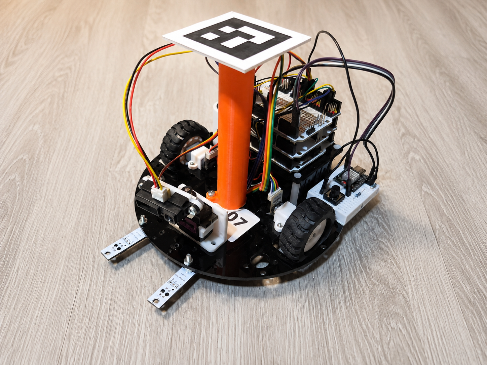

# Интенсив по мобильной робототехнике — Неймарк 2026



Репозиторий содержит учебные программы, инструкции, схемы подключения и программные инструменты интенсива по мобильной робототехнике.

Материалы построены по принципу последовательного усложнения: сначала каждый аппаратный узел проверяется отдельной программой, затем измерения объединяются в математическую модель движения, после чего робот получает единый текстовый протокол управления по USB и Wi-Fi.

## Навигация по дням

| День | Тема | Результат | Материалы |
|---:|---|---|---|
| 1 | Сборка робота и проверка оборудования | Проверены моторы, энкодеры, датчики, сервопривод и кнопка; собраны первые автономные алгоритмы | [День 1 — аппаратная часть](day_01_hardware/) |
| 2 | Энкодеры, скорость, одометрия и удалённое управление | Получены координаты робота, реализован текстовый протокол, управление из Python по USB и через ESP32-C3 | [День 2 — одометрия и управление](day_02_odometry_and_control/) |
| 3 | Python, датчики и компьютерное зрение | Реализованы автономные алгоритмы по телеметрии, изучены BGR/HSV, цветовые маски и ArUco; робот получает цель щелчком по изображению | [День 3 — Python и компьютерное зрение](day_03_python_and_computer_vision/) |
| 4 | Подготовка к индивидуальному проекту | Повторён обмен с роботом и разобраны готовые основы проектов: движение по клику, маршрут по ArUco, управление жестами, обход нарисованных препятствий и движение к цветной цели | [День 4 — подготовка к проекту](day_04_project_preparation/) |
| 5 | Разработка индивидуальных проектов | Участники выбирают задачи, объединяют изученные технологии и создают рабочие прототипы | [Дни 5–6 — проекты участников](day_05_06_individual_projects/) |
| 6 | Финальная отладка и защита | Подготовлены демонстрации, репозитории и презентации; проведена защита проектов | [Дни 5–6 — проекты участников](day_05_06_individual_projects/) |


## Логика курса

### День 1: надёжная аппаратная основа

Каждый компонент подключается и проверяется независимо. Такая последовательность отделяет ошибки монтажа от ошибок алгоритма и позволяет точно определить источник неисправности.

### День 2: переход от импульсов к координатам

Сигналы энкодеров последовательно преобразуются:

```text
тики энкодера
      ↓
путь каждого колеса
      ↓
скорость каждого колеса
      ↓
линейное и угловое перемещение робота
      ↓
координаты X, Y и угол θ
      ↓
телеметрия, карта и удалённое управление
```

Arduino остаётся главным контроллером реального времени: управляет моторами, считывает датчики, рассчитывает скорость и одометрию. ESP32-C3 выполняет транспортную функцию — создаёт Wi-Fi-сеть и передаёт строки протокола между TCP и UART.

### День 3: перенос алгоритмов на компьютер и переход к зрению

Python получает телеметрию робота через TCP, принимает решения и возвращает команды движения. Одни и те же данные используются в нескольких последовательных задачах: движение по линии, остановка перед стеной и движение к заданной точке по одометрии.

После этого вводится компьютерное зрение: изображение рассматривается как массив пикселей, изучаются каналы BGR и модель HSV, создаются цветовые маски, находятся контуры и ограничивающие прямоугольники. Финальный пример объединяет камеру, ArUco-маркер и сетевое управление: щелчок по кадру задаёт точку, к которой должен приехать робот.

## День 4. Подготовка к индивидуальному проекту

Повторение протокола обмена с роботом и набор законченных примеров, которые
можно развить в собственный проект: маршрут по ArUco, управление жестами,
движение по нарисованной поверх видеокадра карте препятствий и движение к цветной цели.

## Структура репозитория

```text
.
├── README.md
├── images/
│   ├── robot_day_01.png
│   ├── day_02_wheel_speed_plot.png
│   ├── day_02_odometry_map.png
│   └── day_02_esp32_arduino_uart.png
├── day_01_hardware/
│   ├── README.md
│   ├── 01_motors_check/
│   ├── 02_encoders_check/
│   ├── 03_line_sensors_check/
│   ├── 04_ir_raw_check/
│   ├── 05_ir_distance_check/
│   ├── 06_servo_check/
│   ├── 07_start_button_check/
│   ├── 08_line_following/
│   ├── 09_doorway_search/
│   └── 10_kegelring/
└── day_02_odometry_and_control/
    ├── README.md
    ├── requirements.txt
    ├── 01_encoder_distance/
    ├── 02_wheel_speed/
    ├── 03_odometry/
    ├── 04_usb_text_protocol/
    ├── 05_checkpoint_day_02/
    ├── 06_odometry_map_serial/
    ├── 07_checkpoint_esp32_day_02/
    └── 08_odometry_map_wifi/
└── day_03_python_and_computer_vision/
    ├── README.md
    ├── INSTRUCTOR_CHECKLIST.md
    ├── requirements.txt
    ├── 01_robot_tcp_basics/
    ├── 02_line_following_python/
    ├── 03_drive_to_wall/
    ├── 04_drive_to_point/
    ├── 05_image_pixels_3x3/
    ├── 06_camera_view/
    ├── 07_split_bgr_channels/
    ├── 08_channel_sums/
    ├── 09_hsv_tuner/
    ├── 10_detect_red/
    ├── 11_detect_blue/
    ├── 12_detect_green/
    ├── 13_aruco_single/
    ├── 14_aruco_center_angle/
    ├── 15_aruco_multiple/
    ├── 16_click_to_drive/
    └── resources/
└── day_04_project_preparation/
    ├── README.md
    ├── INSTRUCTOR_CHECKLIST.md
    ├── requirements.txt
    ├── 02_marker_route_mission/
    ├── 03_gesture_control_mediapipe/
    ├── 04_camera_virtual_obstacles/
    ├── 05_color_target_mission/
    └── resources/
```

Каждый Arduino-скетч расположен в отдельной папке, название которой совпадает с именем файла `.ino`. Такая структура соответствует требованиям Arduino IDE и позволяет открывать любой пример непосредственно из репозитория.

## Принятые единицы измерения

| Величина | Единица |
|---|---|
| Расстояние и координаты | миллиметры, `mm` |
| Линейная скорость | миллиметры в секунду, `mm/s` |
| Угол внутри Arduino | радианы, `rad` |
| Угол в телеметрии | миллирадианы, `mrad` |
| Угловая скорость в командах | миллирадианы в секунду, `mrad/s` |
| Скорость USB Serial | `115200 baud` |
| Скорость UART Arduino ↔ ESP32 | `38400 baud` |

## Общие требования к запуску

- Arduino Nano/Uno или совместимая плата с микроконтроллером ATmega328P.
- Arduino IDE с библиотеками `Servo` и `SoftwareSerial`, входящими в стандартную поставку.
- Python 3 с поддержкой Tkinter.
- Пакет `pyserial` для управления по USB.
- Общая земля между Arduino, драйвером моторов, датчиками, сервоприводом и ESP32-C3.
- Отключённое питание во время изменения проводки.

---

Материалы дополняются последовательно по мере прохождения интенсива.
