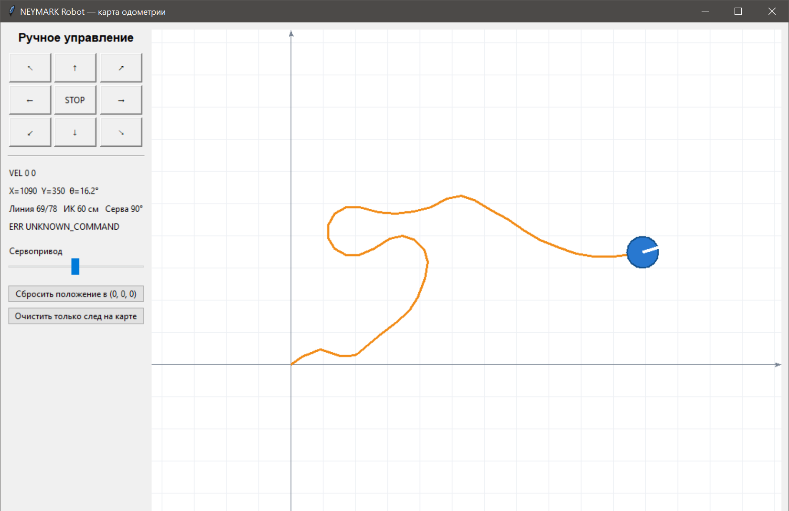
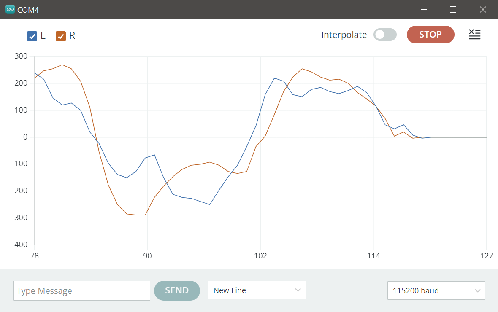
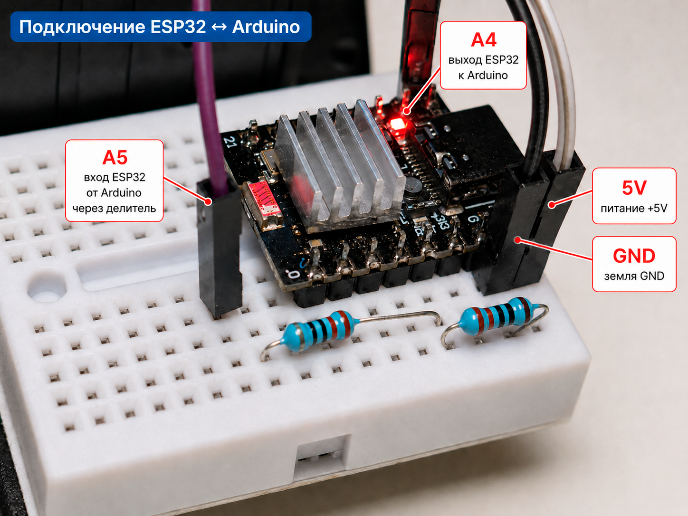

# День 2. Энкодеры, скорость, одометрия и удалённое управление

[← День 1: аппаратная часть](../day_01_hardware/) · [К общей навигации](../README.md)



Второй день посвящён переходу от отдельных импульсов энкодеров к измеряемому движению робота. Последовательность материалов охватывает путь колёс, скорость, одометрию дифференциального робота, текстовый протокол управления, приложение на Python и беспроводной мост на ESP32-C3.

К концу этапа формируется система из трёх уровней:

```text
Python: интерфейс, команды, карта
                ↕
USB Serial или TCP/Wi-Fi
                ↕
Arduino: моторы, энкодеры, датчики, регуляторы, одометрия
```


ESP32-C3 не подменяет Arduino в контуре управления. Её функция ограничена транспортом данных между TCP и UART.

## Содержание

1. [Путь по тикам энкодеров](#1-путь-по-тикам-энкодеров)
2. [Скорость каждого колеса](#2-скорость-каждого-колеса)
3. [Одометрия дифференциального робота](#3-одометрия-дифференциального-робота)
4. [Текстовый протокол по USB Serial](#4-текстовый-протокол-по-usb-serial)
5. [Финальная прошивка Arduino](#5-финальная-прошивка-arduino)
6. [Управление из Python по USB](#6-управление-из-python-по-usb)
7. [Подключение и прошивка ESP32-C3](#7-подключение-и-прошивка-esp32-c3)
8. [Управление из Python по Wi-Fi](#8-управление-из-python-по-wi-fi)

## Маршрут программ

| № | Код | Плата / среда | Назначение |
|---:|---|---|---|
| 1 | [`01_encoder_distance.ino`](01_encoder_distance/01_encoder_distance.ino) | Arduino | Перевод тиков энкодеров в путь каждого колеса |
| 2 | [`02_wheel_speed.ino`](02_wheel_speed/02_wheel_speed.ino) | Arduino | Расчёт скорости левого и правого колеса |
| 3 | [`03_odometry.ino`](03_odometry/03_odometry.ino) | Arduino | Расчёт координат `X`, `Y` и угла `θ` |
| 4 | [`04_usb_text_protocol.ino`](04_usb_text_protocol/04_usb_text_protocol.ino) | Arduino | Базовый строковый протокол через USB Serial |
| 5 | [`05_checkpoint_day_02.ino`](05_checkpoint_day_02/05_checkpoint_day_02.ino) | Arduino | Финальная прошивка дня: движение, регуляторы, датчики, одометрия и телеметрия |
| 6 | [`06_odometry_map_serial.py`](06_odometry_map_serial/06_odometry_map_serial.py) | Python | Управление финальной прошивкой напрямую по USB |
| 7 | [`07_checkpoint_esp32_day_02.ino`](07_checkpoint_esp32_day_02/07_checkpoint_esp32_day_02.ino) | ESP32-C3 | Точка доступа и мост TCP ↔ UART |
| 8 | [`08_odometry_map_wifi.py`](08_odometry_map_wifi/08_odometry_map_wifi.py) | Python | Управление по Wi-Fi и отображение карты |

## Исходные параметры робота

Параметры взяты непосредственно из программ второго дня.

| Параметр | Обозначение | Значение |
|---|---:|---:|
| Диаметр колеса | `D` | `44 mm` |
| Колёсная база | `B` | `128 mm` |
| Число тиков на оборот | `N` | `358 ticks/rev` |
| Период расчёта скорости в примере 2 | `Δt` | около `100 ms` |
| Период контура финальной прошивки | — | `50 ms` |
| Период телеметрии | — | `200 ms` |
| USB Serial | — | `115200 baud` |
| UART Arduino ↔ ESP32-C3 | — | `38400 baud` |

Диаметр, база и число тиков определяют масштаб всей одометрии. Ошибка в любом из этих параметров приводит к систематической ошибке координат.

---

# Часть I. Расчёты на Arduino

## 1. Путь по тикам энкодеров

**Код:** [`01_encoder_distance.ino`](01_encoder_distance/01_encoder_distance.ino)

Энкодер сообщает не расстояние, а количество дискретных событий — тиков. Для перевода тиков в миллиметры используется длина окружности колеса.

### 1.1. Длина окружности

```text
C = π · D
```

где:

- `C` — путь за один полный оборот;
- `D` — диаметр колеса.

Для колеса диаметром 44 мм:

```text
C = π · 44 ≈ 138.23 mm
```

### 1.2. Путь на один тик

Если за один оборот формируется `N = 358` тиков:

```text
s_tick = C / N
s_tick = π · D / N
s_tick = π · 44 / 358 ≈ 0.386 mm/tick
```

В программе эта величина вычисляется один раз:

```cpp
const float MM_PER_TICK =
    PI * WHEEL_DIAMETER_MM / ENCODER_TICKS_PER_REV;
```

### 1.3. Полный путь колеса

```text
s = n · s_tick
```

где `n` — накопленное число тиков с учётом знака. Положительное значение соответствует одному направлению вращения, отрицательное — противоположному.

### 1.4. Считывание энкодеров

Каналы A левого и правого энкодеров подключены к D2 и D3 — выводам аппаратных прерываний ATmega328P. Обработчик вызывается по фронту `RISING`. Состояние канала B определяет знак изменения счётчика.

```cpp
leftTicks += digitalRead(LEFT_ENCODER_B_PIN) ? 1 : -1;
```

Переменные счётчиков объявлены как `volatile`, поскольку изменяются внутри обработчиков прерываний. Копирование двух многобайтовых значений выполняется при кратковременно запрещённых прерываниях:

```cpp
noInterrupts();
left = leftTicks;
right = rightTicks;
interrupts();
```

Такой приём исключает чтение значения в момент, когда обработчик уже изменил часть байтов переменной `long`.

### Ожидаемый вывод

```text
L:123.5 R:121.9
```

Значения отображают полный путь каждого колеса в миллиметрах с момента перезапуска платы.

---

## 2. Скорость каждого колеса

**Код:** [`02_wheel_speed.ino`](02_wheel_speed/02_wheel_speed.ino)

Скорость определяется не по полному числу тиков, а по их изменению за известный интервал времени.

### 2.1. Изменение числа тиков

```text
Δn = n_current − n_previous
```

### 2.2. Путь за интервал

```text
Δs = Δn · s_tick
```

### 2.3. Скорость

```text
v = Δs / Δt
v = Δn · s_tick / Δt
```

В программе время переводится из миллисекунд в секунды:

```cpp
const float dt = (nowMs - previousMs) * 0.001f;
```

После этого вычисляются скорости колёс:

```cpp
const float leftSpeed = deltaLeft * MM_PER_TICK / dt;
const float rightSpeed = deltaRight * MM_PER_TICK / dt;
```

Фактическое `dt` рассчитывается по `millis()`, поэтому небольшие задержки выполнения программы не искажают масштаб скорости.



На графике видны положительные и отрицательные участки скорости, разница между колёсами и переход к нулю после остановки. Ступенчатость и колебания связаны с дискретностью энкодера: за короткий период измерения регистрируется только целое число тиков. Увеличение периода делает график ровнее, но повышает задержку измерения; уменьшение периода ускоряет реакцию, но усиливает шум квантования.

Формат вывода совместим с Arduino Serial Plotter:

```text
L:215.4 R:247.8
```

---

## 3. Одометрия дифференциального робота

**Код:** [`03_odometry.ino`](03_odometry/03_odometry.ino)

Одометрия оценивает положение робота по перемещению двух ведущих колёс. Состояние описывается тремя величинами:

```text
X     координата вдоль глобальной оси X, mm
Y     координата вдоль глобальной оси Y, mm
θ     ориентация робота, rad
```

Начальное состояние:

```text
X = 0
Y = 0
θ = 0
```

При `θ = 0` передняя часть робота направлена вдоль положительной оси X.

### 3.1. Перемещения колёс

Для очередного интервала рассчитываются пути:

```text
ΔsL = ΔnL · s_tick
ΔsR = ΔnR · s_tick
```

### 3.2. Перемещение центра робота

Средний путь двух колёс соответствует перемещению геометрического центра базы:

```text
Δs = (ΔsL + ΔsR) / 2
```

### 3.3. Изменение угла

Разность путей колёс создаёт поворот:

```text
Δθ = (ΔsR − ΔsL) / B
```

где `B` — расстояние между точками контакта левого и правого колеса, то есть колёсная база.

Характерные случаи:

| Перемещение колёс | Результат |
|---|---|
| `ΔsL = ΔsR` | Прямолинейное движение, `Δθ = 0` |
| `ΔsL = −ΔsR` | Поворот на месте, `Δs = 0` |
| `ΔsL ≠ ΔsR` | Движение по дуге |

### 3.4. Угол в середине шага

За один расчётный интервал робот одновременно перемещается и поворачивается. Для проекции пути используется ориентация в середине этого интервала:

```text
θmid = θ + Δθ / 2
```

### 3.5. Обновление координат

```text
Xnew = X + Δs · cos(θmid)
Ynew = Y + Δs · sin(θmid)
θnew = θ + Δθ
```

Реализация:

```cpp
xMm += distance * cos(middleTheta);
yMm += distance * sin(middleTheta);
thetaRad = normalizeAngle(thetaRad + deltaTheta);
```

Угол нормализуется в диапазон от `−π` до `π`. Нормализация не меняет физическую ориентацию, но удерживает числовое значение в компактном диапазоне.

### 3.6. Причины накопления ошибки

Одометрия является оценкой, а не абсолютным измерением положения. Ошибка накапливается из-за следующих факторов:

- неточно измеренный диаметр колёс;
- неточно измеренная колёсная база;
- различие фактических диаметров левого и правого колеса;
- проскальзывание на разгоне, торможении и повороте;
- люфт редукторов;
- пропущенные или ложные импульсы энкодеров;
- неровность поверхности.

Ошибка угла особенно заметна: небольшой постоянный перекос постепенно превращается в значительную ошибку координат `X` и `Y`.

### Сброс начала координат

Символ `R`, отправленный через Serial Monitor, вызывает `resetOdometry()` и устанавливает текущее положение как `(0, 0, 0)`.

---

## 4. Текстовый протокол по USB Serial

**Код:** [`04_usb_text_protocol.ino`](04_usb_text_protocol/04_usb_text_protocol.ino)

На этом этапе USB перестаёт быть только каналом диагностического вывода и становится двусторонним интерфейсом управления.

### 4.1. Формат обмена

Каждая команда представляет собой строку ASCII, завершённую символом конца строки:

```text
COMMAND argument1 argument2\n
```

Строковый формат удобен по трём причинам:

- команды остаются читаемыми в Serial Monitor;
- протокол легко формируется в Python;
- один и тот же разбор команд используется для USB, UART и TCP.

### 4.2. Команды базового примера

| Команда | Действие | Ответ |
|---|---|---|
| `PING` | Проверка связи | `PONG` |
| `GET` | Однократный вывод датчиков | `L:... R:... IR_cm:... Servo:...` |
| `SERVO 45` | Установка логического угла сервы | `OK SERVO 45` |

Ошибочные запросы возвращают строки `ERR ...`, например:

```text
ERR SERVO_NEEDS_ANGLE
ERR UNKNOWN_COMMAND
ERR LINE_TOO_LONG
```

### 4.3. Буферизация

Байты накапливаются в массиве `inputBuffer`. Разбор начинается только после получения `\n` или `\r`. Это предотвращает обработку неполной команды, поскольку последовательный порт может доставлять строку частями.

### 4.4. Логический и физический угол сервы

Механическая установка сервопривода развёрнута относительно интерфейса, поэтому используется преобразование:

```text
physical_angle = 180° − logical_angle
```

Логический диапазон ограничен значениями от 20° до 160°.

---

## 5. Финальная прошивка Arduino

**Код:** [`05_checkpoint_day_02.ino`](05_checkpoint_day_02/05_checkpoint_day_02.ino)

Файл получил номер `05` в общей последовательности материалов. Он объединяет расчёты предыдущих этапов и становится основной прошивкой Arduino на конец второго дня.

### 5.1. Функции прошивки

- управление левым и правым мотором;
- измерение скорости обоих колёс;
- расчёт координат и ориентации;
- преобразование линейной и угловой скорости в скорости колёс;
- табличная компенсация нелинейности мотор-редукторов;
- P-регулирование скорости;
- дополнительная коррекция прямолинейности по пройденному пути;
- чтение двух датчиков линии;
- чтение ИК-дальномера;
- управление сервоприводом;
- приём одинаковых команд по USB и отдельному UART;
- выдача одинаковой телеметрии в оба канала;
- автоматическая остановка при потере потока команд.

### 5.2. Преобразование команды `VEL`

Команда задаёт скорость всего корпуса:

```text
VEL linear_mm_s angular_mrad_s
```

Угловая скорость переводится из миллирадиан в радианы:

```text
ω = angular_mrad_s / 1000
```

Целевые скорости колёс:

```text
vL = v − ω · B / 2
vR = v + ω · B / 2
```

где:

- `v` — линейная скорость центра робота;
- `ω` — угловая скорость корпуса;
- `B` — колёсная база.

Примеры:

| Команда | Интерпретация |
|---|---|
| `VEL 300 0` | Движение вперёд со скоростью 300 мм/с |
| `VEL -300 0` | Движение назад |
| `VEL 0 4000` | Поворот влево на месте |
| `VEL 0 -4000` | Поворот вправо на месте |
| `VEL 300 3000` | Движение вперёд по левой дуге |

Ненулевые команды ограничиваются рабочими диапазонами конкретных мотор-редукторов. Полный ноль остаётся остановкой.

### 5.3. Табличная калибровка моторов

Одинаковый PWM не гарантирует одинаковую скорость двух мотор-редукторов. В прошивке хранятся четыре таблицы:

```text
левый мотор, вперёд
левый мотор, назад
правый мотор, вперёд
правый мотор, назад
```

Для измеренных скоростей указаны экспериментально подобранные значения PWM. Между соседними точками применяется линейная интерполяция:

```text
k = (v − v0) / (v1 − v0)
PWM = PWM0 + k · (PWM1 − PWM0)
```

Таблица выполняет роль прямой модели двигателя: по требуемой скорости формируется базовый PWM до включения обратной связи.

### 5.4. P-регулятор скорости

После расчёта базового PWM учитывается ошибка скорости:

```text
e = v_target − v_measured
correction = Kp · e
PWM_output = PWM_table + correction
```

В коде:

```cpp
const float error = target - measured;
const float correction = SPEED_P_GAIN * error;
```

Поправка ограничивается, чтобы единичный выброс скорости не создавал чрезмерный управляющий сигнал.

### 5.5. Стартовый импульс

Мотор-редуктор требует большего PWM для начала движения, чем для удержания уже набранной скорости. При смене направления на короткое время активируется стартовый импульс `START_BOOST_MS = 250 ms`. После запуска управление возвращается к табличной модели и P-регулятору.

### 5.6. Коррекция прямолинейности

При команде с ненулевой линейной и нулевой угловой скоростью запоминаются значения энкодеров в начале прямого участка. Затем сравнивается фактически пройденный путь:

```text
path_error = progress_left − progress_right
correction = Kstraight · path_error
```

Колесо, ушедшее вперёд, получает меньшую целевую скорость, а отставшее — большую. Коррекция по накопленному пути компенсирует медленный уход от прямой, который не всегда заметен по мгновенной скорости.

### 5.7. Watchdog

Команды движения должны повторяться. При отсутствии новой команды `VEL` более 500 мс прошивка выключает моторы и выдаёт:

```text
EVENT WATCHDOG_STOP
```

Такой механизм останавливает робот при закрытии программы, обрыве USB, потере TCP-соединения или зависании управляющего компьютера.

### 5.8. Сервопривод

После команды изменения угла сигнал сервы удерживается 180 мс, затем библиотека отсоединяет вывод. Это уменьшает постоянную нагрузку на таймер и вероятность дрожания после достижения положения.

### 5.9. Полный набор команд

| Команда | Аргументы | Назначение |
|---|---|---|
| `VEL` | `linear_mm_s angular_mrad_s` | Задание линейной и угловой скорости |
| `STOP` | — | Немедленная остановка моторов |
| `SERVO` | `angle_deg` | Установка логического угла 20…160° |
| `RESET_ODOM` | — | Остановка и сброс `X`, `Y`, `θ` |
| `GET` | — | Немедленная отправка телеметрии |
| `PING` | — | Проверка связи, ответ `PONG ARDUINO` |

### 5.10. Формат телеметрии

```text
TEL x y theta_mrad v w_mrad encL encR lineL lineR ir_cm servo
```

| Поле | Содержание | Единица |
|---|---|---|
| `x` | Координата X | мм |
| `y` | Координата Y | мм |
| `theta_mrad` | Ориентация | мрад |
| `v` | Измеренная линейная скорость | мм/с |
| `w_mrad` | Измеренная угловая скорость | мрад/с |
| `encL` | Накопленный счётчик левого энкодера | тики |
| `encR` | Накопленный счётчик правого энкодера | тики |
| `lineL` | Левый датчик линии | значение АЦП |
| `lineR` | Правый датчик линии | значение АЦП |
| `ir_cm` | Оценка расстояния | см |
| `servo` | Логический угол сервопривода | градусы |

Пример:

```text
TEL 1090 350 283 0 0 15432 15311 69 78 60 90
```

### 5.11. Два независимых канала

Один и тот же обработчик команд используется для:

```text
USB Serial      115200 baud
SoftwareSerial  38400 baud, A4/A5
```

Ответы и телеметрия одновременно отправляются в оба канала. Поэтому прошивка Arduino не меняется при переходе от прямого USB-управления к Wi-Fi-мосту.

---

# Часть II. Управление из Python по USB

## 6. Управление из Python по USB

**Код:** [`06_odometry_map_serial.py`](06_odometry_map_serial/06_odometry_map_serial.py)

Приложение соединяется с Arduino через виртуальный COM-порт, отправляет команды финальной прошивке и строит траекторию по принимаемой телеметрии.

### 6.1. Зависимости

```bash
python -m pip install -r requirements.txt
```

Пакет `pyserial` используется только USB-версией. Tkinter входит в стандартную поставку Python для Windows; в некоторых дистрибутивах Linux он устанавливается отдельным системным пакетом.

### 6.2. Запуск

Автоматический выбор из найденных последовательных портов:

```bash
python 06_odometry_map_serial/06_odometry_map_serial.py
```

Явное указание порта:

```bash
python 06_odometry_map_serial/06_odometry_map_serial.py --port COM4
```

Для Linux типичный вид команды:

```bash
python 06_odometry_map_serial/06_odometry_map_serial.py --port /dev/ttyUSB0
```

Serial Monitor и Serial Plotter Arduino IDE должны быть закрыты, поскольку COM-порт обычно доступен только одному приложению.

### 6.3. Последовательность соединения

1. Открывается порт со скоростью `115200 baud`.
2. Выдерживается пауза 1,8 секунды, поскольку Arduino Nano/Uno обычно перезапускается при открытии USB-порта.
3. Входной буфер очищается.
4. Отправляется команда `GET`.
5. Начинается циклический приём строк и разбор сообщений `TEL`.

### 6.4. Передача команд

Состояние клавиатуры преобразуется в пару `(linear, angular)`. Пока клавиша движения удерживается, команда `VEL` отправляется каждые 50 мс:

```text
W / ↑       VEL 350 0
S / ↓       VEL -350 0
A / ←       VEL 0 5000
D / →       VEL 0 -5000
W + A       VEL 350 5000
W + D       VEL 350 -5000
```

После отпускания клавиш отправляется `STOP`. Регулярная передача `VEL` поддерживает watchdog Arduino в активном состоянии.

Ползунок сервопривода формирует строку:

```text
SERVO angle
```

Кнопка сброса координат формирует:

```text
RESET_ODOM
```

### 6.5. Приём телеметрии

Функция `parse_telemetry()` принимает только строки из 12 полей, начинающиеся с `TEL`. Остальные строки — `READY`, `PONG`, `ERR`, `EVENT` — отображаются как статусные сообщения.

Точки добавляются в траекторию при смещении не менее 5 мм относительно предыдущей точки. Такой порог уменьшает объём данных и исключает многократную отрисовку практически одинаковых координат.

### 6.6. Карта

Карта автоматически подбирает масштаб по накопленной траектории. Оранжевая линия показывает путь, синяя окружность — текущую позицию, белая стрелка — ориентацию `θ`.


Кнопка «Сбросить положение» отправляет `RESET_ODOM` в Arduino и устанавливает физическое текущее положение как новое начало координат. Кнопка «Очистить только след» изменяет только отображение в Python и не затрагивает одометрию Arduino.

---

# Часть III. ESP32-C3 и управление по Wi-Fi

## 7. Подключение и прошивка ESP32-C3

**Код:** [`07_checkpoint_esp32_day_02.ino`](07_checkpoint_esp32_day_02/07_checkpoint_esp32_day_02.ino)

ESP32-C3 создаёт собственную Wi-Fi-сеть и прозрачно передаёт строки между TCP-клиентом и Arduino.

### 7.1. Архитектура обмена

```text
Python на компьютере
TCP 192.168.4.1:8888
        ↕
ESP32-C3
точка доступа + TCP/UART-мост
        ↕  UART 38400 baud
Arduino
движение + датчики + одометрия + watchdog
```

Команды от компьютера проходят по цепочке:

```text
Python → TCP → ESP32-C3 → UART → Arduino
```

Телеметрия возвращается в обратном направлении:

```text
Arduino → UART → ESP32-C3 → TCP → Python
```

ESP32-C3 не интерпретирует `VEL`, `SERVO` или `TEL`; она передаёт законченные строки без изменения содержания.

### 7.2. Параметры сети

| Параметр | Значение |
|---|---|
| SSID | `NEYMARK_01` |
| Пароль | `neymark123` |
| Адрес ESP32-C3 | `192.168.4.1` |
| TCP-порт управления | `8888` |
| HTTP-страница состояния | `http://192.168.4.1/` |

Веб-страница предназначена только для диагностики. На ней отображаются имя сети, адрес TCP, наличие клиента и счётчики переданных строк.

### 7.3. Подключение UART



| Направление данных | Arduino | ESP32-C3 | Подключение |
|---|---:|---:|---|
| ESP32-C3 → Arduino | A4, `SoftwareSerial RX` | GPIO5, `UART TX` | Прямое соединение |
| Arduino → ESP32-C3 | A5, `SoftwareSerial TX` | GPIO4, `UART RX` | Через делитель напряжения |
| Питание | 5V | 5V | Питание модуля через вход 5V |
| Общая земля | GND | GND | Прямое соединение |

Обозначения A4 и A5 относятся к выводам Arduino:

```text
ESP32 GPIO5 TX  ───────────────→  Arduino A4 RX
Arduino A5 TX   ─→ делитель ───→  ESP32 GPIO4 RX
```

### 7.4. Причина применения делителя

Arduino с ATmega328P работает с логическими уровнями около 5 В, а входы ESP32-C3 рассчитаны на 3,3 В. Поэтому линия от Arduino A5 к входу ESP32 GPIO4 понижает напряжение резистивным делителем.

Формула делителя:

```text
Vout = Vin · R2 / (R1 + R2)
```

`R1` включается между выходом Arduino и входом ESP32, `R2` — между входом ESP32 и GND. Отношение сопротивлений подбирается так, чтобы при `Vin ≈ 5 V` на входе ESP32 формировалось около `3.3 V`.

Пример номиналов:

```text
R1 = 1 kΩ
R2 = 2 kΩ
Vout = 5 · 2 / (1 + 2) ≈ 3.33 V
```

Обратное направление, от TX ESP32 к RX Arduino, работает с уровнем 3,3 В и не требует понижения. Общая земля обязательна для обоих направлений.

### 7.5. Соответствие константам в программах

Arduino:

```cpp
const uint8_t ESP_RX_PIN = A4;
const uint8_t ESP_TX_PIN = A5;
SoftwareSerial espSerial(ESP_RX_PIN, ESP_TX_PIN);
```

ESP32-C3:

```cpp
const uint8_t ROBOT_RX_PIN = 4;
const uint8_t ROBOT_TX_PIN = 5;
robotSerial.begin(38400, SERIAL_8N1, ROBOT_RX_PIN, ROBOT_TX_PIN);
```

Линии соединены крест-накрест: `TX → RX`, `RX ← TX`.

### 7.6. Работа прошивки ESP32-C3

Прошивка выполняет четыре независимые задачи в основном цикле:

- обслуживание HTTP-сервера;
- приём одного TCP-клиента;
- чтение строк от TCP и передача в UART;
- чтение строк от Arduino и передача в TCP.

Как и на Arduino, строка считается завершённой после `\n` или `\r`. Максимальная длина строки ограничена буфером 192 байта.

---

## 8. Управление из Python по Wi-Fi

**Код:** [`08_odometry_map_wifi.py`](08_odometry_map_wifi/08_odometry_map_wifi.py)

Wi-Fi-версия использует тот же интерфейс, формат телеметрии и набор команд, что и USB-версия. Отличается только транспортный уровень.

### 8.1. Последовательность запуска

1. В Arduino загружена прошивка [`05_checkpoint_day_02.ino`](05_checkpoint_day_02/05_checkpoint_day_02.ino).
2. В ESP32-C3 загружена прошивка [`07_checkpoint_esp32_day_02.ino`](07_checkpoint_esp32_day_02/07_checkpoint_esp32_day_02.ino).
3. UART соединён по таблице выше, линия Arduino → ESP32 проходит через делитель.
4. Компьютер подключён к сети `NEYMARK_01`.
5. Страница `http://192.168.4.1/` отображает состояние моста.
6. Приложение запускается командой:

```bash
python 08_odometry_map_wifi/08_odometry_map_wifi.py
```

Скрипт создаёт TCP-соединение с адресом:

```text
192.168.4.1:8888
```

### 8.2. Передача данных

Функция `send()` добавляет символ конца строки и вызывает `socket.sendall()`:

```python
self.socket.sendall((command + "\n").encode("ascii"))
```

Сокет переведён в неблокирующий режим. Метод `_receive_loop()` периодически считывает доступные пакеты, добавляет их в общий байтовый буфер и выделяет завершённые строки. TCP может разбить одну строку на несколько пакетов или объединить несколько строк в один пакет, поэтому разбор выполняется по `\n`, а не по границам вызовов `recv()`.

### 8.3. Идентичность протокола

```text
USB-вариант:  Python ↔ Serial ↔ Arduino
Wi-Fi-вариант: Python ↔ TCP ↔ ESP32 ↔ UART ↔ Arduino
```

На обоих маршрутах Arduino получает одинаковые строки. Это позволяет сначала проверить движение и одометрию по USB, а затем добавить ESP32-C3 без изменения алгоритмов управления роботом.

---
