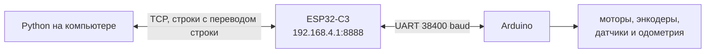
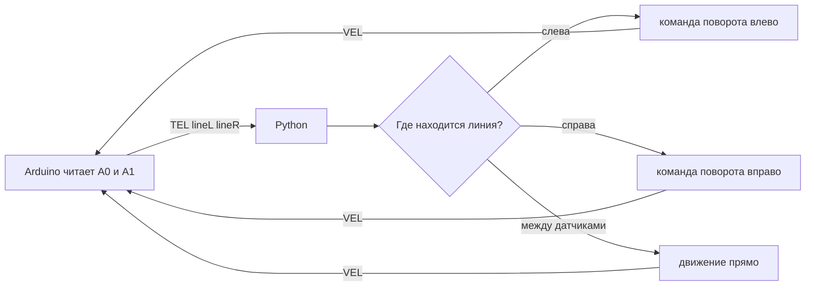
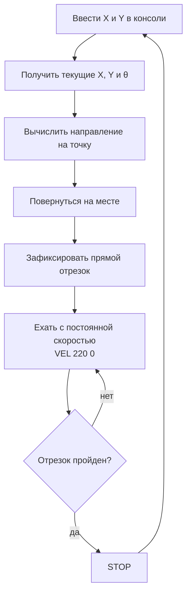
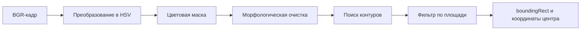

# День 3. Python, датчики и компьютерное зрение

[← День 2: одометрия и управление](../day_02_odometry_and_control/) · [К общей навигации](../README.md)

Третий день связывает две большие части курса.

Сначала Python становится внешним контроллером робота: принимает телеметрию, анализирует датчики и отправляет команды движения. Затем вводится компьютерное зрение — от массива из девяти пикселей до управления мобильным роботом по изображению с камеры.

# Подготовка

## Аппаратная часть

Используются финальные прошивки второго дня:

- Arduino: `05_checkpoint_day_02.ino`;
- ESP32-C3: `07_checkpoint_esp32_day_02.ino`.

Архитектура обмена не меняется:



ESP32-C3 остаётся мостом. Она не принимает решений о движении и не изменяет строки протокола.

## Установка Python-зависимостей


Установка библиотек:

```bash
python -m pip install -r requirements.txt
```

Используется именно `opencv-contrib-python`, поскольку модуль `cv2.aruco` входит в набор дополнительных модулей OpenCV.

## Перед запуском программ с роботом

1. Подключить компьютер к сети ESP32-C3, например `NEYMARK_01`.
2. Проверить страницу `http://192.168.4.1/`.
3. Убедиться, что адрес управления — `192.168.4.1:8888`.
4. Поставить робота на подставку для первой проверки.
5. Запускать только один TCP-клиент одновременно.

---

# Протокол робота

## Команды

| Команда | Назначение |
|---|---|
| `PING` | Проверка связи |
| `GET` | Немедленно запросить состояние |
| `VEL linear_mm_s angular_mrad_s` | Задать линейную и угловую скорость |
| `STOP` | Остановить оба мотора |
| `SERVO angle_deg` | Повернуть сервопривод |
| `RESET_ODOM` | Принять текущее положение за `(0, 0, 0)` |

Примеры:

```text
VEL 250 0       движение вперёд
VEL 0 3500      поворот влево
VEL 0 -3500     поворот вправо
STOP            остановка
```

Каждая команда заканчивается символом перевода строки `\n`.

## Телеметрия

Arduino передаёт строку:

```text
TEL x y theta v w encL encR lineL lineR ir servo
```

| Поле | Содержание | Единица |
|---|---|---|
| `x`, `y` | Координаты центра робота | мм |
| `theta` | Ориентация робота | мрад |
| `v` | Измеренная линейная скорость | мм/с |
| `w` | Измеренная угловая скорость | мрад/с |
| `encL`, `encR` | Счётчики энкодеров | тики |
| `lineL`, `lineR` | Аналоговые значения датчиков линии | 0…1023 |
| `ir` | Расстояние по ИК-дальномеру | см |
| `servo` | Текущий угол сервопривода | градусы |

В строке ровно 12 элементов: слово `TEL` и 11 целых чисел.

## Почему нельзя разбирать TCP по вызовам `recv()`

TCP передаёт поток байтов, а не отдельные сообщения. Одна строка может прийти частями, а несколько строк — одним пакетом. Поэтому программы накапливают байты в буфере и выделяют данные только по символу `\n`.

---

# Часть I. Управление роботом из Python

## 1. Простейший обмен по TCP

Папка: [`01_robot_tcp_basics`](01_robot_tcp_basics/)

### 1.1. Чтение телеметрии

Код: [`01_receive_telemetry.py`](01_robot_tcp_basics/01_receive_telemetry.py)

Запуск:

```bash
python 01_robot_tcp_basics/01_receive_telemetry.py
```

Программа подключается к ESP32-C3, отправляет `GET`, читает строки и преобразует `TEL` в объект `Telemetry`.

Главная идея:

```python
parts = line.split()
if len(parts) == 12 and parts[0] == "TEL":
    values = list(map(int, parts[1:]))
```

### 1.2. Передача команд

Код: [`02_send_commands.py`](01_robot_tcp_basics/02_send_commands.py)

Запуск:

```bash
python 01_robot_tcp_basics/02_send_commands.py
```

Быстрые команды:

| Ввод | Команда роботу |
|---|---|
| `w` | `VEL 250 0` |
| `s` | `VEL -250 0` |
| `a` | `VEL 0 3500` |
| `d` | `VEL 0 -3500` |
| `x` | `STOP` |

Также можно вводить полные строки протокола.

---

## 2. Движение по чёрной линии

Код: [`02_line_following_python.py`](02_line_following_python/02_line_following_python.py)

В этом примере Arduino только измеряет датчики и исполняет команду скорости. Решение принимается на компьютере.



Перед запуском необходимо вписать измеренные пороги:

```python
LEFT_BLACK_THRESHOLD = 500
RIGHT_BLACK_THRESHOLD = 500
```

В текущей аппаратной конфигурации белая поверхность даёт значение выше порога, а чёрная линия — ниже. Это необходимо подтвердить тестом конкретного робота.

Запуск:

```bash
python 02_line_following_python/02_line_following_python.py
```

---

## 3. Движение до стены

Код: [`03_drive_to_wall.py`](03_drive_to_wall/03_drive_to_wall.py)

Python выбирает поле `ir` из телеметрии. Пока расстояние больше `STOP_DISTANCE_CM`, отправляется команда движения вперёд. После нескольких последовательных близких измерений отправляется `STOP`.

```text
расстояние > порога  → VEL 180 0
расстояние ≤ порога  → STOP
нет свежей телеметрии → STOP
```

Несколько подтверждающих измерений уменьшают вероятность остановки из-за одиночного выброса датчика.

Запуск:

```bash
python 03_drive_to_wall/03_drive_to_wall.py
```

---

## 4. Ручное построение маршрута по точкам `(X, Y)`

Код: [`04_drive_to_point.py`](04_drive_to_point/04_drive_to_point.py)

Пример использует координаты одометрии, рассчитанные Arduino во втором дне. Точки маршрута вводятся из консоли **по одной**, поэтому маршрут можно строить вручную прямо во время запуска программы.

Запуск:

```bash
python 04_drive_to_point/04_drive_to_point.py
```

После подключения программа предлагает установить робота в начало координат и направить вдоль положительной оси `X`. Затем одометрия один раз сбрасывается командой `RESET_ODOM`.

Пример квадратного маршрута:

```text
Следующая точка X Y в мм > 1000 0
Следующая точка X Y в мм > 1000 700
Следующая точка X Y в мм > 0 700
Следующая точка X Y в мм > 0 0
```

Все введённые координаты являются **абсолютными координатами в одной системе одометрии**, а не смещениями относительно текущего положения.

Дополнительные команды:

| Команда | Действие |
|---|---|
| `pose` | Показать текущие координаты и угол |
| `reset` | Принять текущее положение за `(0, 0, 0)` |
| `stop` | Немедленно отправить `STOP` |
| `exit` | Остановить робота и завершить программу |

### 4.1. Ошибка положения

Пусть текущая координата робота — `(x, y)`, а новая цель — `(xₜ, yₜ)`.

```text
Δx = xₜ − x
Δy = yₜ − y
```

Расстояние до цели:

```text
ρ = √(Δx² + Δy²)
```

### 4.2. Направление на новую точку

Перед началом каждого отрезка вычисляется направление от текущего положения к новой точке:

```text
θцели = atan2(Δy, Δx)
```

Ошибка курса:

```text
eθ = θцели − θробота
```

Угол приводится к диапазону от `−π` до `+π`, чтобы робот выбирал кратчайший поворот.

### 4.3. Две отдельные фазы движения

В этой версии поворот и движение вперёд намеренно разделены.

**Фаза 1 — поворот.** Робот стоит на месте и разворачивается к новой точке. Угловая скорость уменьшается вместе с ошибкой направления:

```text
ω = K · eθ
```

**Фаза 2 — прямой отрезок.** После выравнивания направление фиксируется. Робот едет с постоянной линейной скоростью:

```text
VEL 220 0
```

Во время этого отрезка угловая скорость всегда равна нулю. Робот не подруливает, не переключается обратно в режим поворота и поэтому не должен дёргаться. После достижения точки дополнительного поворота также нет.



### 4.4. Как определяется окончание отрезка

После поворота программа запоминает начальную точку отрезка и единичный вектор его направления. По текущей одометрии вычисляется, насколько далеко робот продвинулся вдоль этого вектора.

```text
progress = (x − x₀) · ux + (y − y₀) · uy
```

Остановка выполняется, когда робот оказался в допустимой близости от цели либо прошёл почти всю расчётную длину отрезка. Такой критерий не позволяет роботу бесконечно продолжать движение, если из-за небольшой механической погрешности он прошёл рядом с точкой.

### 4.5. Важное ограничение

Во время прямого движения курс намеренно не корректируется. Поэтому точность зависит от:

- одинаковой скорости колёс;
- качества калибровки;
- сцепления с поверхностью;
- точности одометрии;
- отсутствия пробуксовки.

Этот пример нужен для наглядного построения маршрута из отдельных команд: **повернуться — проехать прямой отрезок — остановиться — принять следующую точку**.

---

# Часть II. Основы компьютерного зрения

## 5. Изображение как массив пикселей

Код: [`05_image_pixels_3x3.py`](05_image_pixels_3x3/05_image_pixels_3x3.py)  
Файл: [`sample_3x3.png`](05_image_pixels_3x3/sample_3x3.png)

Изображение имеет размер `3 × 3` пикселя. Каждый цветной пиксель хранит три числа от `0` до `255`.

OpenCV читает цветовые компоненты в порядке **BGR**:

```text
[Blue, Green, Red]
```

Поэтому красный пиксель выглядит как `[0, 0, 255]`, а синий — `[255, 0, 0]`.

Запуск:

```bash
python 05_image_pixels_3x3/05_image_pixels_3x3.py
```

Ожидаемая форма массива:

```text
(3, 3, 3)
```

- первая тройка — три строки;
- вторая — три столбца;
- третья — три цветовых канала.

---

## 6. Получение изображения с камеры

Код: [`06_camera_view.py`](06_camera_view/06_camera_view.py)

Основной цикл камеры:

```python
ok, frame = camera.read()
cv2.imshow("Camera", frame)
```

`frame` — обычный массив NumPy. Каждый новый вызов `read()` возвращает очередной кадр видеопотока.

---

## 7. Разделение изображения на каналы

Код: [`07_split_bgr_channels.py`](07_split_bgr_channels/07_split_bgr_channels.py)

```python
blue, green, red = cv2.split(frame)
```

Каждый отдельный канал — двумерное изображение яркости. Светлая область в окне `Red channel` означает большое значение красной компоненты, а не обязательно светлый объект в обычном смысле.

---

## 8. Сумма пикселей в каналах

Код: [`08_channel_sums.py`](08_channel_sums/08_channel_sums.py)

Для каждого канала вычисляется сумма всех значений:

```python
red_sum = np.sum(red)
```

Если объект занимает значительную часть кадра, фон нейтрален, а освещение стабильно, наибольшая сумма часто соответствует преобладающему цвету.

Важно: сумма относится ко всему изображению. Яркий фон или большой посторонний объект также влияет на результат. Этот пример показывает принцип, но ещё не отделяет объект от фона.

---

# Часть III. HSV, маски и контуры

## 9. Почему используется HSV

Код: [`09_hsv_tuner.py`](09_hsv_tuner/09_hsv_tuner.py)

В BGR одновременно меняются и цвет, и яркость. Например, один красный предмет при ярком и слабом освещении может иметь очень разные значения каналов.

HSV разделяет признаки:

| Канал | Смысл |
|---|---|
| `H` — Hue | Цветовой тон: красный, жёлтый, зелёный, синий |
| `S` — Saturation | Насыщенность цвета |
| `V` — Value | Яркость |

В OpenCV диапазоны отличаются от привычной цветовой модели:

```text
H: 0…179
S: 0…255
V: 0…255
```

Цветовая маска строится так:

```python
hsv = cv2.cvtColor(frame, cv2.COLOR_BGR2HSV)
mask = cv2.inRange(hsv, lower, upper)
```

В маске:

- `255` — пиксель входит в заданный диапазон;
- `0` — пиксель не входит.

Ползунки позволяют подобрать границы по реальному объекту и реальному освещению.

### Почему для красного нужны два диапазона

Шкала оттенка замкнута в кольцо. Красный находится одновременно около начала и конца шкалы `H`:

```text
0 … 10      первый красный диапазон
170 … 179   второй красный диапазон
```

Поэтому создаются две маски и объединяются логической операцией OR:

```python
mask = cv2.bitwise_or(mask_1, mask_2)
```

---

## 10–12. Поиск цветных объектов

- Красный: [`10_detect_red.py`](10_detect_red/10_detect_red.py)
- Синий: [`11_detect_blue.py`](11_detect_blue/11_detect_blue.py)
- Зелёный: [`12_detect_green.py`](12_detect_green/12_detect_green.py)

Общий конвейер:



### Что такое контур

Контур — последовательность точек, описывающих границу связной белой области бинарной маски.

```python
contours, _ = cv2.findContours(
    mask,
    cv2.RETR_EXTERNAL,
    cv2.CHAIN_APPROX_SIMPLE,
)
```

- `RETR_EXTERNAL` возвращает внешние границы объектов;
- `CHAIN_APPROX_SIMPLE` сокращает число точек на прямых участках.

Мелкие области отбрасываются по площади:

```python
area = cv2.contourArea(contour)
if area < MIN_CONTOUR_AREA:
    continue
```

### Что делает `boundingRect`

```python
x, y, width, height = cv2.boundingRect(contour)
```

Функция возвращает наименьший прямоугольник, стороны которого параллельны осям изображения и который полностью охватывает контур.

Центр прямоугольника:

```text
center_x = x + width / 2
center_y = y + height / 2
```

Эти координаты можно использовать как положение объекта в кадре.

---

# Часть IV. ArUco-маркеры

## Подготовка маркеров

Папка [`resources/aruco_4x4_50`](resources/aruco_4x4_50/) содержит маркеры ID `0…9` и общий лист для печати.

Во всех примерах используется словарь:

```python
cv2.aruco.DICT_4X4_50
```

`4X4` означает внутреннюю сетку из `4 × 4` информационных ячеек. Число `50` означает, что словарь содержит 50 различных кодов.

## 13. Один маркер и четыре вершины

Код: [`13_aruco_single.py`](13_aruco_single/13_aruco_single.py)

Детектор возвращает:

```python
corners, ids, rejected = detector.detectMarkers(frame)
```

Для каждого маркера `corners` содержит четыре точки в согласованном порядке:

```text
0 — верхний левый угол маркера
1 — верхний правый
2 — нижний правый
3 — нижний левый
```

Порядок задаётся относительно ориентации самого маркера, поэтому по нему можно определить направление.

## 14. Центр и угол маркера

Код: [`14_aruco_center_angle.py`](14_aruco_center_angle/14_aruco_center_angle.py)

Центр вычисляется как среднее четырёх вершин:

```text
C = (P₀ + P₁ + P₂ + P₃) / 4
```

Середина верхней стороны:

```text
F = (P₀ + P₁) / 2
```

Вектор направления:

```text
h = F − C
```

В изображении начало координат находится слева сверху, а `Y` растёт вниз. Перед вычислением привычного математического угла знак вертикальной компоненты меняется:

```text
angle = atan2(−hᵧ, hₓ)
```

## 15. Несколько маркеров

Код: [`15_aruco_multiple.py`](15_aruco_multiple/15_aruco_multiple.py)

Массив `ids` сопоставляется с массивом `corners`:

```python
for marker_corners, marker_id in zip(corners, ids):
    ...
```

Так можно одновременно определить положение робота и нескольких целевых точек.

---

# 16. Щелчок по изображению задаёт цель роботу

Код: [`16_click_to_drive.py`](16_click_to_drive/16_click_to_drive.py)

На роботе закреплён ArUco-маркер ID `4`. Верхняя сторона маркера должна быть направлена вперёд по корпусу.

Ниже — демонстрация работы: щелчок по изображению задаёт цель, и робот едет к выбранной точке.


Управление:

| Действие | Результат |
|---|---|
| Левая кнопка мыши | Задать новую цель |
| Правая кнопка мыши | Удалить цель и остановиться |
| `Space` | Удалить цель и остановиться |
| `Esc` | Остановиться и завершить программу |

## 16.1. Координаты цели

Обработчик мыши получает координаты щелчка:

```python
target_pixel = (x, y)
```

Это точка в системе координат изображения:

```text
(0, 0) находится слева сверху
X растёт вправо
Y растёт вниз
```

## 16.2. Положение робота

Детектор возвращает четыре вершины маркера ID `4`:

```text
P₀, P₁, P₂, P₃
```

Центр робота принимается равным центру маркера:

```text
C = (P₀ + P₁ + P₂ + P₃) / 4
```

Это двумерная координата робота в пикселях текущего кадра.

## 16.3. Направление робота

Середина верхней стороны:

```text
F = (P₀ + P₁) / 2
```

Вектор направления:

```text
h = F − C
```

После нормализации длина `h` становится равной единице. Он показывает, куда направлена передняя часть робота.

## 16.4. Вектор на цель

```text
t = target − C
```

Длина этого вектора — ошибка положения в пикселях:

```text
distance = √(tₓ² + tᵧ²)
```

## 16.5. Ошибка курса со знаком

Сначала ось `Y` изображения разворачивается вверх. Затем используются скалярное и псевдоскалярное произведения двух векторов:

```text
cross = hₓtᵧ − hᵧtₓ
dot   = hₓtₓ + hᵧtᵧ
error = atan2(cross, dot)
```

`atan2` одновременно сообщает величину и знак поворота:

- положительная ошибка — цель слева;
- отрицательная — цель справа;
- ошибка около нуля — робот смотрит на цель.

## 16.6. Алгоритм движения

```text
расстояние меньше допуска
        ↓
       STOP

ошибка угла больше допуска
        ↓
поворот на месте к цели

угол выровнен, цель ещё далеко
        ↓
движение вперёд
```

Программа отправляет команду каждые `50 мс`, чтобы Arduino постоянно получала подтверждение управления и не остановилась по watchdog.

## 16.7. Связь с примером 4

Финальное задание использует ту же геометрию, что и [пример 4 — ручное построение маршрута по точкам](04_drive_to_point/):

| Пример 4 | Пример 16 |
|---|---|
| Координаты робота приходят из одометрии | Координаты робота определяет камера |
| Единицы — миллиметры | Единицы — пиксели |
| Направление — `theta_mrad` | Направление — верхняя сторона ArUco |
| Цель вводится числами `(X, Y)` | Цель выбирается щелчком |
| Сначала определяется направление на цель | Сначала определяется направление на цель |

Различается способ управления. В примере 4 каждый введённый отрезок выполняется строго в двух фазах: один поворот в начале, затем прямое движение без подруливания. В примере 16 камера непрерывно видит робота и может заново оценивать ошибку по каждому кадру.

Компьютерное зрение не отменяет расчёт направления и расстояния. Оно предоставляет другой способ измерить положение робота и цели.

## 16.8. Ограничения метода

- камера должна оставаться неподвижной;
- весь маршрут должен попадать в кадр;
- маркер ID `4` должен быть виден;
- расстояние измеряется в пикселях, а не в миллиметрах;
- перспектива камеры искажает масштаб в разных частях кадра;
- точность зависит от размера маркера, освещения и разрешения.

Для учебного полигона и верхней неподвижной камеры этого достаточно. Следующий уровень — калибровка камеры и преобразование пикселей в координаты плоскости.

---

# Полная последовательность третьего дня

| Этап | Код | Контрольный результат |
|---:|---|---|
| 1 | `01_receive_telemetry.py` | Python получает и разбирает `TEL` |
| 2 | `02_send_commands.py` | Робот исполняет команды из консоли |
| 3 | `02_line_following_python.py` | Решение по датчикам линии принимает Python |
| 4 | `03_drive_to_wall.py` | Робот останавливается на заданной дистанции |
| 5 | `04_drive_to_point.py` | Робот приезжает в координату по одометрии |
| 6 | `05_image_pixels_3x3.py` | Изображение прочитано как массив BGR |
| 7 | `06_camera_view.py` | Получен видеопоток камеры |
| 8 | `07_split_bgr_channels.py` | Выведены исходный кадр и три канала |
| 9 | `08_channel_sums.py` | На кадре показаны суммы B, G и R |
| 10 | `09_hsv_tuner.py` | Подобран HSV-диапазон объекта |
| 11 | `10_detect_red.py` | Красный найден по двум диапазонам H |
| 12 | `11_detect_blue.py` | Найден синий объект |
| 13 | `12_detect_green.py` | Найден зелёный объект |
| 14 | `13_aruco_single.py` | Найден маркер и четыре вершины |
| 15 | `14_aruco_center_angle.py` | Вычислены центр и ориентация |
| 16 | `15_aruco_multiple.py` | Одновременно найдены несколько ID |
| 17 | `16_click_to_drive.py` | Робот едет к точке, выбранной в кадре |

---

# Типичные проблемы

| Проблема | Что проверить |
|---|---|
| `ConnectionRefusedError` | Компьютер подключён к сети ESP32, адрес и порт верны, другой TCP-клиент закрыт |
| Телеметрия не разбирается | Строка начинается с `TEL`, содержит 12 полей и завершается `\n` |
| Робот сам останавливается | Команды должны повторяться чаще тайм-аута watchdog |
| Робот поворачивает не туда | Проверить знак угловой скорости и направление установки маркера |
| Линия определяется наоборот | Повторно измерить белое и чёрное, проверить знак сравнения |
| Дальномер даёт скачки | Проверить калибровку, питание, угол и высоту установки |
| Камера не открывается | Изменить `CAMERA_INDEX`, закрыть приложения, занявшие камеру |
| Нет `cv2.aruco` | Установить `opencv-contrib-python`, удалить конфликтующий пакет `opencv-python` |
| Маска пустая | Ослабить минимальные `S` и `V`, подобрать диапазон ползунками |
| Маска захватывает фон | Сузить диапазон HSV, изменить освещение или фон |
| Контуры дрожат | Увеличить `MIN_CONTOUR_AREA`, применить морфологическую очистку |
| ArUco не находится | Маркер целиком виден, не размыт, имеет белое поле вокруг и относится к `DICT_4X4_50` |
| Робот не доезжает точно до клика | Настроить `TARGET_TOLERANCE_PX`, скорость и положение камеры |

## Контрольная точка дня

Третий день завершён, если:

- телеметрия принимается Python без потери структуры строк;
- команды по TCP устойчиво управляют роботом;
- робот проходит тест линии и тест дальномера;
- робот приезжает к точке по одометрии;
- участник объясняет порядок BGR и назначение HSV;
- цветной объект выделяется маской и контуром;
- ArUco ID, центр и направление определяются в реальном времени;
- щелчок по изображению задаёт достижимую цель роботу.

Следующий этап — более сложные сценарии автономного движения и объединение нескольких источников информации.
