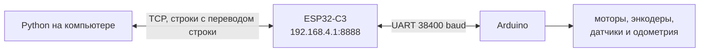
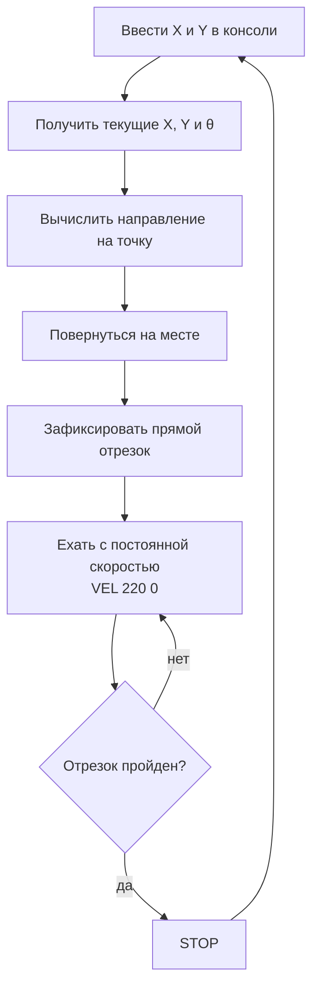
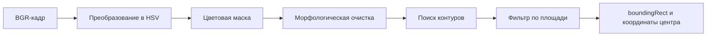

# День 3. Python, датчики и компьютерное зрение

[← День 2: одометрия и управление](../day_02_odometry_and_control/) · [К общей навигации](../README.md)

Третий день связывает две большие части курса.

Сначала Python становится внешним контроллером робота: принимает телеметрию, анализирует датчики и отправляет команды движения. Затем вводится компьютерное зрение — от массива из девяти пикселей до управления мобильным роботом по изображению с камеры.

# Подготовка

## Аппаратная часть

Используются финальные прошивки второго дня:

- Arduino: `05_checkpoint_day_02.ino`;
- ESP32-C3: `07_checkpoint_esp32_day_02.ino`.

Архитектура обмена не меняется:



ESP32-C3 остаётся мостом. Она не принимает решений о движении и не изменяет строки протокола.

## Установка Python-зависимостей


Установка библиотек:

```bash
python -m pip install -r requirements.txt
```

Используется именно `opencv-contrib-python`, поскольку модуль `cv2.aruco` входит в набор дополнительных модулей OpenCV.

## Перед запуском программ с роботом

1. Подключить компьютер к сети ESP32-C3, например `NEYMARK_01`.
2. Проверить страницу `http://192.168.4.1/`.
3. Убедиться, что адрес управления — `192.168.4.1:8888`.
4. Поставить робота на подставку для первой проверки.
5. Запускать только один TCP-клиент одновременно.

---

# Протокол робота

## Команды

| Команда | Назначение |
|---|---|
| `PING` | Проверка связи |
| `GET` | Немедленно запросить состояние |
| `VEL linear_mm_s angular_mrad_s` | Задать линейную и угловую скорость |
| `STOP` | Остановить оба мотора |
| `SERVO angle_deg` | Повернуть сервопривод |
| `RESET_ODOM` | Принять текущее положение за `(0, 0, 0)` |

Примеры:

```text
VEL 250 0       движение вперёд
VEL 0 3500      поворот влево
VEL 0 -3500     поворот вправо
STOP            остановка
```

Каждая команда заканчивается символом перевода строки `\n`.

## Телеметрия

Arduino передаёт строку:

```text
TEL x y theta v w encL encR lineL lineR ir servo
```

| Поле | Содержание | Единица |
|---|---|---|
| `x`, `y` | Координаты центра робота | мм |
| `theta` | Ориентация робота | мрад |
| `v` | Измеренная линейная скорость | мм/с |
| `w` | Измеренная угловая скорость | мрад/с |
| `encL`, `encR` | Счётчики энкодеров | тики |
| `lineL`, `lineR` | Аналоговые значения датчиков линии | 0…1023 |
| `ir` | Расстояние по ИК-дальномеру | см |
| `servo` | Текущий угол сервопривода | градусы |

В строке ровно 12 элементов: слово `TEL` и 11 целых чисел.

## Почему нельзя разбирать TCP по вызовам `recv()`

TCP передаёт поток байтов, а не отдельные сообщения. Одна строка может прийти частями, а несколько строк — одним пакетом. Поэтому программы накапливают байты в буфере и выделяют данные только по символу `\n`.

---

# Часть I. Управление роботом из Python

## 1. Простейший обмен по TCP

Папка: [`01_robot_tcp_basics`](01_robot_tcp_basics/)

### 1.1. Чтение телеметрии

Код: [`01_receive_telemetry.py`](01_robot_tcp_basics/01_receive_telemetry.py)

Запуск:

```bash
python 01_robot_tcp_basics/01_receive_telemetry.py
```

Программа подключается к ESP32-C3, отправляет `GET`, читает строки и преобразует `TEL` в объект `Telemetry`.

Главная идея:

```python
parts = line.split()
if len(parts) == 12 and parts[0] == "TEL":
    values = list(map(int, parts[1:]))
```

### 1.2. Передача команд

Код: [`02_send_commands.py`](01_robot_tcp_basics/02_send_commands.py)

Запуск:

```bash
python 01_robot_tcp_basics/02_send_commands.py
```

Быстрые команды:

| Ввод | Команда роботу |
|---|---|
| `w` | `VEL 250 0` |
| `s` | `VEL -250 0` |
| `a` | `VEL 0 3500` |
| `d` | `VEL 0 -3500` |
| `x` | `STOP` |

Также можно вводить полные строки протокола.

---

## 2. Движение по чёрной линии

Код: [`02_line_following_python.py`](02_line_following_python/02_line_following_python.py)

В этом примере Arduino только измеряет датчики и исполняет команду скорости. Решение принимается на компьютере.

Перед запуском необходимо вписать измеренные пороги:

```python
LEFT_BLACK_THRESHOLD = 500
RIGHT_BLACK_THRESHOLD = 500
```

В текущей аппаратной конфигурации белая поверхность даёт значение выше порога, а чёрная линия — ниже. Это необходимо подтвердить тестом конкретного робота.

Запуск:

```bash
python 02_line_following_python/02_line_following_python.py
```

---

## 3. Движение до стены

Код: [`03_drive_to_wall.py`](03_drive_to_wall/03_drive_to_wall.py)

Python выбирает поле `ir` из телеметрии. Пока расстояние больше `STOP_DISTANCE_CM`, отправляется команда движения вперёд. После нескольких последовательных близких измерений отправляется `STOP`.

```text
расстояние > порога  → VEL 180 0
расстояние ≤ порога  → STOP
нет свежей телеметрии → STOP
```

Несколько подтверждающих измерений уменьшают вероятность остановки из-за одиночного выброса датчика.

Запуск:

```bash
python 03_drive_to_wall/03_drive_to_wall.py
```

---

## 4. Ручное построение маршрута по точкам `(X, Y)`

Код: [`04_drive_to_point.py`](04_drive_to_point/04_drive_to_point.py)

Пример использует координаты одометрии, рассчитанные Arduino во втором дне. Точки маршрута вводятся из консоли **по одной**, поэтому маршрут можно строить вручную прямо во время запуска программы.

Запуск:

```bash
python 04_drive_to_point/04_drive_to_point.py
```

После подключения программа предлагает установить робота в начало координат и направить вдоль положительной оси `X`. Затем одометрия один раз сбрасывается командой `RESET_ODOM`.

Пример квадратного маршрута:

```text
Следующая точка X Y в мм > 1000 0
Следующая точка X Y в мм > 1000 700
Следующая точка X Y в мм > 0 700
Следующая точка X Y в мм > 0 0
```

Все введённые координаты являются **абсолютными координатами в одной системе одометрии**, а не смещениями относительно текущего положения.

Дополнительные команды:

| Команда | Действие |
|---|---|
| `pose` | Показать текущие координаты и угол |
| `reset` | Принять текущее положение за `(0, 0, 0)` |
| `stop` | Немедленно отправить `STOP` |
| `exit` | Остановить робота и завершить программу |

### 4.1. Ошибка положения

Пусть текущая координата робота — `(x, y)`, а новая цель — `(xₜ, yₜ)`.

```text
Δx = xₜ − x
Δy = yₜ − y
```

Расстояние до цели:

```text
ρ = √(Δx² + Δy²)
```

### 4.2. Направление на новую точку

Перед началом каждого отрезка вычисляется направление от текущего положения к новой точке:

```text
θцели = atan2(Δy, Δx)
```

Ошибка курса:

```text
eθ = θцели − θробота
```

Угол приводится к диапазону от `−π` до `+π`, чтобы робот выбирал кратчайший поворот.

### 4.3. Две отдельные фазы движения

В этой версии поворот и движение вперёд намеренно разделены.

**Фаза 1 — поворот.** Робот стоит на месте и разворачивается к новой точке. Угловая скорость уменьшается вместе с ошибкой направления:

```text
ω = K · eθ
```

**Фаза 2 — прямой отрезок.** После выравнивания направление фиксируется. Робот едет с постоянной линейной скоростью:

```text
VEL 220 0
```

Во время этого отрезка угловая скорость всегда равна нулю. Робот не подруливает, не переключается обратно в режим поворота и поэтому не должен дёргаться. После достижения точки дополнительного поворота также нет.



### 4.4. Как определяется окончание отрезка

После поворота программа запоминает начальную точку отрезка и единичный вектор его направления. По текущей одометрии вычисляется, насколько далеко робот продвинулся вдоль этого вектора.

```text
progress = (x − x₀) · ux + (y − y₀) · uy
```

Остановка выполняется, когда робот оказался в допустимой близости от цели либо прошёл почти всю расчётную длину отрезка. Такой критерий не позволяет роботу бесконечно продолжать движение, если из-за небольшой механической погрешности он прошёл рядом с точкой.

### 4.5. Важное ограничение

Во время прямого движения курс намеренно не корректируется. Поэтому точность зависит от:

- одинаковой скорости колёс;
- качества калибровки;
- сцепления с поверхностью;
- точности одометрии;
- отсутствия пробуксовки.

Этот пример нужен для наглядного построения маршрута из отдельных команд: **повернуться — проехать прямой отрезок — остановиться — принять следующую точку**.

---

# Часть II. Основы компьютерного зрения

## 5. Изображение как массив пикселей

Код: [`05_image_pixels_3x3.py`](05_image_pixels_3x3/05_image_pixels_3x3.py)  
Файл: [`sample_3x3.png`](05_image_pixels_3x3/sample_3x3.png)

Изображение имеет размер `3 × 3` пикселя. Каждый цветной пиксель хранит три числа от `0` до `255`.

OpenCV читает цветовые компоненты в порядке **BGR**:

```text
[Blue, Green, Red]
```

Поэтому красный пиксель выглядит как `[0, 0, 255]`, а синий — `[255, 0, 0]`.

Запуск:

```bash
python 05_image_pixels_3x3/05_image_pixels_3x3.py
```

Ожидаемая форма массива:

```text
(3, 3, 3)
```

- первая тройка — три строки;
- вторая — три столбца;
- третья — три цветовых канала.

---

## 6. Получение изображения с камеры

Код: [`06_camera_view.py`](06_camera_view/06_camera_view.py)

Основной цикл камеры:

```python
ok, frame = camera.read()
cv2.imshow("Camera", frame)
```

`frame` — обычный массив NumPy. Каждый новый вызов `read()` возвращает очередной кадр видеопотока.

---

## 7. Разделение изображения на каналы

Код: [`07_split_bgr_channels.py`](07_split_bgr_channels/07_split_bgr_channels.py)

```python
blue, green, red = cv2.split(frame)
```

Каждый отдельный канал — двумерное изображение яркости. Светлая область в окне `Red channel` означает большое значение красной компоненты, а не обязательно светлый объект в обычном смысле.

---

## 8. Сумма пикселей в каналах

Код: [`08_channel_sums.py`](08_channel_sums/08_channel_sums.py)

Для каждого канала вычисляется сумма всех значений:

```python
red_sum = np.sum(red)
```

Если объект занимает значительную часть кадра, фон нейтрален, а освещение стабильно, наибольшая сумма часто соответствует преобладающему цвету.

Важно: сумма относится ко всему изображению. Яркий фон или большой посторонний объект также влияет на результат. Этот пример показывает принцип, но ещё не отделяет объект от фона.

---

# Часть III. HSV, маски и контуры

## 9. Почему используется HSV

Код: [`09_hsv_tuner.py`](09_hsv_tuner/09_hsv_tuner.py)

В BGR одновременно меняются и цвет, и яркость. Например, один красный предмет при ярком и слабом освещении может иметь очень разные значения каналов.

HSV разделяет признаки:

| Канал | Смысл |
|---|---|
| `H` — Hue | Цветовой тон: красный, жёлтый, зелёный, синий |
| `S` — Saturation | Насыщенность цвета |
| `V` — Value | Яркость |

В OpenCV диапазоны отличаются от привычной цветовой модели:

```text
H: 0…179
S: 0…255
V: 0…255
```

Цветовая маска строится так:

```python
hsv = cv2.cvtColor(frame, cv2.COLOR_BGR2HSV)
mask = cv2.inRange(hsv, lower, upper)
```

В маске:

- `255` — пиксель входит в заданный диапазон;
- `0` — пиксель не входит.

Ползунки позволяют подобрать границы по реальному объекту и реальному освещению.

### Почему для красного нужны два диапазона

Шкала оттенка замкнута в кольцо. Красный находится одновременно около начала и конца шкалы `H`:

```text
0 … 10      первый красный диапазон
170 … 179   второй красный диапазон
```

Поэтому создаются две маски и объединяются логической операцией OR:

```python
mask = cv2.bitwise_or(mask_1, mask_2)
```

---

## 10–12. Поиск цветных объектов

- Красный: [`10_detect_red.py`](10_detect_red/10_detect_red.py)
- Синий: [`11_detect_blue.py`](11_detect_blue/11_detect_blue.py)
- Зелёный: [`12_detect_green.py`](12_detect_green/12_detect_green.py)

Общий конвейер:



### Что такое контур

Контур — последовательность точек, описывающих границу связной белой области бинарной маски.

```python
contours, _ = cv2.findContours(
    mask,
    cv2.RETR_EXTERNAL,
    cv2.CHAIN_APPROX_SIMPLE,
)
```

- `RETR_EXTERNAL` возвращает внешние границы объектов;
- `CHAIN_APPROX_SIMPLE` сокращает число точек на прямых участках.

Мелкие области отбрасываются по площади:

```python
area = cv2.contourArea(contour)
if area < MIN_CONTOUR_AREA:
    continue
```

### Что делает `boundingRect`

```python
x, y, width, height = cv2.boundingRect(contour)
```

Функция возвращает наименьший прямоугольник, стороны которого параллельны осям изображения и который полностью охватывает контур.

Центр прямоугольника:

```text
center_x = x + width / 2
center_y = y + height / 2
```

Эти координаты можно использовать как положение объекта в кадре.

---

# Часть IV. ArUco-маркеры

## Подготовка маркеров

Папка [`resources/aruco_4x4_50`](resources/aruco_4x4_50/) содержит маркеры ID `0…9` и общий лист для печати.

Во всех примерах используется словарь:

```python
cv2.aruco.DICT_4X4_50
```

`4X4` означает внутреннюю сетку из `4 × 4` информационных ячеек. Число `50` означает, что словарь содержит 50 различных кодов.

## 13. Один маркер и четыре вершины

Код: [`13_aruco_single.py`](13_aruco_single/13_aruco_single.py)

Детектор возвращает:

```python
corners, ids, rejected = detector.detectMarkers(frame)
```

Для каждого маркера `corners` содержит четыре точки в согласованном порядке:

```text
0 — верхний левый угол маркера
1 — верхний правый
2 — нижний правый
3 — нижний левый
```

Порядок задаётся относительно ориентации самого маркера, поэтому по нему можно определить направление.

## 14. Центр и угол маркера

Код: [`14_aruco_center_angle.py`](14_aruco_center_angle/14_aruco_center_angle.py)

Центр вычисляется как среднее четырёх вершин:

```text
C = (P₀ + P₁ + P₂ + P₃) / 4
```

Середина верхней стороны:

```text
F = (P₀ + P₁) / 2
```

Вектор направления:

```text
h = F − C
```

В изображении начало координат находится слева сверху, а `Y` растёт вниз. Перед вычислением привычного математического угла знак вертикальной компоненты меняется:

```text
angle = atan2(−hᵧ, hₓ)
```

## 15. Несколько маркеров

Код: [`15_aruco_multiple.py`](15_aruco_multiple/15_aruco_multiple.py)

Массив `ids` сопоставляется с массивом `corners`:

```python
for marker_corners, marker_id in zip(corners, ids):
    ...
```

Так можно одновременно определить положение робота и нескольких целевых точек.

---

# 16. Щелчок по изображению задаёт цель роботу

Код: [`16_click_to_drive.py`](16_click_to_drive/16_click_to_drive.py)

На роботе закреплён ArUco-маркер ID `4`. Сторона маркера между вершинами `P₀` и `P₁` должна быть направлена вперёд по корпусу робота. Это важно: программа определяет направление движения именно по этой стороне маркера.

В этом примере компьютер выполняет замкнутый цикл управления:

1. получает новый кадр с камеры;
2. находит на нём ArUco-маркер робота;
3. вычисляет центр маркера — это положение робота в кадре;
4. вычисляет, куда направлена передняя часть робота;
5. получает координаты точки, выбранной мышью;
6. строит вектор от робота к цели;
7. вычисляет расстояние до цели;
8. вычисляет ошибку направления — на какой угол и в какую сторону нужно повернуть;
9. отправляет одну из трёх команд: остановка, поворот или движение вперёд;
10. повторяет расчёт для следующего кадра.

Ниже показана работа программы: щелчок по изображению задаёт новую цель, после чего робот поворачивается к ней и начинает движение.


Управление:

| Действие | Результат |
|---|---|
| Левая кнопка мыши | Задать новую цель |
| Правая кнопка мыши | Удалить цель и остановить робота |
| `Space` | Удалить цель и остановить робота |
| `Esc` | Остановить робота и завершить программу |

## 16.1. Где хранится выбранная цель

До первого щелчка цели нет, поэтому переменная содержит `None`:

```python
target_pixel: tuple[int, int] | None = None
```

Запись означает, что `target_pixel` может содержать:

- пару целых чисел `(x, y)` — координаты выбранной точки;
- `None` — цель не выбрана.

Например:

```text
target_pixel = None       цель отсутствует
target_pixel = (700, 300) цель находится в пикселе X=700, Y=300
```

Затем окну OpenCV назначается функция, которая будет получать события мыши:

```python
cv2.setMouseCallback(window, mouse_callback)
```

После этого при каждом щелчке OpenCV автоматически вызывает функцию:

```python
def mouse_callback(
    event: int,
    x: int,
    y: int,
    _flags: int,
    _data: object,
) -> None:
```

Параметры `x` и `y` — координаты курсора в изображении в момент щелчка.

Левая кнопка сохраняет новую цель:

```python
if event == cv2.EVENT_LBUTTONDOWN:
    target_pixel = (x, y)
```

Правая кнопка удаляет цель:

```python
elif event == cv2.EVENT_RBUTTONDOWN:
    target_pixel = None
```

Координаты относятся к изображению камеры:

```text
(0, 0) находится в левом верхнем углу
X увеличивается вправо
Y увеличивается вниз
```

Например, точка `(700, 300)` расположена на `700` пикселей правее левого края и на `300` пикселей ниже верхнего края кадра.

## 16.2. Как программа находит именно маркер робота

Детектор ищет в кадре все ArUco-маркеры:

```python
corners, ids, _rejected = detector.detectMarkers(frame)
```

Результаты хранятся в двух связанных массивах:

- `corners` — координаты четырёх вершин каждого найденного маркера;
- `ids` — идентификаторы этих маркеров.

Например, камера может одновременно увидеть маркеры `1`, `4` и `7`. Чтобы удобно получать вершины по номеру маркера, создаётся словарь:

```python
markers = {
    int(marker_id): marker_corners
    for marker_corners, marker_id in zip(
        corners,
        ids.flatten(),
    )
}
```

Функция `zip` соединяет элементы с одинаковыми номерами:

```text
corners[0] ↔ ids[0]
corners[1] ↔ ids[1]
corners[2] ↔ ids[2]
```

В итоге словарь может выглядеть так:

```text
{
    1: вершины маркера 1,
    4: вершины маркера 4,
    7: вершины маркера 7
}
```

Маркер робота задан константой:

```python
ROBOT_MARKER_ID = 4
```

Перед расчётом движения программа проверяет, виден ли этот маркер:

```python
if ROBOT_MARKER_ID not in markers:
    state = f"WAIT FOR ROBOT MARKER ID {ROBOT_MARKER_ID}"
```

В начале каждого кадра команда заранее устанавливается в безопасное значение:

```python
command = "STOP"
```

Поэтому при потере маркера робот не продолжает движение вслепую. Он останавливается и ждёт, пока камера снова увидит ID `4`.

Если маркер найден, его вершины передаются функции `robot_geometry`:

```python
robot_center, robot_heading = robot_geometry(
    markers[ROBOT_MARKER_ID]
)
```

Функция возвращает две величины:

- `robot_center` — положение центра робота в кадре;
- `robot_heading` — единичный вектор, показывающий направление передней части робота.

## 16.3. Как из четырёх вершин получается положение и направление робота

### 16.3.1. Четыре вершины маркера

OpenCV возвращает четыре точки ArUco-маркера в определённом порядке:

```text
P₀ — верхний левый угол маркера
P₁ — верхний правый угол
P₂ — нижний правый угол
P₃ — нижний левый угол
```

Важно: слова «верхний» и «нижний» относятся не к экрану, а к рисунку самого ArUco-маркера. Когда маркер поворачивается вместе с роботом, порядок его вершин сохраняется.

В памяти OpenCV координаты могут иметь дополнительные уровни вложенности. Строка

```python
points = corners.reshape(4, 2)
```

приводит их к удобному виду:

```text
points[0] = P₀ = (x₀, y₀)
points[1] = P₁ = (x₁, y₁)
points[2] = P₂ = (x₂, y₂)
points[3] = P₃ = (x₃, y₃)
```

Каждая точка содержит две координаты: `X` и `Y`.

### 16.3.2. Центр маркера

Положение робота принимается равным центру маркера. Центр находится как среднее значение четырёх вершин:

```python
center = points.mean(axis=0)
```

То же самое можно записать формулой:

```text
C = (P₀ + P₁ + P₂ + P₃) / 4
```

Отдельно для координат:

```text
Cₓ = (x₀ + x₁ + x₂ + x₃) / 4
Cᵧ = (y₀ + y₁ + y₂ + y₃) / 4
```

Например:

```text
P₀ = (100, 100)
P₁ = (200, 100)
P₂ = (200, 200)
P₃ = (100, 200)
```

Тогда:

```text
C = (150, 150)
```

Это координаты центра робота в пикселях текущего кадра.

### 16.3.3. Какая сторона считается передней

Маркер устанавливается на робота так, чтобы сторона между `P₀` и `P₁` была направлена вперёд по корпусу.

Сначала программа находит середину этой стороны:

```python
front = 0.5 * (points[0] + points[1])
```

То есть:

```text
F = (P₀ + P₁) / 2
```

Для предыдущего примера:

```text
P₀ = (100, 100)
P₁ = (200, 100)
F  = (150, 100)
```

Точка `F` находится посередине передней стороны маркера.

Схематично:

```text
P₀ ───── F ───── P₁
│        ↑        │
│        │        │
│        C        │
│                 │
P₃ ───────────── P₂
```

Точка `C` — центр, а точка `F` — середина передней стороны. Значит, стрелка из `C` в `F` показывает, куда направлен робот.

### 16.3.4. Вектор направления

Стрелка от центра к передней стороне строится вычитанием координат:

```python
heading = front - center
```

То есть:

```text
h = F − C
```

Вычитание выполняется отдельно по каждой координате:

```text
hₓ = Fₓ − Cₓ
hᵧ = Fᵧ − Cᵧ
```

Для примера:

```text
C = (150, 150)
F = (150, 100)
```

Получаем:

```text
h = (150 − 150, 100 − 150)
h = (0, −50)
```

Это означает:

- по горизонтали стрелка не смещена: `hₓ = 0`;
- по изображению стрелка направлена вверх: `hᵧ = −50`.

Следовательно, робот смотрит вверх по кадру.

Ещё несколько примеров:

```text
h = ( 50,   0)  робот смотрит вправо
h = (-50,   0)  робот смотрит влево
h = (  0, -50)  робот смотрит вверх
h = (  0,  50)  робот смотрит вниз
h = ( 40, -30)  робот смотрит вправо и вверх
```

Именно строка

```python
heading = front - center
```

создаёт направление. Нормализация, выполняемая дальше, направление не создаёт — она только убирает зависимость от длины стрелки.

### 16.3.5. Почему вектор делится на свою длину

Если маркер выглядит крупным, расстояние от центра `C` до точки `F` будет большим. Если маркер выглядит маленьким, тот же вектор будет короче.

Например, два вектора

```text
(50, 0)
(150, 0)
```

имеют разную длину, но оба показывают строго вправо.

Для дальнейших расчётов удобнее оставить только направление. Поэтому вычисляется длина вектора:

```python
np.linalg.norm(heading)
```

Для вектора `h = (hₓ, hᵧ)` длина находится по теореме Пифагора:

```text
|h| = √(hₓ² + hᵧ²)
```

Например, для `h = (30, 40)`:

```text
|h| = √(30² + 40²)
|h| = √2500
|h| = 50
```

Затем обе компоненты делятся на эту длину:

```text
hₓ' = hₓ / |h|
hᵧ' = hᵧ / |h|
```

Получаем:

```text
h' = (30/50, 40/50)
h' = (0.6, 0.8)
```

Длина нового вектора равна единице:

```text
√(0.6² + 0.8²) = 1
```

В коде нормализация записана одной строкой:

```python
heading /= max(float(np.linalg.norm(heading)), 1.0)
```

Она читается так:

1. `np.linalg.norm(heading)` — вычислить длину вектора;
2. `float(...)` — преобразовать результат в обычное число Python;
3. `max(..., 1.0)` — не позволить делителю стать меньше `1.0`;
4. `heading /= ...` — разделить обе компоненты вектора на выбранную длину.

`max(..., 1.0)` защищает программу от деления на ноль или на очень маленькое число, если координаты вершин были определены некорректно.

После нормализации:

```text
(50, 0)   → (1, 0)
(150, 0)  → (1, 0)
(30, 40)  → (0.6, 0.8)
```

Размер маркера больше не влияет на результат. Остаётся только направление.

### 16.3.6. Как из единичного вектора получается угол

После нормализации вектор имеет длину `1`. Его можно представить как точку на единичной окружности.

В обычной математической системе координат компоненты единичного вектора связаны с углом так:

```text
hₓ = cos(θ)
hᵧ = sin(θ)
```

Поэтому единичный вектор фактически хранит угол в двух числах:

```text
(1, 0)             соответствует 0°
(0, 1)             соответствует 90°
(-1, 0)            соответствует 180°
(0, -1)            соответствует −90°
(0.707, 0.707)     соответствует 45°
```

Чтобы восстановить угол из компонентов, используется функция `atan2`:

```python
angle = math.atan2(y, x)
```

Она получает вертикальную и горизонтальную компоненты и возвращает угол от `−π` до `π`, то есть от `−180°` до `180°`.

Однако в изображении ось `Y` направлена вниз. Поэтому перед вычислением математического угла знак вертикальной компоненты меняется:

```python
robot_angle = math.atan2(
    -heading[1],
    heading[0],
)
```

Здесь:

```text
heading[0]  — горизонтальная компонента X
heading[1]  — вертикальная компонента Y изображения
-heading[1] — та же компонента после разворота оси Y вверх
```

Пример. После нормализации получилось:

```text
heading = (0.6, -0.8)
```

В изображении отрицательный `Y` означает направление вверх. Для математической системы:

```text
x = 0.6
y = -(-0.8) = 0.8
```

Тогда:

```python
robot_angle = math.atan2(0.8, 0.6)
```

Результат:

```text
robot_angle ≈ 0.927 радиана
robot_angle ≈ 53.1°
```

Перевод из радиан в градусы выполняется так:

```python
math.degrees(robot_angle)
```

В основном алгоритме абсолютный угол робота отдельно не требуется. Для управления важнее другой угол — насколько нужно повернуть от текущего направления к направлению на цель. Он вычисляется ниже функцией `signed_angle`.

Функция `robot_geometry` возвращает центр и единичный вектор направления:

```python
return center, heading
```

## 16.4. Как строится вектор от робота к цели

Координаты щелчка преобразуются в массив NumPy:

```python
target = np.array(target_pixel, dtype=np.float32)
```

Теперь известны две точки:

```text
robot_center — центр робота
target       — выбранная точка
```

Чтобы построить стрелку от робота к цели, из координат цели вычитаются координаты робота:

```python
target_vector = target - robot_center
```

То есть:

```text
t = target − C
```

Пример:

```text
центр робота: C = (200, 300)
цель:         T = (500, 200)
```

Тогда:

```text
t = (500 − 200, 200 − 300)
t = (300, −100)
```

Это означает:

- цель находится на `300` пикселей правее робота;
- цель находится на `100` пикселей выше робота.

Длина этого вектора — расстояние до цели:

```python
distance = float(np.linalg.norm(target_vector))
```

По формуле:

```text
distance = √(tₓ² + tᵧ²)
```

Для нашего примера:

```text
distance = √(300² + (−100)²)
distance = √100000
distance ≈ 316 пикселей
```

На изображении рисуется стрелка от центра робота к цели:

```python
cv2.arrowedLine(
    frame,
    robot_pixel,
    target_pixel,
    (255, 80, 0),
    3,
)
```

Эта стрелка показывает именно `target_vector`.

## 16.5. Как вычисляется угол поворота к цели

Теперь у программы есть две стрелки:

```text
robot_heading — куда сейчас смотрит робот
target_vector — куда находится цель
```

Нужно найти угол **от первой стрелки ко второй**.

```text
                 цель
                   ●
                  ↗  target_vector
                 /
                C ─────→ robot_heading
                    робот смотрит сюда
```

Этот угол называется ошибкой направления:

```python
angle_error = signed_angle(robot_heading, target_vector)
```

Результат должен сообщить сразу две вещи:

1. на сколько градусов робот отклонён от цели;
2. в какую сторону нужно поворачивать.

Поэтому угол вычисляется со знаком:

```text
положительный угол  — цель слева, поворот влево
отрицательный угол  — цель справа, поворот вправо
угол около нуля     — робот смотрит на цель
```

### 16.5.1. Разворачиваем ось Y

Функция начинается с преобразования координат изображения в привычные математические координаты:

```python
hx, hy = float(heading[0]), -float(heading[1])
tx, ty = float(target_vector[0]), -float(target_vector[1])
```

Получаются два вектора:

```text
h = (hx, hy) — направление робота
t = (tx, ty) — направление на цель
```

Знаки вертикальных компонентов меняются, потому что:

```text
в изображении Y растёт вниз;
в математике Y растёт вверх.
```

Без этого разворота лево и право при вычислении угла поменялись бы местами.

### 16.5.2. Скалярное произведение сообщает, впереди цель или сзади

Сначала вычисляется скалярное произведение:

```python
dot = hx * tx + hy * ty
```

Формула:

```text
dot = hₓtₓ + hᵧtᵧ
```

Оно связано с косинусом угла между векторами:

```text
dot = |h| · |t| · cos(error)
```

Поэтому знак `dot` сообщает общее положение цели:

| Значение `dot` | Что это означает |
|---:|---|
| `dot > 0` | цель находится в передней полуплоскости |
| `dot = 0` | цель находится примерно сбоку, угол около `90°` |
| `dot < 0` | цель находится позади робота |

Пример: робот смотрит вправо.

```text
h = (1, 0)
```

Цель впереди и немного выше:

```text
t = (300, 100)
```

Тогда:

```text
dot = 1·300 + 0·100 = 300
```

Значение положительное, значит цель находится впереди.

Но `dot` не говорит, слева цель или справа. Для этого нужна ещё одна величина.

### 16.5.3. Псевдоскалярное произведение сообщает сторону

Сторона определяется выражением:

```python
cross = hx * ty - hy * tx
```

Формула:

```text
cross = hₓtᵧ − hᵧtₓ
```

Оно связано с синусом угла:

```text
cross = |h| · |t| · sin(error)
```

Знак `cross` показывает направление поворота:

| Значение `cross` | Положение цели |
|---:|---|
| `cross > 0` | цель слева |
| `cross < 0` | цель справа |
| `cross = 0` | цель лежит на линии направления робота |

Рассмотрим два примера.

Робот смотрит вправо:

```text
h = (1, 0)
```

Цель находится впереди и слева:

```text
t = (300, 100)
```

Тогда:

```text
cross = 1·100 − 0·300 = 100
```

Значение положительное — нужно поворачивать влево.

Теперь цель находится впереди и справа:

```text
t = (300, −100)
```

Получаем:

```text
cross = 1·(−100) − 0·300 = −100
```

Значение отрицательное — нужно поворачивать вправо.

### 16.5.4. Как `atan2` получает сам угол

Теперь программа знает две величины:

```text
cross содержит sin(error) и знак стороны;
dot   содержит cos(error) и положение цели впереди или сзади.
```

Угол вычисляется так:

```python
return math.atan2(cross, dot)
```

Почему аргументы именно такие?

Для угла `error`:

```text
cross = |h| · |t| · sin(error)
dot   = |h| · |t| · cos(error)
```

Один и тот же множитель `|h| · |t|` присутствует в обеих величинах. Для определения угла он не важен. Поэтому выражение

```text
atan2(cross, dot)
```

работает как

```text
atan2(sin(error), cos(error))
```

и возвращает сам угол `error`.

Именно поэтому вектор на цель необязательно нормализовать: его длина одинаково умножает и `cross`, и `dot`, а на итоговый угол не влияет.

Разберём числовой пример:

```text
h = (1, 0)
t = (300, 100)
```

Считаем:

```text
cross = 100
dot   = 300
```

Тогда:

```python
error = math.atan2(100, 300)
```

Получаем:

```text
error ≈ 0.322 радиана
error ≈ 18.4°
```

Угол положительный, значит цель находится на `18.4°` левее текущего направления робота.

Для цели справа:

```text
h = (1, 0)
t = (300, −100)
```

Получаем:

```text
cross = −100
dot   = 300
error = atan2(−100, 300) ≈ −18.4°
```

Отрицательный знак означает поворот вправо.

### 16.5.5. Почему нельзя использовать только `atan(y / x)`

На первый взгляд угол можно было бы искать так:

```python
math.atan(y / x)
```

Но этот вариант имеет проблемы:

- при `x = 0` возникает деление на ноль;
- направления впереди-слева и сзади-справа могут дать одинаковое отношение;
- теряется информация о четверти окружности;
- диапазон результата ограничен примерно от `−90°` до `90°`.

`atan2` получает две величины отдельно и правильно определяет угол во всём диапазоне:

```text
от −180° до 180°
```

Поэтому цель, находящаяся сзади, также обрабатывается правильно.

### 16.5.6. Перевод угла в градусы

`math.atan2` возвращает угол в радианах. Для вывода на экран он переводится в градусы:

```python
math.degrees(angle_error)
```

Например:

```text
0 радиан      = 0°
π/2 радиана   = 90°
π радиан      = 180°
−π/2 радиана  = −90°
```

В программе на экран выводятся расстояние и ошибка угла:

```python
cv2.putText(
    frame,
    f"distance={distance:.0f}px  "
    f"error={math.degrees(angle_error):.1f}deg",
    ...
)
```

## 16.6. Как ошибка превращается в команду движения

После расчётов известны:

```text
distance    — расстояние до цели в пикселях
angle_error — угол от направления робота к цели
```

Далее выполняются три последовательные проверки.

### 16.6.1. Цель уже достигнута

```python
if distance <= TARGET_TOLERANCE_PX:
    command = "STOP"
    state = "TARGET REACHED"
```

Вокруг точки назначения используется круг допуска:

```python
TARGET_TOLERANCE_PX = 70
```

Если центр робота попал внутрь круга радиусом `70` пикселей, цель считается достигнутой.

Допуск нужен потому, что:

- робот имеет физические размеры;
- колёса обладают инерцией;
- возможна небольшая пробуксовка;
- координаты ArUco немного меняются между кадрами;
- попасть точно в один пиксель практически невозможно.

### 16.6.2. Робот ещё не смотрит на цель

Если цель далеко, проверяется ошибка угла:

```python
elif abs(angle_error) > ANGLE_TOLERANCE_RAD:
```

Допустимая ошибка задаётся так:

```python
ANGLE_TOLERANCE_RAD = math.radians(10)
```

То есть робот сначала поворачивается, пока отклонение превышает `10°`.

Функция `abs` убирает знак и оставляет величину ошибки:

```text
abs(+25°) = 25°
abs(−25°) = 25°
```

Знак используется отдельно для выбора стороны:

```python
angular = (
    ANGULAR_SPEED_MRAD_S
    if angle_error > 0
    else -ANGULAR_SPEED_MRAD_S
)
```

Логика:

```text
angle_error > 0  → положительная угловая скорость → поворот влево
angle_error < 0  → отрицательная угловая скорость → поворот вправо
```

Команда поворота:

```python
command = f"VEL 0 {angular}"
```

Первое число равно нулю, поэтому поступательного движения нет. Робот поворачивается на месте.

Например:

```text
VEL 0 3500   поворот в одну сторону
VEL 0 -3500  поворот в другую сторону
```

### 16.6.3. Робот смотрит на цель и может ехать вперёд

Если расстояние ещё велико, но ошибка угла уже не превышает `10°`, выполняется ветка `else`:

```python
else:
    command = f"VEL {LINEAR_SPEED_MM_S} 0"
    state = "DRIVE"
```

Команда:

```text
VEL 220 0
```

означает:

- линейная скорость `220 мм/с`;
- угловая скорость `0`;
- робот едет прямо.

В следующем кадре камера снова измерит положение маркера. Если направление опять выйдет за допустимые `10°`, программа снова переключится на поворот. Так получается движение с постоянной визуальной обратной связью.

Полный алгоритм:

```text
цель не выбрана
      ↓
     STOP

маркер робота не виден
      ↓
     STOP

расстояние до цели ≤ 70 пикселей
      ↓
     STOP

|ошибка угла| > 10°
      ↓
поворот на месте

|ошибка угла| ≤ 10°, но цель ещё далеко
      ↓
движение вперёд
```

## 16.7. Почему команды отправляются постоянно

Команда отправляется не один раз, а периодически:

```python
SEND_PERIOD_SECONDS = 0.05
```

Проверка периода:

```python
now = time.monotonic()
if now - previous_send_time >= SEND_PERIOD_SECONDS:
    send(connection, command)
    previous_send_time = now
```

`0.05` секунды — это `50 мс`, то есть примерно `20` команд в секунду.

Это необходимо по двум причинам:

1. команда пересчитывается по каждому новому положению робота;
2. Arduino должна регулярно получать подтверждение связи, иначе защитный watchdog остановит моторы.

Если программа завершится, соединение пропадёт или камера перестанет выдавать кадры, блок `finally` отправит остановку:

```python
finally:
    send(connection, "STOP")
```

Это дополнительная мера безопасности.

## 16.8. Связь с примером 4

Финальное задание использует ту же основную геометрию, что и [пример 4 — движение по введённым координатам](04_drive_to_point/):

| Пример 4 | Пример 16 |
|---|---|
| Координаты робота приходят из одометрии | Координаты робота определяет камера |
| Единицы измерения — миллиметры | Единицы измерения — пиксели |
| Направление известно как `theta_mrad` | Направление строится по стороне ArUco-маркера |
| Цель вводится числами `(X, Y)` | Цель выбирается щелчком мыши |
| Сначала вычисляется вектор на цель | Сначала вычисляется вектор на цель |
| Затем вычисляется ошибка направления | Затем вычисляется ошибка направления |

Главное различие — способ получения координат.

В примере 4 положение оценивается по вращению колёс. В примере 16 положение измеряется камерой заново в каждом кадре. Поэтому компьютерное зрение позволяет постоянно видеть фактическое положение робота и корректировать движение.

Компьютерное зрение не заменяет геометрию движения. Оно даёт другой источник координат, а расчёты остаются теми же:

```text
положение робота
        +
положение цели
        ↓
вектор на цель
        ↓
расстояние и ошибка угла
        ↓
команда движения
```

## 16.9. Ограничения метода

- камера должна оставаться неподвижной;
- весь рабочий участок должен попадать в кадр;
- маркер ID `4` должен быть полностью виден;
- сторона `P₀–P₁` должна быть направлена вперёд по корпусу;
- расстояние измеряется в пикселях, а не в миллиметрах;
- перспектива камеры может менять масштаб в разных частях изображения;
- точность зависит от разрешения, освещения, размытия и размера маркера;
- если робот или цель закрыты другим объектом, управление временно невозможно.

Для учебного полигона с неподвижной камерой сверху этого достаточно.