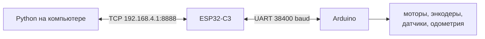
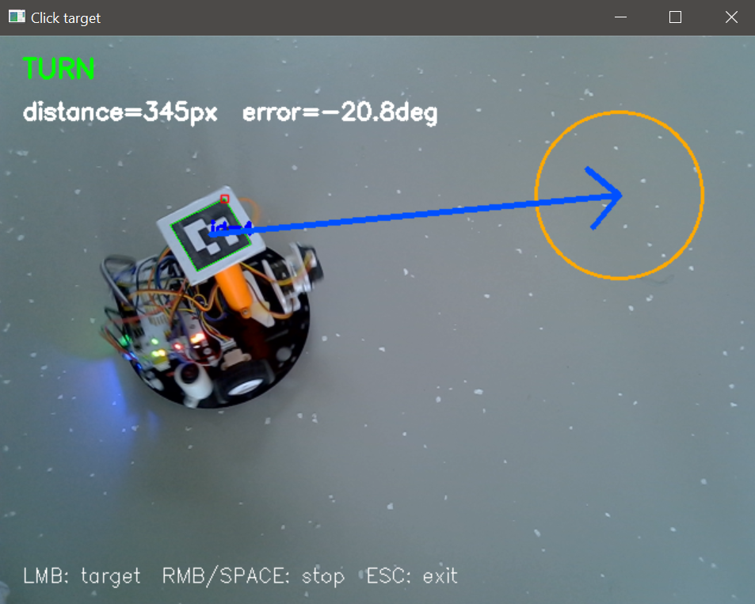
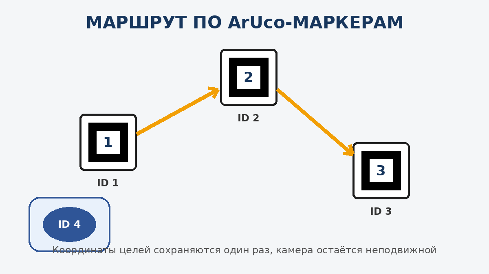
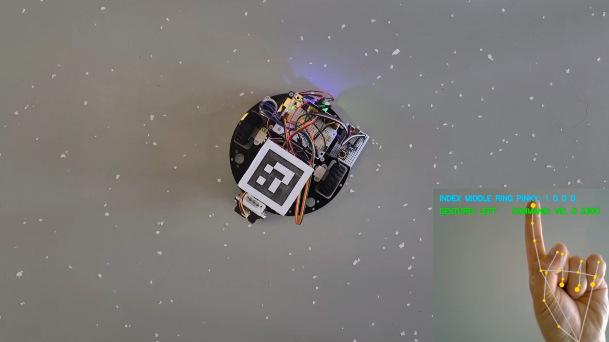
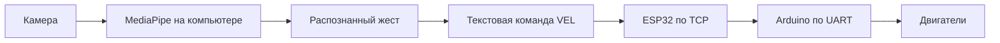
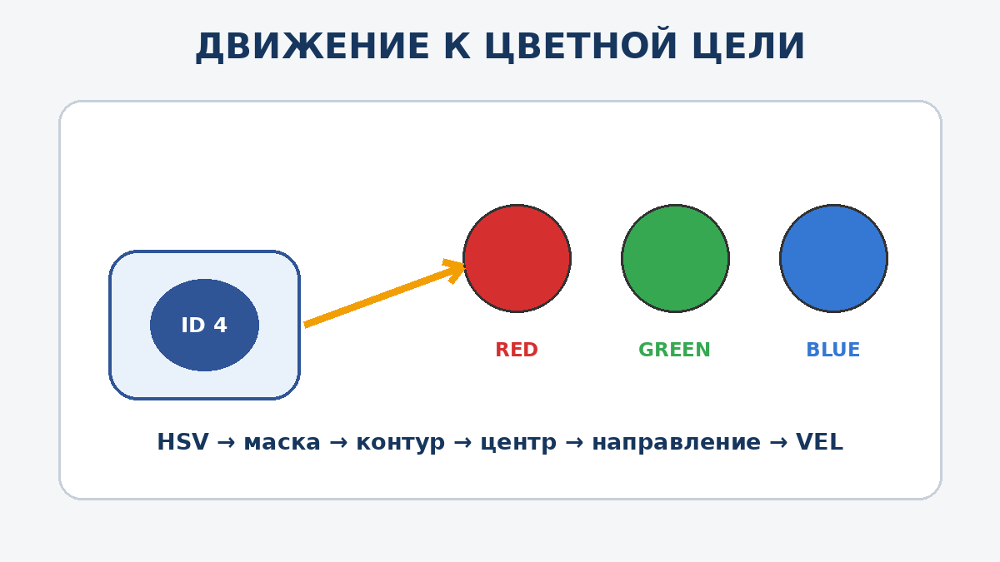
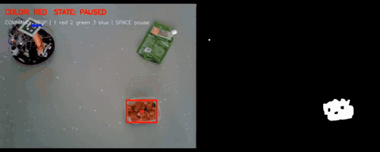

# День 4. Подготовка к индивидуальному проекту

[← День 3: Python и компьютерное зрение](../day_03_python_and_computer_vision/) · [К общей навигации](../README.md)

# Подготовка

## Аппаратная часть

Используется та же архитектура, что и в третий день:



ESP32 остаётся мостом между компьютером и Arduino. Решения принимает Python-программа на ноутбуке.

## Установка зависимостей

Установка библиотек:

```bash
python -m pip install --upgrade pip
python -m pip install -r requirements.txt
```

В `requirements.txt` используются:

- `opencv-contrib-python` — камера, HSV, контуры и ArUco;
- `numpy` — векторы, расстояния и координаты;
- `mediapipe` — распознавание положения пальцев.

## Перед первым запуском любого движения

1. Подключить компьютер к сети ESP32.
2. Проверить `http://192.168.4.1/`.
3. Убедиться, что адрес управления равен `192.168.4.1:8888`.
4. Поставить робота на подставку.
5. Запустить только один TCP-клиент.
6. Проверить команду `STOP`.
7. Только после этого поставить робота на полигон.

> Любая программа должна отправлять `STOP`, если пропала камера, телеметрия, цель или маркер робота.

---

# 1. Повторение связи с роботом

Перед проектами необходимо ещё раз проверить два простейших сценария третьего дня.

## 1.1. Получение телеметрии

Код третьего дня:

[`01_receive_telemetry.py`](../day_03_python_and_computer_vision/01_robot_tcp_basics/01_receive_telemetry.py)

Запуск из корня репозитория:

```bash
python day_03_python_and_computer_vision/01_robot_tcp_basics/01_receive_telemetry.py
```

Программа:

1. подключается к ESP32 по TCP;
2. отправляет команду `GET`;
3. читает строки до символа `\n`;
4. проверяет, что строка начинается с `TEL`;
5. преобразует одиннадцать значений в объект `Telemetry`;
6. выводит координаты, угол, датчики линии и дальномер.

Строка телеметрии:

```text
TEL x y theta v w encL encR lineL lineR ir servo
```

Контрольный результат:

- координаты меняются при движении робота;
- угол меняется при повороте;
- показания датчиков изменяются при воздействии;
- строки не обрываются и не смешиваются.

## 1.2. Передача команд

Код третьего дня:

[`02_send_commands.py`](../day_03_python_and_computer_vision/01_robot_tcp_basics/02_send_commands.py)

Запуск:

```bash
python day_03_python_and_computer_vision/01_robot_tcp_basics/02_send_commands.py
```

Быстрые команды:

| Ввод | Команда | Действие |
|---|---|---|
| `w` | `VEL 250 0` | движение вперёд |
| `s` | `VEL -250 0` | движение назад |
| `a` | `VEL 0 3500` | поворот влево |
| `d` | `VEL 0 -3500` | поворот вправо |
| `x` | `STOP` | остановка |

Можно вводить и полные команды:

```text
VEL 180 0
VEL 0 -2500
SERVO 90
GET
RESET_ODOM
```

Контрольный результат:

- робот исполняет каждую команду;
- `STOP` срабатывает немедленно;
- одновременно в консоль приходит телеметрия;
- после завершения программы робот останавливается.

---

# Варианты проектов

Ниже приведены пять готовых направлений. Первое уже реализовано в третьем дне. Остальные программы находятся в текущей папке.

| № | Основа проекта | Основные технологии | Сложность |
|---:|---|---|---|
| 1 | Движение к координате | одометрия, `atan2`, TCP | базовая |
| 2 | Маршрут по ArUco | камера, ArUco, состояние маршрута, безопасность | средняя |
| 3 | Управление жестами | MediaPipe, landmarks, фильтрация жестов, TCP | средняя |
| 4 | Виртуальный лабиринт | сетка, A*, планирование пути, симуляция | средняя/высокая |
| 5 | Движение к цветной цели | HSV, контуры, ArUco, визуальная обратная связь | высокая |

---

# 2. Проект 1 — движение к точке по одометрии

Код третьего дня:

[`04_drive_to_point.py`](../day_03_python_and_computer_vision/04_drive_to_point/04_drive_to_point.py)

Подробное объяснение находится в [README третьего дня](../day_03_python_and_computer_vision/README.md).



Демонстрация движения робота к цели по щелчку мыши:


Файл изображения:

```text
resources/images/01_drive_to_point_placeholder.png
```

Его необходимо заменить реальной фотографией или кадром с полигона, сохранив то же имя файла. После замены README обновится автоматически.

## Идея проекта

В консоль по одной вводятся абсолютные координаты:

```text
1000 0
1000 700
0 700
0 0
```

Для каждого отрезка робот:

1. получает текущее положение `(x, y, θ)`;
2. вычисляет направление на следующую точку;
3. один раз поворачивается в начале отрезка;
4. едет прямо с постоянной скоростью;
5. останавливается после прохождения рассчитанного расстояния;
6. ожидает следующую точку.

## Что можно добавить в собственном проекте

- загрузку маршрута из файла;
- сохранение маршрута в JSON;
- графическое окно для расстановки точек;
- отображение пройденной траектории;
- возврат в начальную точку;
- проверку препятствий дальномером;
- выбор скорости для каждого участка;
- автоматическую остановку на чёрной границе.

---

# 3. Проект 2 — маршрут по ArUco-маркерам

Код:

[`02_marker_route_mission.py`](02_marker_route_mission/02_marker_route_mission.py)



Демонстрация прохождения маршрута по ArUco-маркерам:


## 3.1. Задача

На полигоне размещаются три целевых маркера:

```text
ID 1 → ID 2 → ID 3
```

На роботе закреплён маркер `ID 4`.

После нажатия `Space` программа запоминает координаты всех трёх целей. Затем робот последовательно едет к сохранённым точкам.

Целевые маркеры могут быть закрыты корпусом робота после запуска. Их положение уже хранится в памяти программы.

## 3.2. Управление

| Клавиша | Действие |
|---|---|
| `Space` | сохранить цели и запустить миссию |
| `Space` во время движения | поставить миссию на паузу |
| `Space` на паузе | продолжить движение |
| `R` | удалить сохранённые точки и начать подготовку заново |
| `Esc` | отправить `STOP` и завершить программу |

Перед первым нажатием `Space` одновременно должны быть видны:

- маркер робота `ID 4`;
- целевой маркер `ID 1`;
- целевой маркер `ID 2`;
- целевой маркер `ID 3`.

## 3.3. Основные параметры

```python
CAMERA_INDEX = 0
ROBOT_MARKER_ID = 4
TARGET_SEQUENCE = (1, 2, 3)
ROBOT_ADDRESS = ("192.168.4.1", 8888)
```

Последовательность можно изменить:

```python
TARGET_SEQUENCE = (3, 1, 2)
```

Можно добавить новые точки:

```python
TARGET_SEQUENCE = (1, 2, 3, 5, 6)
```

При этом соответствующие маркеры должны относиться к словарю `DICT_4X4_50` и быть видны во время сохранения маршрута.

## 3.4. Почему координаты целей сохраняются один раз

Если каждый кадр заново искать целевой маркер, робот может закрыть его своим корпусом. Тогда цель временно исчезнет, и движение остановится.

Поэтому программа сначала фиксирует координаты:

```python
target_points: dict[int, np.ndarray] = {}
```

Словарь связывает номер маркера с координатой его центра:

```text
{
    1: (x1, y1),
    2: (x2, y2),
    3: (x3, y3),
}
```

Функция проверяет наличие всех обязательных ID:

```python
missing = tuple(
    marker_id
    for marker_id in TARGET_SEQUENCE
    if marker_id not in markers
)
```

Если хотя бы одного маркера нет, миссия не запускается.

Если все маркеры обнаружены, вычисляются их центры:

```python
for marker_id in TARGET_SEQUENCE:
    center, _heading = marker_geometry(markers[marker_id])
    points[marker_id] = center.copy()
```

`copy()` создаёт отдельный массив координат. Он больше не зависит от массива текущего кадра.

> После сохранения точек камеру нельзя перемещать. Иначе сохранённые координаты перестанут соответствовать изображению.

## 3.5. Как программа сопоставляет ID и вершины

Детектор возвращает два связанных массива:

```python
corners, ids, _rejected = detector.detectMarkers(frame)
```

- `corners` содержит четыре вершины каждого маркера;
- `ids` содержит номера этих маркеров.

Создаётся словарь:

```python
markers = {
    int(marker_id): marker_corners
    for marker_corners, marker_id in zip(
        corners,
        ids.flatten(),
    )
}
```

`zip` объединяет элементы с одинаковыми индексами:

```text
corners[0] ↔ ids[0]
corners[1] ↔ ids[1]
corners[2] ↔ ids[2]
```

После этого можно получить вершины конкретного маркера:

```python
markers[4]  # вершины маркера робота
markers[1]  # вершины первой цели
```

## 3.6. Центр и направление робота

Функция получает четыре вершины:

```python
def marker_geometry(corners):
    points = corners.reshape(4, 2)
```

После `reshape`:

```text
points[0] = P₀
points[1] = P₁
points[2] = P₂
points[3] = P₃
```

Центр:

```python
center = points.mean(axis=0)
```

Формула:

```text
C = (P₀ + P₁ + P₂ + P₃) / 4
```

Середина стороны `P₀–P₁`:

```python
front = 0.5 * (points[0] + points[1])
```

Формула:

```text
F = (P₀ + P₁) / 2
```

Маркер устанавливается так, чтобы эта сторона была направлена вперёд по корпусу.

Вектор направления:

```python
heading = front - center
```

Формула:

```text
h = F − C
```

Именно вычитание `front - center` строит стрелку от центра к передней стороне.

Далее убирается зависимость от размера маркера:

```python
heading /= max(float(np.linalg.norm(heading)), 1.0)
```

После нормализации длина `heading` равна единице, а направление сохраняется.

## 3.7. Как выбирается текущая цель

Индекс текущей точки хранится отдельно:

```python
target_index = 0
```

Текущий ID:

```python
current_id = TARGET_SEQUENCE[target_index]
```

В начале:

```text
target_index = 0 → current_id = 1
```

После достижения первой точки:

```python
target_index += 1
```

Получается:

```text
target_index = 1 → current_id = 2
```

После достижения последней точки выполняется условие:

```python
target_index >= len(TARGET_SEQUENCE)
```

Миссия завершается, а команда остаётся `STOP`.

## 3.8. Вектор от робота к цели

Координата робота:

```text
C = (robot_x, robot_y)
```

Координата текущей цели:

```text
T = target_points[current_id]
```

Вектор:

```python
vector = target - robot
```

Формула:

```text
t = T − C
```

Расстояние:

```python
distance = float(np.linalg.norm(vector))
```

Формула:

```text
distance = √(tₓ² + tᵧ²)
```

Расстояние измеряется в пикселях, потому что координаты получены из изображения.

## 3.9. Ошибка направления

Имеются два вектора:

```text
heading — куда смотрит робот;
vector  — куда находится цель.
```

Перед вычислением разворачивается ось `Y`:

```python
hx, hy = heading[0], -heading[1]
vx, vy = vector[0], -vector[1]
```

Это необходимо, потому что в изображении `Y` растёт вниз, а в математической системе — вверх.

Псевдоскалярное произведение:

```python
cross = hx * vy - hy * vx
```

Оно сообщает сторону:

```text
cross > 0 → цель слева;
cross < 0 → цель справа.
```

Скалярное произведение:

```python
dot = hx * vx + hy * vy
```

Оно помогает определить полный угол, включая случаи, когда цель находится сзади.

Угол:

```python
error = math.atan2(cross, dot)
```

Функция `atan2` возвращает значение от `−π` до `π`:

```text
error > 0 → поворот влево;
error < 0 → поворот вправо;
error ≈ 0 → робот направлен на цель.
```

## 3.10. Три режима управления

### Цель достигнута

```python
if distance <= TARGET_TOLERANCE_PX:
    target_index += 1
```

Точка считается достигнутой не в одном точном пикселе, а внутри круга допуска.

### Требуется поворот

```python
elif abs(error) > ANGLE_TOLERANCE_RAD:
```

Выбор направления:

```python
angular = (
    ANGULAR_SPEED_MRAD_S
    if error > 0
    else -ANGULAR_SPEED_MRAD_S
)
```

Команда:

```python
command = f"VEL 0 {angular}"
```

Линейная скорость равна нулю. Робот поворачивается на месте.

### Можно двигаться прямо

```python
else:
    command = f"VEL {LINEAR_SPEED_MM_S} 0"
```

Угловая скорость равна нулю. Робот едет прямо.

На следующем кадре положение измеряется заново. Если направление снова отклонится больше допуска, программа вернётся к повороту.

## 3.11. Порядок проверок безопасности

Команда в начале каждого кадра устанавливается в безопасное значение:

```python
command = "STOP"
```

Далее условия проверяются по приоритету:

```text
нет свежей телеметрии
        ↓
       STOP

миссия завершена
        ↓
       STOP

обнаружена чёрная граница
        ↓
       STOP + пауза

обнаружено препятствие
        ↓
       STOP

миссия на паузе
        ↓
       STOP

не виден маркер робота
        ↓
       STOP

иначе
        ↓
расчёт движения
```

Так робот не продолжает движение вслепую.

## 3.12. Данные датчиков

Из полной телеметрии выбираются только три поля:

```python
line_left=int(parts[8])
line_right=int(parts[9])
ir_cm=int(parts[10])
```

Чёрная граница:

```python
black_border = (
    safety.line_left < LEFT_LINE_THRESHOLD
    or safety.line_right < RIGHT_LINE_THRESHOLD
)
```

Препятствие:

```python
obstacle = 0 < safety.ir_cm <= OBSTACLE_STOP_CM
```

Перед запуском необходимо вписать реальные пороги конкретного робота.

## 3.13. Почему команда отправляется каждые 50 мс

```python
SEND_PERIOD_SECONDS = 0.05
```

Это примерно двадцать команд в секунду.

Причины:

1. положение и ошибка пересчитываются по новым кадрам;
2. Arduino регулярно получает подтверждение связи;
3. watchdog может остановить моторы при прекращении команд;
4. изменение состояния быстро приводит к `STOP`.

## 3.14. Отображение траектории

Координаты центра робота добавляются в список:

```python
trajectory.append(robot_point)
```

Хранятся только последние точки:

```python
trajectory = trajectory[-600:]
```

Линия рисуется функцией:

```python
cv2.polylines(...)
```

Это позволяет увидеть фактический маршрут и сравнить его с ожидаемым.

## 3.15. Что можно добавить в проект

- произвольное количество маркеров;
- выбор порядка маршрута с клавиатуры;
- поиск кратчайшего порядка обхода;
- разные действия у разных ID;
- остановку на заданное время;
- поворот сервопривода у точки;
- возврат к старту;
- запись результатов в CSV;
- оценку точности попадания;
- движение по маршруту несколько кругов;
- объезд препятствия и возврат к маршруту.

---

# 4. Проект 3 — управление жестами MediaPipe

Код:

[`03_gesture_control_mediapipe.py`](03_gesture_control_mediapipe/03_gesture_control_mediapipe.py)

Загрузка модели:

[`download_model.py`](03_gesture_control_mediapipe/download_model.py)



Демонстрация управления роботом жестами:


## 4.1. Подготовка модели

Современный MediaPipe Hand Landmarker использует отдельный файл модели.

Один раз выполнить:

```bash
python day_04_project_preparation/03_gesture_control_mediapipe/download_model.py
```

После загрузки рядом со скриптом появится:

```text
hand_landmarker.task
```

Официальная документация:

- https://developers.google.com/edge/mediapipe/solutions/vision/hand_landmarker/python
- https://storage.googleapis.com/mediapipe-models/hand_landmarker/hand_landmarker/float16/latest/hand_landmarker.task

## 4.2. Жесты

Большой палец не используется.

Состояния записываются в порядке:

```text
указательный, средний, безымянный, мизинец
```

| Состояние | Команда | Движение |
|---|---|---|
| `1000` | `VEL 0 3300` | поворот влево |
| `0001` | `VEL 0 -3300` | поворот вправо |
| `1111` | `VEL 220 0` | движение вперёд |
| `1001` | `VEL -220 0` | движение назад |
| любое другое | `STOP` | остановка |

## 4.3. Почему жесты распознаются на компьютере

В старом проекте состояние пальцев кодировалось в один байт и передавалось по Serial в Arduino.

В текущей архитектуре это не требуется:



Компьютер сразу преобразует жест в команду протокола робота.

## 4.4. Двадцать одна точка руки

Hand Landmarker возвращает `21` landmark.

Для каждого из четырёх пальцев используются точки:

```text
MCP → PIP → DIP → TIP
```

В коде:

```python
FINGER_LANDMARKS = {
    "index": (5, 6, 7, 8),
    "middle": (9, 10, 11, 12),
    "ring": (13, 14, 15, 16),
    "pinky": (17, 18, 19, 20),
}
```

## 4.5. Как определяется разогнутый палец

Простая длина от основания до кончика зависит от положения руки и может ошибаться.

Поэтому проверяются углы в суставах.

Для трёх точек `A`, `B`, `C` вычисляется угол `ABC`:

```python
joint_angle(A, B, C)
```

Если палец разогнут, углы в суставах близки к `180°`.

Проверка:

```python
pip_angle >= 150°
dip_angle >= 145°
```

Дополнительно кончик должен находиться дальше от запястья, чем средний сустав:

```python
tip_distance > pip_distance
```

Это уменьшает ложные срабатывания при согнутом пальце.

## 4.6. Преобразование состояний в команду

```python
mapping = {
    (1, 0, 0, 0): "LEFT",
    (0, 0, 0, 1): "RIGHT",
    (1, 1, 1, 1): "FORWARD",
    (1, 0, 0, 1): "BACKWARD",
}
```

Любая неизвестная комбинация:

```python
return mapping.get(states, "STOP")
```

Безопасное состояние по умолчанию — остановка.

## 4.7. Зачем нужна стабилизация

Landmark слегка меняются в каждом кадре. На границе порога один палец может быстро переключаться между `0` и `1`.

Поэтому команда принимается только после нескольких одинаковых результатов:

```python
STABLE_FRAMES = 4
```

История:

```python
gesture_history: deque[str] = deque(maxlen=STABLE_FRAMES)
```

Условие:

```python
len(gesture_history) == STABLE_FRAMES
and len(set(gesture_history)) == 1
```

Робот реагирует немного позже, но не дёргается при единичной ошибке распознавания.

## 4.8. Почему принимаемая телеметрия удаляется

ESP32 продолжает передавать `TEL`, даже если жестовой программе она не нужна.

Если никогда не читать входящие данные, TCP-буфер может заполниться.

Поэтому вызывается:

```python
drain_telemetry(connection)
```

Функция читает и удаляет все доступные входящие пакеты.

## 4.9. Безопасность

- нет руки в кадре → `STOP`;
- неизвестный жест → `STOP`;
- жест должен быть устойчивым;
- `Esc` завершает программу;
- блок `finally` всегда отправляет `STOP`.

## 4.10. Что можно добавить

- регулировку скорости количеством пальцев;
- жест для включения автономного режима;
- две руки для раздельного управления скоростью и поворотом;
- запись команд и воспроизведение маршрута;
- жест аварийной остановки;
- распознавание динамических жестов;
- голосовую обратную связь;
- графический индикатор скорости.

---

# 5. Проект 4 — виртуальный лабиринт и A*

Код:

[`04_virtual_maze_planner.py`](04_virtual_maze_planner/04_virtual_maze_planner.py)


Демонстрация движения робота по карте с нарисованными препятствиями:


## 5.1. Задача

В окне OpenCV отображаются:

- сетка;
- стены;
- виртуальный робот;
- цель;
- найденный маршрут.

Цель задаётся правой кнопкой мыши. После этого программа самостоятельно строит безопасный путь и перемещает виртуального робота.

## 5.2. Управление

| Действие | Результат |
|---|---|
| ПКМ | установить цель |
| ЛКМ и перетаскивание | добавить стену |
| `Shift` + ЛКМ | удалить стену |
| `Space` | пауза/продолжение |
| `R` | восстановить исходный лабиринт |
| `C` | удалить внутренние стены |
| `Esc` | завершить программу |

## 5.3. Представление поля

Поле разбивается на клетки:

```python
CELL_SIZE = 25
GRID_COLS = 36
GRID_ROWS = 26
```

Клетка хранится как:

```text
(row, column)
```

Стены — множество занятых клеток:

```python
walls: set[Cell]
```

Проверка занятости выполняется быстро:

```python
if candidate in walls:
```

## 5.4. Зачем стены расширяются

Робот имеет размер. Если строить путь только для математической точки, центр может пройти рядом со стеной, а корпус столкнётся с ней.

Поэтому стены расширяются на радиус робота:

```python
inflated = inflate_walls(
    walls,
    ROBOT_RADIUS_CELLS,
)
```

A* считает расширенные клетки запрещёнными.

Это называется построением конфигурационного пространства: вместо движения большого объекта рассматривается движение его центра среди увеличенных препятствий.

## 5.5. Алгоритм A*

Для каждой клетки хранится стоимость уже пройденного пути:

```text
g(n)
```

И приблизительная оценка оставшегося расстояния:

```text
h(n)
```

Приоритет:

```text
f(n) = g(n) + h(n)
```

В качестве эвристики используется манхэттенское расстояние:

```python
abs(row1 - row2) + abs(col1 - col2)
```

Оно подходит, потому что виртуальный робот переходит только вверх, вниз, влево и вправо.

## 5.6. Восстановление маршрута

При переходе к новой клетке запоминается, откуда программа пришла:

```python
came_from[candidate] = current
```

После достижения цели цепочка разворачивается от цели к старту:

```python
reconstruct_path(came_from, goal)
```

Получается список клеток:

```text
start → ... → goal
```

## 5.7. Движение виртуального робота

Для следующей клетки вычисляется центр:

```python
target = cell_center(path[path_index])
```

Вектор движения:

```python
vector = target - robot_position
```

На каждом кадре робот перемещается на фиксированное расстояние:

```python
robot_position += vector / distance * speed
```

После достижения центра клетки выбирается следующая.

## 5.8. Почему этот пример полезен для реального проекта

В виртуальной среде можно отдельно проверить:

- представление карты;
- поиск пути;
- реакцию на изменение стен;
- выбор новой цели;
- безопасность маршрута.

Следующий шаг — заменить виртуальное положение робота координатами ArUco и передавать команды физическому роботу.

## 5.9. Возможные расширения

- диагональные переходы;
- алгоритм Дейкстры;
- сравнение A*, BFS и Дейкстры;
- динамические препятствия;
- автоматическое перестроение пути;
- несколько целей;
- разные стоимости клеток;
- карта из изображения камеры;
- управление физическим роботом;
- сохранение лабиринта в файл.

---

# 6. Проект 5 — движение к объекту выбранного цвета

Код:

[`05_color_target_mission.py`](05_color_target_mission/05_color_target_mission.py)



Демонстрация движения к объекту выбранного цвета:



## 6.1. Идея

На роботе установлен ArUco `ID 4`. В кадре находится красный, зелёный или синий объект.

Пользователь выбирает цвет:

| Клавиша | Цель |
|---|---|
| `1` | красная |
| `2` | зелёная |
| `3` | синяя |
| `Space` | пауза/продолжение |
| `Esc` | остановка и выход |

Программа:

1. преобразует кадр в HSV;
2. создаёт маску выбранного цвета;
3. очищает маску морфологическими операциями;
4. находит контуры;
5. выбирает крупнейший объект;
6. определяет его центр;
7. находит ArUco робота;
8. строит вектор от робота к объекту;
9. вычисляет ошибку направления;
10. отправляет `TURN`, `DRIVE` или `STOP`.

## 6.2. Цветовые диапазоны

Красный занимает две части шкалы `H`:

```python
"RED": (
    ([0, 100, 70], [10, 255, 255]),
    ([170, 100, 70], [179, 255, 255]),
)
```

Зелёный и синий используют по одному диапазону.

Диапазоны необходимо подбирать для реального освещения с помощью HSV-тюнера третьего дня.

## 6.3. Объединение масок

```python
mask = cv2.bitwise_or(
    mask,
    cv2.inRange(hsv, lower, upper),
)
```

Для красного две маски объединяются в одну.

## 6.4. Морфологическая очистка

```python
mask = cv2.morphologyEx(mask, cv2.MORPH_OPEN, kernel)
mask = cv2.morphologyEx(mask, cv2.MORPH_CLOSE, kernel)
```

- `OPEN` удаляет мелкие белые точки;
- `CLOSE` заполняет небольшие отверстия внутри объекта.

## 6.5. Поиск крупнейшего объекта

```python
contours, _ = cv2.findContours(
    mask,
    cv2.RETR_EXTERNAL,
    cv2.CHAIN_APPROX_SIMPLE,
)
```

Мелкие контуры отбрасываются:

```python
cv2.contourArea(contour) >= MIN_CONTOUR_AREA
```

Выбирается самый большой:

```python
contour = max(valid, key=cv2.contourArea)
```

## 6.6. Координаты центра

Основной способ — моменты контура:

```python
center_x = m10 / m00
center_y = m01 / m00
```

Если площадь момента слишком мала, используется центр `boundingRect`.

## 6.7. Управление

Геометрия движения совпадает с проектом по ArUco:

```text
центр робота + центр цели
          ↓
      вектор на цель
          ↓
  расстояние и ошибка угла
          ↓
    STOP / TURN / DRIVE
```

Отличие в том, что координата цели обновляется по каждому кадру. Поэтому объект можно медленно перемещать, а робот будет менять направление.

## 6.8. Безопасность

Робот останавливается, если:

- цель выбранного цвета не найдена;
- маркер робота не найден;
- телеметрия устарела;
- датчик линии увидел границу;
- дальномер увидел препятствие;
- включена пауза;
- программа завершилась.

## 6.9. Как развить проект

- проезжать к цветам в заданном порядке;
- выполнять разные действия у разных цветов;
- распознавать сигналы светофора;
- считать найденные объекты;
- выбирать ближайший объект;
- объезжать препятствия;
- возвращаться на базу;
- использовать форму и цвет одновременно;
- добавить захват или толкатель;
- создать игру с перемещаемой целью.


# Рекомендуемая структура репозитория проекта

```text
project_name/
├── README.md
├── requirements.txt
├── arduino/
│   └── firmware.ino
├── esp32/
│   └── bridge.ino
├── python/
│   └── main.py
├── media/
│   ├── robot.jpg
│   └── demo.gif
└── docs/
    └── presentation.pdf
```

В `README.md` проекта должны быть:

1. название;
2. автор;
3. задача;
4. фотография;
5. оборудование;
6. схема обмена данными;
7. алгоритм;
8. инструкция по запуску;
9. управление;
10. результат;
11. известные ограничения;
12. идеи дальнейшего развития.

