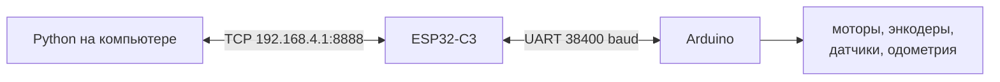
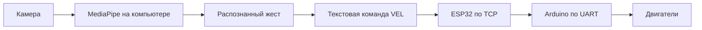
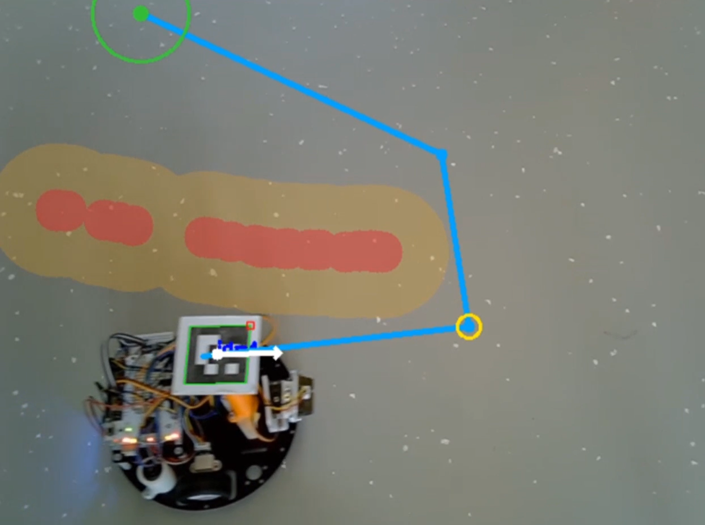

# День 4. Подготовка к индивидуальному проекту

[← День 3: Python и компьютерное зрение](../day_03_python_and_computer_vision/) · [К общей навигации](../README.md)


# Подготовка

## Аппаратная часть

Используется та же архитектура, что и в третий день:



ESP32 остаётся мостом между компьютером и Arduino. Решения принимает Python-программа на ноутбуке.

## Установка зависимостей

Установка библиотек:

```bash
python -m pip install --upgrade pip
python -m pip install -r requirements.txt
```

В `requirements.txt` используются:

- `opencv-contrib-python` — камера, HSV, контуры и ArUco;
- `numpy` — векторы, расстояния и координаты;
- `mediapipe` — распознавание положения пальцев.

## Перед первым запуском любого движения

1. Подключить компьютер к сети ESP32.
2. Проверить `http://192.168.4.1/`.
3. Убедиться, что адрес управления равен `192.168.4.1:8888`.
4. Поставить робота на подставку.
5. Запустить только один TCP-клиент.
6. Проверить команду `STOP`.
7. Только после этого поставить робота на полигон.

> Любая программа должна отправлять `STOP`, если пропала камера, телеметрия, цель или маркер робота.

---

# 1. Повторение связи с роботом

Перед проектами необходимо ещё раз проверить два простейших сценария третьего дня.

## 1.1. Получение телеметрии

Код третьего дня:

[`01_receive_telemetry.py`](../day_03_python_and_computer_vision/01_robot_tcp_basics/01_receive_telemetry.py)

Запуск из корня репозитория:

```bash
python day_03_python_and_computer_vision/01_robot_tcp_basics/01_receive_telemetry.py
```

Программа:

1. подключается к ESP32 по TCP;
2. отправляет команду `GET`;
3. читает строки до символа `\n`;
4. проверяет, что строка начинается с `TEL`;
5. преобразует одиннадцать значений в объект `Telemetry`;
6. выводит координаты, угол, датчики линии и дальномер.

Строка телеметрии:

```text
TEL x y theta v w encL encR lineL lineR ir servo
```

Контрольный результат:

- координаты меняются при движении робота;
- угол меняется при повороте;
- показания датчиков изменяются при воздействии;
- строки не обрываются и не смешиваются.

## 1.2. Передача команд

Код третьего дня:

[`02_send_commands.py`](../day_03_python_and_computer_vision/01_robot_tcp_basics/02_send_commands.py)

Запуск:

```bash
python day_03_python_and_computer_vision/01_robot_tcp_basics/02_send_commands.py
```

Быстрые команды:

| Ввод | Команда | Действие |
|---|---|---|
| `w` | `VEL 250 0` | движение вперёд |
| `s` | `VEL -250 0` | движение назад |
| `a` | `VEL 0 3500` | поворот влево |
| `d` | `VEL 0 -3500` | поворот вправо |
| `x` | `STOP` | остановка |

Можно вводить и полные команды:

```text
VEL 180 0
VEL 0 -2500
SERVO 90
GET
RESET_ODOM
```

Контрольный результат:

- робот исполняет каждую команду;
- `STOP` срабатывает немедленно;
- одновременно в консоль приходит телеметрия;
- после завершения программы робот останавливается.

---

# Варианты проектов

Ниже приведены пять готовых направлений. Первое уже реализовано в третьем дне. Остальные программы находятся в текущей папке.

| № | Основа проекта | Основные технологии | Сложность |
|---:|---|---|---|
| 1 | Движение к координате | одометрия, `atan2`, TCP | базовая |
| 2 | Маршрут по ArUco | камера, ArUco, состояние маршрута, безопасность | средняя |
| 3 | Управление жестами | MediaPipe, landmarks, фильтрация жестов, TCP | средняя |
| 4 | Камера, рисуемые препятствия и цель | ArUco, маска препятствий, A*, TCP | высокая |
| 5 | Движение к цветной цели | HSV, контуры, ArUco, визуальная обратная связь | высокая |

---

# 2. Проект 1 — движение к точке 

Код третьего дня:

[`04_drive_to_point.py`](../day_03_python_and_computer_vision/04_drive_to_point/16_click_to_drive.py)

Подробное объяснение находится в [README третьего дня](../day_03_python_and_computer_vision/README.md).


Файл изображения:

```text
resources/images/01_drive_to_point_placeholder.png
```

Для каждого отрезка робот:

1. получает текущее положение `(x, y, θ)`;
2. вычисляет направление на следующую точку;
3. один раз поворачивается в начале отрезка;
4. едет прямо с постоянной скоростью;
5. останавливается после прохождения рассчитанного расстояния;
6. ожидает следующую точку.

## Что можно добавить в собственном проекте

- загрузку маршрута из файла;
- сохранение маршрута в JSON;
- отображение пройденной траектории;
- возврат в начальную точку;
- проверку препятствий дальномером;
- выбор скорости для каждого участка;
- автоматическую остановку на чёрной границе.

---

# 3. Проект 2 — маршрут по ArUco-маркерам

Код:

[`02_marker_route_mission.py`](02_marker_route_mission/02_marker_route_mission.py)


## 3.1. Задача

На полигоне размещаются три целевых маркера:

```text
ID 1 → ID 2 → ID 3
```

На роботе закреплён маркер `ID 4`.

После нажатия `Space` программа запоминает координаты всех трёх целей. Затем робот последовательно едет к сохранённым точкам.

Целевые маркеры могут быть закрыты корпусом робота после запуска. Их положение уже хранится в памяти программы.

## 3.2. Управление

| Клавиша | Действие |
|---|---|
| `Space` | сохранить цели и запустить миссию |
| `Space` во время движения | поставить миссию на паузу |
| `Space` на паузе | продолжить движение |
| `R` | удалить сохранённые точки и начать подготовку заново |
| `Esc` | отправить `STOP` и завершить программу |

Перед первым нажатием `Space` одновременно должны быть видны:

- маркер робота `ID 4`;
- целевой маркер `ID 1`;
- целевой маркер `ID 2`;
- целевой маркер `ID 3`.

## 3.3. Основные параметры

```python
CAMERA_INDEX = 0
ROBOT_MARKER_ID = 4
TARGET_SEQUENCE = (1, 2, 3)
ROBOT_ADDRESS = ("192.168.4.1", 8888)
```

Последовательность можно изменить:

```python
TARGET_SEQUENCE = (3, 1, 2)
```

Можно добавить новые точки:

```python
TARGET_SEQUENCE = (1, 2, 3, 5, 6)
```

При этом соответствующие маркеры должны относиться к словарю `DICT_4X4_50` и быть видны во время сохранения маршрута.

## 3.4. Почему координаты целей сохраняются один раз

Если каждый кадр заново искать целевой маркер, робот может закрыть его своим корпусом. Тогда цель временно исчезнет, и движение остановится.

Поэтому программа сначала фиксирует координаты:

```python
target_points: dict[int, np.ndarray] = {}
```

Словарь связывает номер маркера с координатой его центра:

```text
{
    1: (x1, y1),
    2: (x2, y2),
    3: (x3, y3),
}
```

Функция проверяет наличие всех обязательных ID:

```python
missing = tuple(
    marker_id
    for marker_id in TARGET_SEQUENCE
    if marker_id not in markers
)
```

Если хотя бы одного маркера нет, миссия не запускается.

Если все маркеры обнаружены, вычисляются их центры:

```python
for marker_id in TARGET_SEQUENCE:
    center, _heading = marker_geometry(markers[marker_id])
    points[marker_id] = center.copy()
```

`copy()` создаёт отдельный массив координат. Он больше не зависит от массива текущего кадра.

> После сохранения точек камеру нельзя перемещать. Иначе сохранённые координаты перестанут соответствовать изображению.

## 3.5. Как программа сопоставляет ID и вершины

Детектор возвращает два связанных массива:

```python
corners, ids, _rejected = detector.detectMarkers(frame)
```

- `corners` содержит четыре вершины каждого маркера;
- `ids` содержит номера этих маркеров.

Создаётся словарь:

```python
markers = {
    int(marker_id): marker_corners
    for marker_corners, marker_id in zip(
        corners,
        ids.flatten(),
    )
}
```

`zip` объединяет элементы с одинаковыми индексами:

```text
corners[0] ↔ ids[0]
corners[1] ↔ ids[1]
corners[2] ↔ ids[2]
```

После этого можно получить вершины конкретного маркера:

```python
markers[4]  # вершины маркера робота
markers[1]  # вершины первой цели
```

## 3.6. Центр и направление робота

Функция получает четыре вершины:

```python
def marker_geometry(corners):
    points = corners.reshape(4, 2)
```

После `reshape`:

```text
points[0] = P₀
points[1] = P₁
points[2] = P₂
points[3] = P₃
```

Центр:

```python
center = points.mean(axis=0)
```

Формула:

```text
C = (P₀ + P₁ + P₂ + P₃) / 4
```

Середина стороны `P₀–P₁`:

```python
front = 0.5 * (points[0] + points[1])
```

Формула:

```text
F = (P₀ + P₁) / 2
```

Маркер устанавливается так, чтобы эта сторона была направлена вперёд по корпусу.

Вектор направления:

```python
heading = front - center
```

Формула:

```text
h = F − C
```

Именно вычитание `front - center` строит стрелку от центра к передней стороне.

Далее убирается зависимость от размера маркера:

```python
heading /= max(float(np.linalg.norm(heading)), 1.0)
```

После нормализации длина `heading` равна единице, а направление сохраняется.

## 3.7. Как выбирается текущая цель

Индекс текущей точки хранится отдельно:

```python
target_index = 0
```

Текущий ID:

```python
current_id = TARGET_SEQUENCE[target_index]
```

В начале:

```text
target_index = 0 → current_id = 1
```

После достижения первой точки:

```python
target_index += 1
```

Получается:

```text
target_index = 1 → current_id = 2
```

После достижения последней точки выполняется условие:

```python
target_index >= len(TARGET_SEQUENCE)
```

Миссия завершается, а команда остаётся `STOP`.

## 3.8. Вектор от робота к цели

Координата робота:

```text
C = (robot_x, robot_y)
```

Координата текущей цели:

```text
T = target_points[current_id]
```

Вектор:

```python
vector = target - robot
```

Формула:

```text
t = T − C
```

Расстояние:

```python
distance = float(np.linalg.norm(vector))
```

Формула:

```text
distance = √(tₓ² + tᵧ²)
```

Расстояние измеряется в пикселях, потому что координаты получены из изображения.

## 3.9. Ошибка направления

Имеются два вектора:

```text
heading — куда смотрит робот;
vector  — куда находится цель.
```

Перед вычислением разворачивается ось `Y`:

```python
hx, hy = heading[0], -heading[1]
vx, vy = vector[0], -vector[1]
```

Это необходимо, потому что в изображении `Y` растёт вниз, а в математической системе — вверх.

Псевдоскалярное произведение:

```python
cross = hx * vy - hy * vx
```

Оно сообщает сторону:

```text
cross > 0 → цель слева;
cross < 0 → цель справа.
```

Скалярное произведение:

```python
dot = hx * vx + hy * vy
```

Оно помогает определить полный угол, включая случаи, когда цель находится сзади.

Угол:

```python
error = math.atan2(cross, dot)
```

Функция `atan2` возвращает значение от `−π` до `π`:

```text
error > 0 → поворот влево;
error < 0 → поворот вправо;
error ≈ 0 → робот направлен на цель.
```

## 3.10. Три режима управления

### Цель достигнута

```python
if distance <= TARGET_TOLERANCE_PX:
    target_index += 1
```

Точка считается достигнутой не в одном точном пикселе, а внутри круга допуска.

### Требуется поворот

```python
elif abs(error) > ANGLE_TOLERANCE_RAD:
```

Выбор направления:

```python
angular = (
    ANGULAR_SPEED_MRAD_S
    if error > 0
    else -ANGULAR_SPEED_MRAD_S
)
```

Команда:

```python
command = f"VEL 0 {angular}"
```

Линейная скорость равна нулю. Робот поворачивается на месте.

### Можно двигаться прямо

```python
else:
    command = f"VEL {LINEAR_SPEED_MM_S} 0"
```

Угловая скорость равна нулю. Робот едет прямо.

На следующем кадре положение измеряется заново. Если направление снова отклонится больше допуска, программа вернётся к повороту.

## 3.11. Порядок проверок безопасности

Команда в начале каждого кадра устанавливается в безопасное значение:

```python
command = "STOP"
```

Далее условия проверяются по приоритету:

```text
нет свежей телеметрии
        ↓
       STOP

миссия завершена
        ↓
       STOP

обнаружена чёрная граница
        ↓
       STOP + пауза

обнаружено препятствие
        ↓
       STOP

миссия на паузе
        ↓
       STOP

не виден маркер робота
        ↓
       STOP

иначе
        ↓
расчёт движения
```

Так робот не продолжает движение вслепую.

## 3.12. Данные датчиков

Из полной телеметрии выбираются только три поля:

```python
line_left=int(parts[8])
line_right=int(parts[9])
ir_cm=int(parts[10])
```

Чёрная граница:

```python
black_border = (
    safety.line_left < LEFT_LINE_THRESHOLD
    or safety.line_right < RIGHT_LINE_THRESHOLD
)
```

Препятствие:

```python
obstacle = 0 < safety.ir_cm <= OBSTACLE_STOP_CM
```

Перед запуском необходимо вписать реальные пороги конкретного робота.

## 3.13. Почему команда отправляется каждые 50 мс

```python
SEND_PERIOD_SECONDS = 0.05
```

Это примерно двадцать команд в секунду.

Причины:

1. положение и ошибка пересчитываются по новым кадрам;
2. Arduino регулярно получает подтверждение связи;
3. watchdog может остановить моторы при прекращении команд;
4. изменение состояния быстро приводит к `STOP`.

## 3.14. Отображение траектории

Координаты центра робота добавляются в список:

```python
trajectory.append(robot_point)
```

Хранятся только последние точки:

```python
trajectory = trajectory[-600:]
```

Линия рисуется функцией:

```python
cv2.polylines(...)
```

Это позволяет увидеть фактический маршрут и сравнить его с ожидаемым.

## 3.15. Что можно добавить в проект

- произвольное количество маркеров;
- выбор порядка маршрута с клавиатуры;
- поиск кратчайшего порядка обхода;
- разные действия у разных ID;
- остановку на заданное время;
- поворот сервопривода у точки;
- возврат к старту;
- запись результатов в CSV;
- оценку точности попадания;
- движение по маршруту несколько кругов;
- объезд препятствия и возврат к маршруту.

---

# 4. Проект 3 — управление жестами MediaPipe

Код:

[`03_gesture_control_mediapipe.py`](03_gesture_control_mediapipe/03_gesture_control_mediapipe.py)

Загрузка модели:

[`download_model.py`](03_gesture_control_mediapipe/download_model.py)


## 4.1. Подготовка модели

Современный MediaPipe Hand Landmarker использует отдельный файл модели.

Один раз выполнить:

```bash
python day_04_project_preparation/03_gesture_control_mediapipe/download_model.py
```

После загрузки рядом со скриптом появится:

```text
hand_landmarker.task
```

Официальная документация:

- https://developers.google.com/edge/mediapipe/solutions/vision/hand_landmarker/python
- https://storage.googleapis.com/mediapipe-models/hand_landmarker/hand_landmarker/float16/latest/hand_landmarker.task

## 4.2. Жесты

Большой палец не используется.

Состояния записываются в порядке:

```text
указательный, средний, безымянный, мизинец
```

| Состояние | Команда | Движение |
|---|---|---|
| `1000` | `VEL 0 3300` | поворот влево |
| `0001` | `VEL 0 -3300` | поворот вправо |
| `1111` | `VEL 220 0` | движение вперёд |
| `1001` | `VEL -220 0` | движение назад |
| любое другое | `STOP` | остановка |

## 4.3. Почему жесты распознаются на компьютере

В старом проекте состояние пальцев кодировалось в один байт и передавалось по Serial в Arduino.

В текущей архитектуре это не требуется:



Компьютер сразу преобразует жест в команду протокола робота.

## 4.4. Двадцать одна точка руки

Hand Landmarker возвращает `21` landmark.

Для каждого из четырёх пальцев используются точки:

```text
MCP → PIP → DIP → TIP
```

В коде:

```python
FINGER_LANDMARKS = {
    "index": (5, 6, 7, 8),
    "middle": (9, 10, 11, 12),
    "ring": (13, 14, 15, 16),
    "pinky": (17, 18, 19, 20),
}
```

## 4.5. Как определяется разогнутый палец

Простая длина от основания до кончика зависит от положения руки и может ошибаться.

Поэтому проверяются углы в суставах.

Для трёх точек `A`, `B`, `C` вычисляется угол `ABC`:

```python
joint_angle(A, B, C)
```

Если палец разогнут, углы в суставах близки к `180°`.

Проверка:

```python
pip_angle >= 150°
dip_angle >= 145°
```

Дополнительно кончик должен находиться дальше от запястья, чем средний сустав:

```python
tip_distance > pip_distance
```

Это уменьшает ложные срабатывания при согнутом пальце.

## 4.6. Преобразование состояний в команду

```python
mapping = {
    (1, 0, 0, 0): "LEFT",
    (0, 0, 0, 1): "RIGHT",
    (1, 1, 1, 1): "FORWARD",
    (1, 0, 0, 1): "BACKWARD",
}
```

Любая неизвестная комбинация:

```python
return mapping.get(states, "STOP")
```

Безопасное состояние по умолчанию — остановка.

## 4.7. Зачем нужна стабилизация

Landmark слегка меняются в каждом кадре. На границе порога один палец может быстро переключаться между `0` и `1`.

Поэтому команда принимается только после нескольких одинаковых результатов:

```python
STABLE_FRAMES = 4
```

История:

```python
gesture_history: deque[str] = deque(maxlen=STABLE_FRAMES)
```

Условие:

```python
len(gesture_history) == STABLE_FRAMES
and len(set(gesture_history)) == 1
```

Робот реагирует немного позже, но не дёргается при единичной ошибке распознавания.

## 4.8. Почему принимаемая телеметрия удаляется

ESP32 продолжает передавать `TEL`, даже если жестовой программе она не нужна.

Если никогда не читать входящие данные, TCP-буфер может заполниться.

Поэтому вызывается:

```python
drain_telemetry(connection)
```

Функция читает и удаляет все доступные входящие пакеты.

## 4.9. Безопасность

- нет руки в кадре → `STOP`;
- неизвестный жест → `STOP`;
- жест должен быть устойчивым;
- `Esc` завершает программу;
- блок `finally` всегда отправляет `STOP`.

## 4.10. Что можно добавить

- регулировку скорости количеством пальцев;
- жест для включения автономного режима;
- две руки для раздельного управления скоростью и поворотом;
- запись команд и воспроизведение маршрута;
- жест аварийной остановки;
- распознавание динамических жестов;
- голосовую обратную связь;
- графический индикатор скорости.

---

# 5. Проект 4 — камера, рисуемые препятствия и движение к цели

Код:

[`04_camera_virtual_obstacles.py`](04_camera_virtual_obstacles/04_camera_virtual_obstacles.py)



## 5.1. Идея проекта

Это развитие примера третьего дня, в котором щелчок по изображению задавал цель роботу.

Теперь в том же окне отображается **живое изображение с камеры**, а поверх него можно мышью нарисовать запрещённые области. Они не являются отдельным виртуальным миром и не заменяют реального робота. Камера продолжает видеть настоящий полигон и ArUco-маркер `ID 4`, закреплённый на корпусе.

Пользователь выполняет два действия:

1. левой кнопкой мыши отмечает на кадре стены, коробки, опасные участки или любые зоны, через которые робот не должен проезжать;
2. правой кнопкой мыши устанавливает конечную точку.

После этого программа:

1. определяет положение и направление реального робота по ArUco;
2. превращает нарисованные линии в маску препятствий;
3. увеличивает препятствия с учётом размеров робота;
4. разбивает изображение на небольшие клетки;
5. строит безопасный маршрут алгоритмом A*;
6. сокращает лишние повороты маршрута;
7. выбирает ближайшую промежуточную точку;
8. поворачивает робота к этой точке;
9. отправляет команду движения вперёд;
10. регулярно перестраивает маршрут по новому положению робота.

Получается полноценная система внешней навигации:

```text
кадры камеры
      +
ArUco на роботе
      +
нарисованные препятствия
      +
цель, выбранная ПКМ
      ↓
планирование безопасного пути
      ↓
команды VEL через ESP32
      ↓
движение физического робота
```

## 5.2. Подготовка

Перед запуском необходимо:

- установить камеру неподвижно над полигоном;
- убедиться, что весь предполагаемый маршрут попадает в кадр;
- закрепить на роботе ArUco-маркер `ID 4`;
- направить сторону маркера `P₀–P₁` вперёд по корпусу;
- подключить компьютер к сети ESP32-C3;
- проверить адрес `192.168.4.1:8888`;
- проверить пороги датчиков линии и дальномера;
- сначала поставить робота на подставку и проверить знаки поворота.

Запуск:

```bash
python 04_camera_virtual_obstacles/04_camera_virtual_obstacles.py
```

## 5.3. Управление

| Действие | Результат |
|---|---|
| ЛКМ и перетаскивание | Нарисовать препятствие поверх кадра камеры |
| `Shift` + ЛКМ | Стереть часть препятствия |
| Средняя кнопка мыши | Также стирать препятствие |
| ПКМ | Установить новую цель и запустить движение |
| `Space` | Пауза или продолжение |
| `C` | Очистить все нарисованные препятствия |
| `R` | Удалить цель и рассчитанный маршрут |
| `Esc` | Остановить робота и завершить программу |

Красным цветом показываются сами нарисованные препятствия. Оранжевая полупрозрачная область вокруг них — дополнительная зона безопасности. Голубая линия — рассчитанный маршрут. Зелёный круг — цель.

## 5.4. Почему используется изображение с камеры

В программе открывается обычный видеопоток:

```python
camera = cv2.VideoCapture(CAMERA_INDEX)
ok, frame = camera.read()
```

`frame` — текущий кадр реального полигона. Все препятствия рисуются не в отдельном пустом окне, а **поверх этого кадра**.

Координаты мыши и координаты ArUco находятся в одной системе:

```text
(0, 0) — левый верхний угол изображения
X растёт вправо
Y растёт вниз
```

Поэтому можно непосредственно сравнивать:

- координаты центра робота;
- координаты цели;
- положение нарисованных препятствий;
- точки найденного маршрута.

## 5.5. Как хранятся нарисованные препятствия

Для препятствий создаётся отдельное чёрно-белое изображение того же размера, что и кадр камеры:

```python
obstacle_mask = np.zeros((height, width), dtype=np.uint8)
```

Изначально все значения равны нулю:

```text
0 — свободная область
255 — препятствие
```

При движении мыши по маске рисуется белый круг:

```python
cv2.circle(
    state.obstacle_mask,
    (x, y),
    WALL_BRUSH_RADIUS_PX,
    255,
    -1,
)
```

Последовательность пересекающихся кругов превращается в непрерывную линию нужной толщины.

Стирание выполняется тем же способом, но записывается значение `0`:

```python
cv2.circle(
    state.obstacle_mask,
    (x, y),
    WALL_BRUSH_RADIUS_PX + 5,
    0,
    -1,
)
```

Маска хранится отдельно от изображения камеры. Новый кадр меняется каждую итерацию, а нарисованные препятствия сохраняются до нажатия `C`.

## 5.6. Как правая кнопка задаёт цель

Обработчик мыши получает событие и координаты курсора:

```python
if event == cv2.EVENT_RBUTTONDOWN:
    state.goal_pixel = np.array([x, y], dtype=np.float32)
```

После выбора новой цели:

- старый маршрут удаляется;
- устанавливается признак необходимости нового расчёта;
- пауза снимается;
- робот начинает движение после успешного построения пути.

```python
state.path_points.clear()
state.waypoint_index = 0
state.map_changed = True
state.paused = False
```

Цель хранится в пикселях текущего изображения, точно так же, как в примере движения по клику третьего дня.

## 5.7. Почему препятствия нужно увеличивать

Планировщик сначала рассматривает робота как одну точку — центр ArUco-маркера. Но реальный робот имеет ширину и длину.

Если провести центр вплотную к нарисованной стене, колёса или корпус могут пересечь опасную область. Поэтому маска расширяется:

```python
diameter = 2 * ROBOT_SAFETY_RADIUS_PX + 1
kernel = cv2.getStructuringElement(
    cv2.MORPH_ELLIPSE,
    (diameter, diameter),
)
inflated = cv2.dilate(mask, kernel)
```

Операция `dilate` увеличивает каждую белую область. Радиус увеличения задаётся константой:

```python
ROBOT_SAFETY_RADIUS_PX = 44
```

После этого планируется движение центра робота среди увеличенных препятствий.

```text
реальное препятствие
        ↓ увеличить на радиус робота
запрещённая область для центра
        ↓
безопасный маршрут корпуса
```

Если робот проходит слишком близко к стенам, значение `ROBOT_SAFETY_RADIUS_PX` необходимо увеличить. Если программа не находит путь через достаточно широкий проход, значение можно немного уменьшить после проверки реальных размеров робота на изображении.

## 5.8. Как изображение превращается в сетку

Алгоритм A* работает не с каждым отдельным пикселем, а с клетками:

```python
GRID_CELL_SIZE_PX = 18
```

Изображение делится на прямоугольные области размером примерно `18 × 18` пикселей. Для каждой клетки проверяется, есть ли внутри неё хотя бы один запрещённый пиксель:

```python
if np.any(mask[y0:y1, x0:x1] > 0):
    blocked.add((row, col))
```

Клетка хранится как пара:

```text
(row, column)
```

Например:

```text
(5, 12)
```

означает пятую строку и двенадцатый столбец сетки.

Координата робота переводится в стартовую клетку, а координата щелчка — в целевую:

```python
start = pixel_to_cell(robot_pixel, rows, cols)
goal = pixel_to_cell(goal_pixel, rows, cols)
```

Чем меньше `GRID_CELL_SIZE_PX`, тем точнее карта, но тем больше клеток должен проверить алгоритм. Для учебного полигона значение около `15–25` пикселей обычно даёт понятный результат.

## 5.9. Как A* выбирает маршрут

Для каждой рассматриваемой клетки алгоритм хранит две оценки.

Стоимость уже пройденного пути:

```text
g(n)
```

Приблизительное расстояние до цели:

```text
h(n)
```

Итоговый приоритет:

```text
f(n) = g(n) + h(n)
```

В коде используется евклидова оценка:

```python
math.hypot(
    row_a - row_b,
    col_a - col_b,
)
```

Алгоритм выбирает клетку с наименьшим значением `f(n)`, проверяет её соседей и постепенно приближается к цели.

Разрешены восемь направлений:

```text
↖  ↑  ↗
←     →
↙  ↓  ↘
```

Прямой переход имеет стоимость `1`, диагональный — `√2`.

При диагональном движении дополнительно проверяются соседние боковые клетки. Это запрещает «срезать угол» через препятствие:

```python
if side_a in blocked or side_b in blocked:
    continue
```

Если свободного пути нет, программа оставляет команду `STOP` и выводит состояние:

```text
NO SAFE PATH
```

## 5.10. Как из клеток получается маршрут на изображении

A* возвращает последовательность клеток:

```text
start → cell₁ → cell₂ → ... → goal
```

Каждая клетка преобразуется в координату своего центра:

```python
points = [
    cell_center(cell, width, height)
    for cell in cells
]
```

Первая точка заменяется фактическим центром ArUco, а последняя — точными координатами щелчка:

```python
points[0] = robot_pixel
points[-1] = goal_pixel
```

Так маршрут начинается в реальном положении робота и заканчивается именно в выбранной точке, а не только в центре соответствующей клетки.

## 5.11. Зачем маршрут упрощается

Сетка может создать много коротких шагов и поворотов. Физическому роботу не нужно останавливаться у центра каждой клетки.

Программа проверяет, можно ли провести прямой отрезок от текущей точки к более далёкой точке, не пересекая расширенную маску:

```python
line_is_free(point_a, point_b, obstacle_mask)
```

Если отрезок свободен, промежуточные точки удаляются.

Например:

```text
до упрощения:
A → B → C → D → E → F

после упрощения:
A ─────────→ D ─────→ F
```

Это уменьшает количество поворотов, делает траекторию понятнее и упрощает управление реальным роботом.

## 5.12. Как программа ведёт робота по промежуточным точкам

После планирования хранится список точек:

```python
state.path_points
```

И номер текущей точки:

```python
state.waypoint_index
```

Программа вычисляет расстояние от центра робота до текущей промежуточной точки. Если точка уже достигнута, выбирается следующая:

```python
if distance <= WAYPOINT_TOLERANCE_PX:
    state.waypoint_index += 1
```

Для последней точки используется отдельный допуск:

```python
GOAL_TOLERANCE_PX = 42
```

Это необходимо, потому что реальный робот не может остановиться точно в одном пикселе.

## 5.13. Как вычисляется команда движения

Для текущей промежуточной точки строится вектор:

```python
vector = current_waypoint - robot_center
```

Направление робота известно по стороне `P₀–P₁` маркера `ID 4`. Угол от текущего направления к промежуточной точке вычисляется той же функцией, что и в примере третьего дня:

```python
angle_error = signed_angle(
    robot_heading,
    vector,
)
```

Дальше используются две фазы.

Если ошибка угла велика:

```python
if abs(angle_error) > ANGLE_TOLERANCE_RAD:
```

робот поворачивается на месте:

```text
VEL 0 3000
```

или:

```text
VEL 0 -3000
```

Если робот уже направлен к промежуточной точке:

```text
VEL 180 0
```

Он едет прямо.

```text
ошибка угла большая
        ↓
поворот на месте
        ↓
ошибка вошла в допуск
        ↓
движение вперёд
        ↓
промежуточная точка достигнута
        ↓
выбор следующей точки
```

## 5.14. Почему маршрут регулярно перестраивается

Физический робот может немного отклоняться из-за:

- разной скорости колёс;
- пробуксовки;
- инерции;
- неточного поворота;
- ошибок определения маркера.

Поэтому маршрут рассчитывается не только один раз. Через заданный интервал программа снова использует фактическое положение ArUco:

```python
REPLAN_PERIOD_SECONDS = 0.65
```

Новый путь начинается уже из обновлённой координаты робота.

Маршрут также немедленно перестраивается, если:

- пользователь дорисовал стену;
- часть стены была стёрта;
- выбрана новая цель;
- предыдущий путь закончился раньше, чем достигнута цель.

Получается замкнутый цикл:

```text
увидеть робота
      ↓
построить путь
      ↓
немного проехать
      ↓
снова увидеть реальное положение
      ↓
уточнить путь
```

## 5.15. Безопасность

В начале каждого кадра команда устанавливается в безопасное значение:

```python
command = "STOP"
```

Движение разрешается только после успешного прохождения всех проверок.

Робот останавливается, если:

- не поступает свежая телеметрия;
- ArUco-маркер `ID 4` не виден;
- цель не задана;
- безопасный путь не найден;
- включена пауза;
- датчик линии увидел чёрную границу;
- дальномер обнаружил реальное препятствие;
- центр робота оказался в расширенной виртуальной стене;
- программа завершается или соединение закрывается.

Команда повторяется каждые `50 мс`:

```python
SEND_PERIOD_SECONDS = 0.05
```

В блоке `finally` всегда отправляется:

```python
send(connection, "STOP")
```

Нарисованные стены являются частью программной карты, но не заменяют реальные меры безопасности. Первые испытания необходимо проводить на малой скорости, с готовностью физически отключить питание.

## 5.16. Отличие от примера движения по клику

| Движение по клику, день 3 | Камера и препятствия, день 4 |
|---|---|
| Есть только робот и одна цель | Есть робот, цель и маска запрещённых зон |
| Строится прямой вектор к цели | Сначала строится безопасный маршрут |
| Одна целевая точка | Несколько промежуточных точек |
| Поворот и движение прямо к цели | Повороты и движение по сегментам маршрута |
| Препятствия не учитываются | Препятствия расширяются и обходятся алгоритмом A* |

Геометрия движения не меняется. На каждом отдельном сегменте по-прежнему вычисляются:

```text
центр робота
      +
текущая промежуточная точка
      ↓
вектор направления
      ↓
ошибка угла
      ↓
TURN или DRIVE
```

Новая часть проекта — именно построение списка безопасных промежуточных точек.

## 5.17. Что можно развить в индивидуальном проекте

- автоматически выделять реальные коробки по цвету или контурам;
- сохранять и загружать нарисованную карту;
- задавать несколько целей;
- строить маршрут через обязательные контрольные зоны;
- сравнить A*, Дейкстру и BFS;
- учитывать разные стоимости участков поля;
- автоматически перестраивать путь при появлении нового препятствия;
- определять препятствия нейросетью;
- добавить интерфейс выбора скорости и безопасного радиуса;
- записывать маршрут и телеметрию;
- возвращать робота на старт;
- объединить виртуальную карту с датчиком расстояния.

---

# 6. Проект 5 — движение к объекту выбранного цвета

Код:

[`05_color_target_mission.py`](05_color_target_mission/05_color_target_mission.py)


## 6.1. Идея

На роботе установлен ArUco `ID 4`. В кадре находится красный, зелёный или синий объект.

Пользователь выбирает цвет:

| Клавиша | Цель |
|---|---|
| `1` | красная |
| `2` | зелёная |
| `3` | синяя |
| `Space` | пауза/продолжение |
| `Esc` | остановка и выход |

Программа:

1. преобразует кадр в HSV;
2. создаёт маску выбранного цвета;
3. очищает маску морфологическими операциями;
4. находит контуры;
5. выбирает крупнейший объект;
6. определяет его центр;
7. находит ArUco робота;
8. строит вектор от робота к объекту;
9. вычисляет ошибку направления;
10. отправляет `TURN`, `DRIVE` или `STOP`.

## 6.2. Цветовые диапазоны

Красный занимает две части шкалы `H`:

```python
"RED": (
    ([0, 100, 70], [10, 255, 255]),
    ([170, 100, 70], [179, 255, 255]),
)
```

Зелёный и синий используют по одному диапазону.

Диапазоны необходимо подбирать для реального освещения с помощью HSV-тюнера третьего дня.

## 6.3. Объединение масок

```python
mask = cv2.bitwise_or(
    mask,
    cv2.inRange(hsv, lower, upper),
)
```

Для красного две маски объединяются в одну.

## 6.4. Морфологическая очистка

```python
mask = cv2.morphologyEx(mask, cv2.MORPH_OPEN, kernel)
mask = cv2.morphologyEx(mask, cv2.MORPH_CLOSE, kernel)
```

- `OPEN` удаляет мелкие белые точки;
- `CLOSE` заполняет небольшие отверстия внутри объекта.

## 6.5. Поиск крупнейшего объекта

```python
contours, _ = cv2.findContours(
    mask,
    cv2.RETR_EXTERNAL,
    cv2.CHAIN_APPROX_SIMPLE,
)
```

Мелкие контуры отбрасываются:

```python
cv2.contourArea(contour) >= MIN_CONTOUR_AREA
```

Выбирается самый большой:

```python
contour = max(valid, key=cv2.contourArea)
```

## 6.6. Координаты центра

Основной способ — моменты контура:

```python
center_x = m10 / m00
center_y = m01 / m00
```

Если площадь момента слишком мала, используется центр `boundingRect`.

## 6.7. Управление

Геометрия движения совпадает с проектом по ArUco:

```text
центр робота + центр цели
          ↓
      вектор на цель
          ↓
  расстояние и ошибка угла
          ↓
    STOP / TURN / DRIVE
```

Отличие в том, что координата цели обновляется по каждому кадру. Поэтому объект можно медленно перемещать, а робот будет менять направление.

## 6.8. Безопасность

Робот останавливается, если:

- цель выбранного цвета не найдена;
- маркер робота не найден;
- телеметрия устарела;
- датчик линии увидел границу;
- дальномер увидел препятствие;
- включена пауза;
- программа завершилась.

## 6.9. Как развить проект

- проезжать к цветам в заданном порядке;
- выполнять разные действия у разных цветов;
- распознавать сигналы светофора;
- считать найденные объекты;
- выбирать ближайший объект;
- объезжать препятствия;
- возвращаться на базу;
- использовать форму и цвет одновременно;
- добавить захват или толкатель;
- создать игру с перемещаемой целью.

---

# Как выбрать тему индивидуального проекта

Хороший проект отвечает на пять вопросов.

## 1. Какова задача?

Не «использовать ArUco», а, например:

> Робот должен самостоятельно объехать три контрольные точки и вернуться на старт.

## 2. Какие входные данные используются?

Например:

- камера;
- координаты ArUco;
- датчики линии;
- дальномер;
- одометрия;
- жесты пользователя.

## 3. Какие состояния есть у системы?

Например:

```text
WAIT
SEARCH
TURN
DRIVE
AVOID
TARGET_REACHED
RETURN_HOME
STOP
```

## 4. Как выглядит успешный результат?

Критерий должен быть проверяемым:

- достигнуть трёх точек;
- не пересечь чёрную границу;
- выполнить маршрут три раза из трёх;
- остановиться не дальше 10 см от цели.

## 5. Что будет собственной частью?

Необходимо заранее определить отличие от готового примера:

- новый алгоритм;
- новое поведение;
- новый интерфейс;
- объединение нескольких датчиков;
- собственная система оценки;
- дополнительное оборудование.

---

# Рекомендуемая структура репозитория проекта

```text
project_name/
├── README.md
├── requirements.txt
├── arduino/
│   └── firmware.ino
├── esp32/
│   └── bridge.ino
├── python/
│   └── main.py
├── media/
│   ├── robot.jpg
│   └── demo.gif
└── docs/
    └── presentation.pdf
```

В `README.md` проекта должны быть:

1. название;
2. автор;
3. задача;
4. фотография;
5. оборудование;
6. схема обмена данными;
7. алгоритм;
8. инструкция по запуску;
9. управление;
10. результат;
11. известные ограничения;
12. идеи дальнейшего развития.

---

# Полная последовательность четвёртого дня

| Этап | Действие | Контрольный результат |
|---:|---|---|
| 1 | чтение телеметрии | координаты и датчики отображаются |
| 2 | передача команд | робот устойчиво управляется с ноутбука |
| 3 | выбор примера | определена основа проекта |
| 4 | запуск базового кода | пример работает без модификации |
| 5 | формулировка задачи | записан проверяемый результат |
| 6 | проектирование состояний | составлена схема алгоритма |
| 7 | создание репозитория | добавлены структура и README |
| 8 | план пятого дня | определён список функций по приоритету |

---

# Типичные проблемы

| Проблема | Что проверить |
|---|---|
| `ConnectionRefusedError` | сеть ESP32, адрес, порт, другой TCP-клиент |
| робот не останавливается | `STOP` в каждой аварийной ветке и в `finally` |
| телеметрия устарела | Arduino передаёт `TEL`, ESP32 пересылает строки |
| ArUco поворачивает не туда | сторона `P₀–P₁` направлена вперёд |
| маршрут сместился | камера была перемещена после сохранения целей |
| MediaPipe не запускается | установлен `mediapipe`, загружен `.task` файл |
| жесты переключаются | увеличить `STABLE_FRAMES` или изменить пороги углов |
| A* не находит путь | цель попала в стену или безопасную зону |
| цвет не определяется | подобрать HSV при текущем освещении |
| маска содержит шум | увеличить `MIN_CONTOUR_AREA`, настроить `S`, `V` |
| робот едет к фону | использовать однотонный полигон и крупнейший контур |
| OpenCV не показывает русский текст | использовать ASCII в `cv2.putText` или Pillow |

---

# Проверка материалов

Синтаксис, локальные ссылки и основные функции можно проверить командой:

```bash
python day_04_project_preparation/tests/validate_materials.py
```

Проверка не заменяет испытание на реальном роботе. Перед занятием необходимо отдельно проверить:

- направление моторов;
- знаки угловой скорости;
- пороги датчиков;
- индекс камеры;
- качество распознавания ArUco;
- диапазоны HSV;
- устойчивость Wi-Fi и TCP.

---

# Контрольная точка дня

Четвёртый день завершён, если:

- телеметрия и команды работают;
- выбран проект;
- базовый пример запускается;
- сформулирована собственная функция;
- составлен алгоритм;
- создан репозиторий;
- подготовлен план реализации на пятый день.
