# Дни 5–6. Индивидуальные проекты участников

[← День 4: подготовка к проекту](../day_04_project_preparation/) · [К общей навигации](../README.md)

Первые четыре дня интенсива были посвящены общей технической базе: сборке робота, датчикам, энкодерам, одометрии, сетевому управлению, Python и компьютерному зрению.

На пятый и шестой дни центр работы смещается к участникам. Каждый выбирает собственную задачу, определяет архитектуру проекта, объединяет изученные технологии и готовит работающую демонстрацию.

## Участники и темы проектов

| № | Участник | Планируемый проект |URL|
|---:|---|---|---|
| 1 | Агупов Александр Сергеевич | Прочёсывание местности |https://github.com/sanechka4/zigzag-painter-robot|
| 2 | Андронов Вячеслав Александрович | Конструктор трассы из цветных кубиков |https://gitverse.ru/YSLM/Path_Constructor|
| 3 | Бердников Максим Сергеевич | Роботизированная турель с двумя режимами |https://github.com/MaksimilianoBerdnkv/Turret-Arduino|
| 4 | Берестов Анатолий Владимирович | Компьютерное зрение для «Битвы роботов» |https://github.com/AnubisGmD/Neymark2026_CV_BattleBot|
| 5 | Власов Павел Алексеевич | Неделя в Неймарк (различные способы управления) ||
| 6 | Гаврин Алексей Сергеевич | От ручного управления к автономному режиму |https://github.com/alexeypythoner/xbox-bot-arduino|
| 7 | Железнов Тимофей Ильич | Движение к цветному объекту с выбором цели маркером ||
| 8 | Затравкин Константин Евгеньевич | Робот-курьер по ArUco-маркерам |https://github.com/SKAZALI-VIGRUZIT-SYDA-IZVINITE/projekt|
| 9 | Истяков Ибрагим Наилевич | Робот-сканер с классификацией объектов |https://github.com/ibragi2012-cloud/OmniSkan|
| 10 | Касторский Александр Васильевич | Подсчёт ящиков на полках ||
| 11 | Касумов Давид Октаевич | Распознавание оператора и управление жестами |https://github.com/kasdavik16-spec/FaceBot|
| 12 | Круглов Егор Павлович | Кегельринг ||
| 13 | Максимов Кирилл Александрович | Управление роботом жестами ||
| 14 | Наумов Андрей Денисович | Управление роботом жестами |https://github.com/koshkomen/Proekt_upravlenie_kameroy|
| 15 | Ролдугина Милана Владиславовна | Игра «Не дай роботу доехать» |https://github.com/milanaroldugina/breakthrough|
| 16 | Ромашков Максим Михайлович | «Робот 67» |https://github.com/maxim1234852/SixSevenBot|
| 17 | Черников Илья Алексеевич | Задача регионального этапа ВсОШ | https://github.com/Ilia22072011/Neymark_project/  |

---

## 1. Агупов Александр Сергеевич

| Фото | Проект |
|---|---|
| 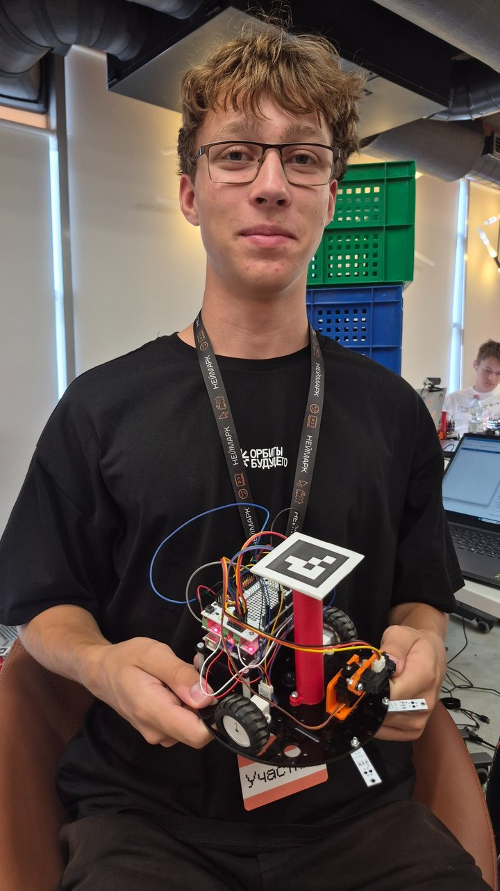 | **Прочёсывание местности**<br><br>Робот должен последовательно обследовать рабочую область, проходя по ней без больших пропущенных участков.<br><br>**Ключевые направления:** автономная навигация, построение маршрута, контроль пройденной области. |

## 2. Андронов Вячеслав Александрович

| Фото | Проект |
|---|---|
| 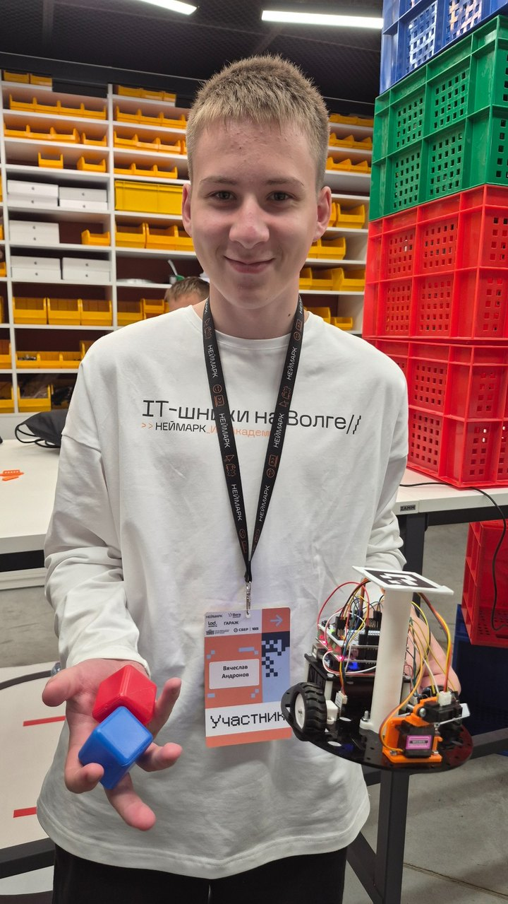 | **Конструктор трассы из цветных кубиков**<br><br>Цветные кубики задают конфигурацию трассы: робот проходит слалом, а зелёные кубики обозначают финишную область.<br><br>**Ключевые направления:** распознавание цвета, поиск объектов, движение по визуальным ориентирам. |

## 3. Бердников Максим Сергеевич

| Фото | Проект |
|---|---|
| 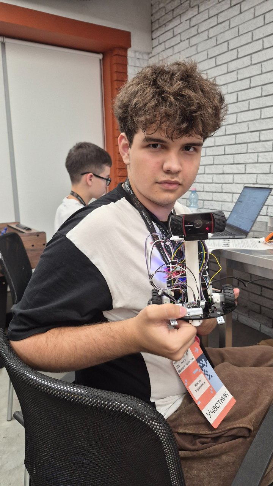 | **Роботизированная турель с двумя режимами**<br><br>Камера устанавливается на роботе. В первом режиме система наводится на синий объект, во втором — обнаруживает человека и отслеживает его положение в кадре.<br><br>**Ключевые направления:** камера на роботе, обнаружение цели, поворот сервопривода, сопровождение объекта. |

## 4. Берестов Анатолий Владимирович

| Фото | Проект |
|---|---|
| 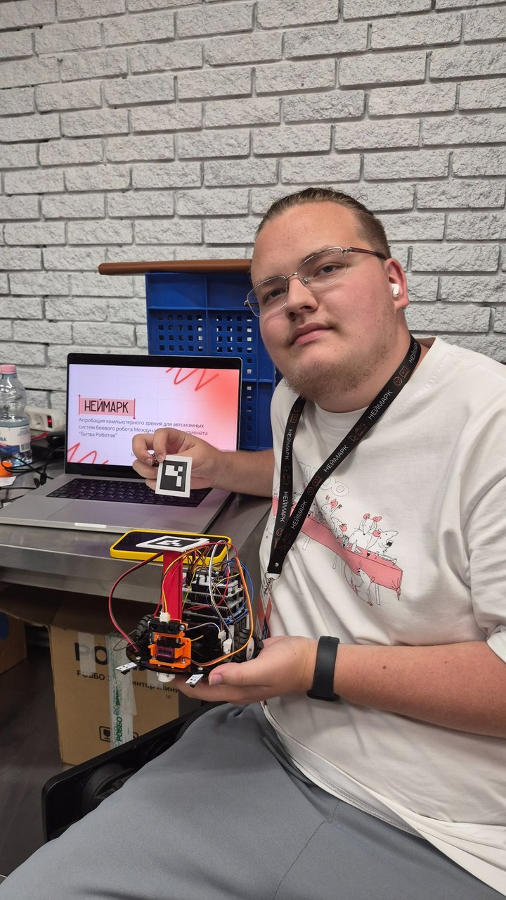 | **Компьютерное зрение для «Битвы роботов»**<br><br>Апробация методов компьютерного зрения для поиска другого робота: система должна обнаружить цель, двигаться за ней и выполнить контакт.<br><br>**Ключевые направления:** обнаружение и сопровождение движущегося объекта, визуальная обратная связь, автономное движение. |

## 5. Власов Павел Алексеевич

| Фото | Проект |
|---|---|
| 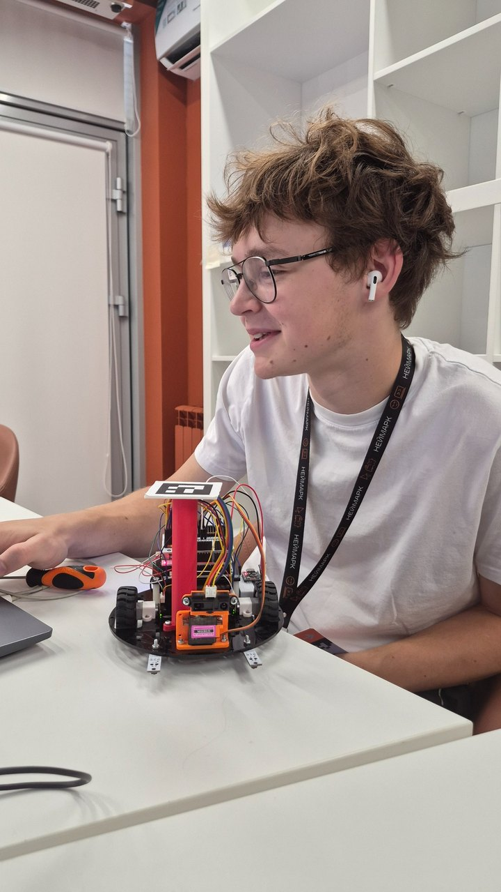 | **Неделя в Неймарк: различные способы управления роботом**<br><br>Проект объединяет в одной программе несколько примеров и способов управления роботом, изученных в течение интенсива. <br><br>**Ключевое направление:** Отдельные учебные программы собираются в единую систему, позволяющую запускать разные режимы работы и переключаться между ними. |

## 6. Гаврин Алексей Сергеевич

| Фото | Проект |
|---|---|
| 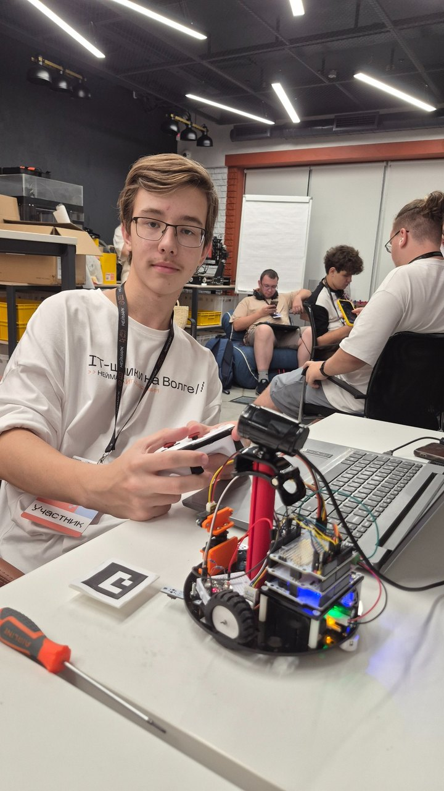 | **От ручного управления к автономному режиму**<br><br>Сначала робот управляется пультом от игровой консоли, затем по команде переходит в автономный режим и самостоятельно движется к заданной цели.<br><br>**Ключевые направления:** игровой контроллер, переключение режимов, автономное движение к цели. |

## 7. Железнов Тимофей Ильич

| Фото | Проект |
|---|---|
| 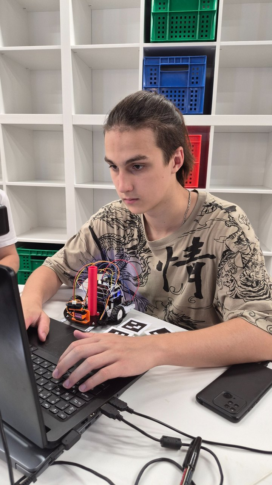 | **Движение к цветному объекту с выбором цели маркером**<br><br>Цвет объекта задаётся маркером, установленным на роботе. После определения требуемого цвета система находит соответствующий объект и направляет к нему робота.<br><br>**Ключевые направления:** ArUco, HSV-маски, контуры, визуальная навигация. |

## 8. Затравкин Константин Евгеньевич

| Фото | Проект |
|---|---|
| 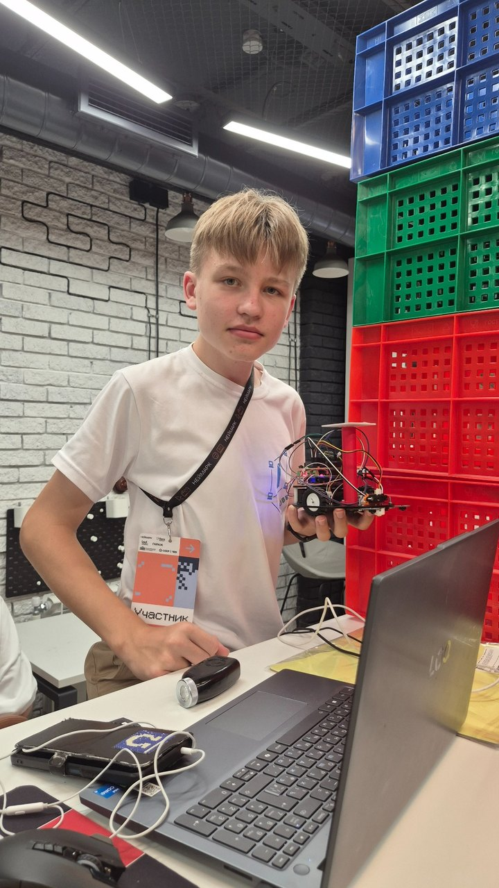 | **Робот-курьер по ArUco-маркерам**<br><br>На полигоне размещены маркеры. Оператор вводит в консоль ID пункта назначения, после чего робот самостоятельно находит нужную точку и едет к ней.<br><br>**Ключевые направления:** ArUco-навигация, выбор цели по ID, автономное движение. |

## 9. Истяков Ибрагим Наилевич

| Фото | Проект |
|---|---|
| 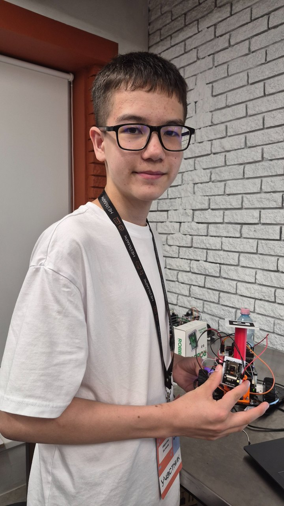 | **Робот-сканер с классификацией объектов**<br><br>Камера установлена на сервоприводе и сканирует окружающее пространство. Найденные объекты классифицируются с помощью YOLO.<br><br>**Ключевые направления:** камера на сервоприводе, обзор пространства, YOLO, классификация объектов. |

## 10. Касторский Александр Васильевич

| Фото | Проект |
|---|---|
| 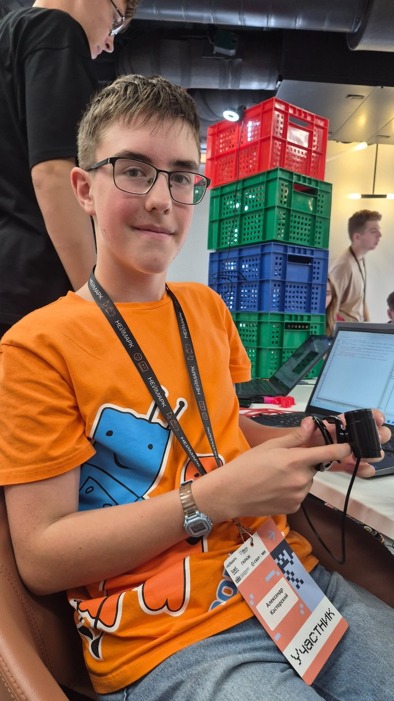 | **Подсчёт ящиков на полках**<br><br>Отдельный проект по компьютерному зрению: программа анализирует изображение стеллажа и определяет количество ящиков на полках.<br><br>**Ключевые направления:** компьютерное зрение, сегментация или детекция объектов, подсчёт. |

## 11. Касумов Давид Октаевич

| Фото | Проект |
|---|---|
| 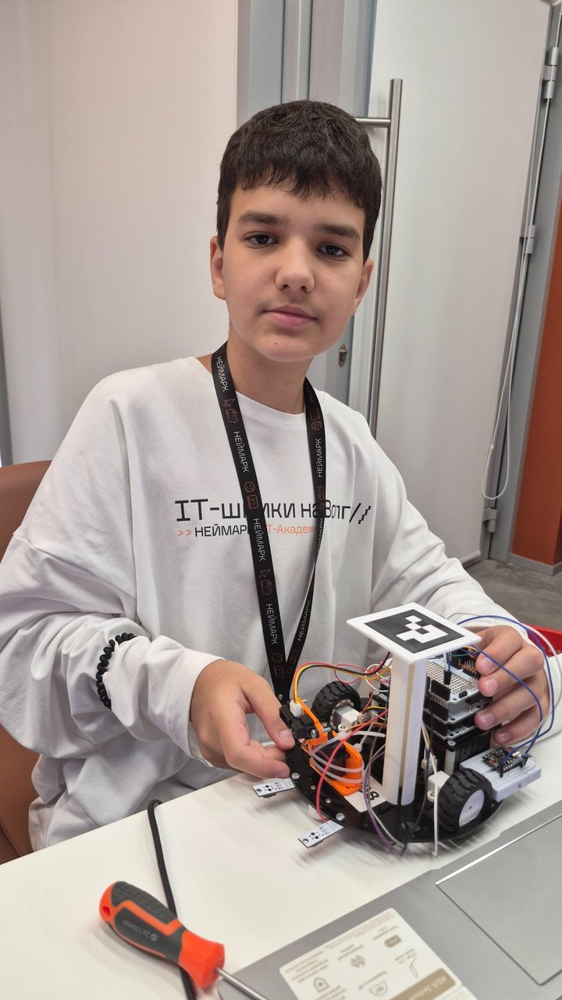 | **Распознавание оператора и управление жестами**<br><br>Система распознаёт лицо оператора и принимает команды управления роботом по жестам.<br><br>**Ключевые направления:** распознавание лица, MediaPipe, жестовое управление, проверка оператора. |

## 12. Круглов Егор Павлович

| Фото | Проект |
|---|---|
| 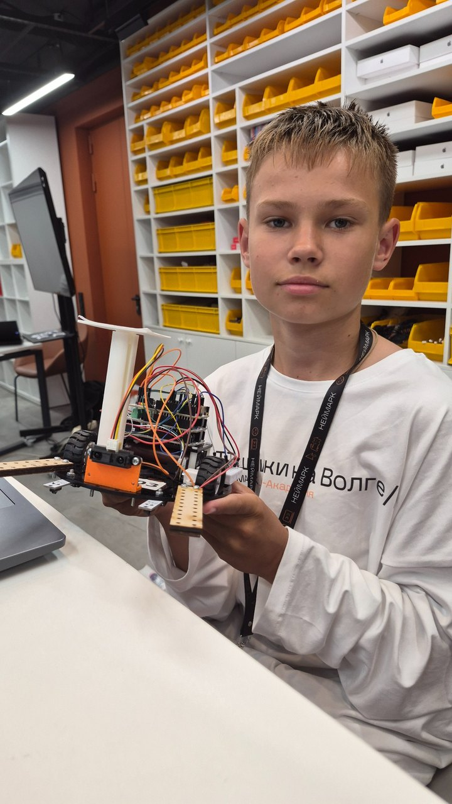 | **Кегельринг**<br><br>Робот должен находить кегли, выталкивать их за пределы ринга и при этом самостоятельно оставаться внутри рабочей области.<br><br>**Ключевые направления:** поиск объектов, датчики линии, автономная стратегия движения. |

## 13. Максимов Кирилл Александрович

| Фото | Проект |
|---|---|
| 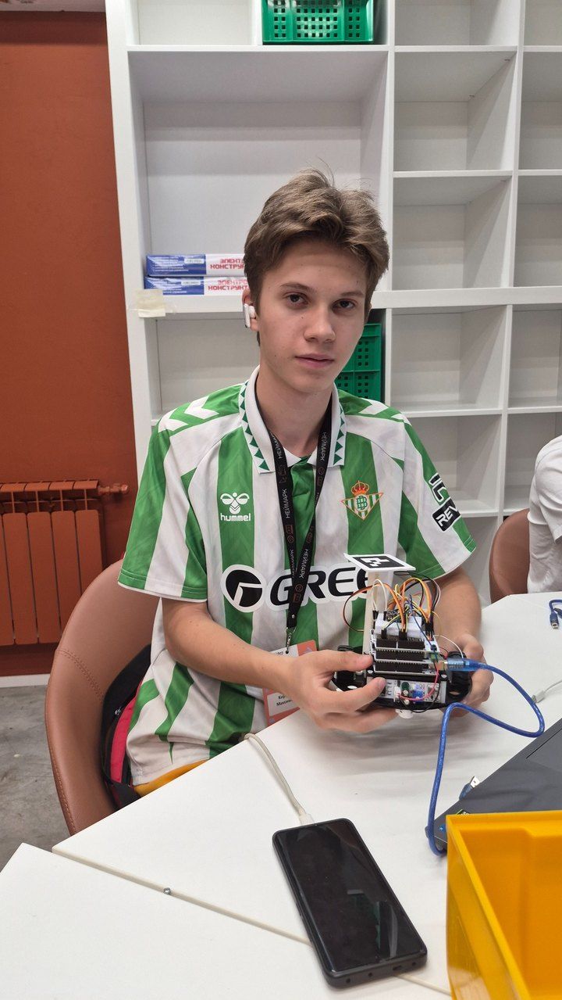 | **Тема проекта уточняется**<br><br>На момент оформления страницы окончательная формулировка индивидуального проекта ещё не была зафиксирована.<br><br>**Ключевые направления:** будут добавлены после выбора темы. |

## 14. Наумов Андрей Денисович

| Фото | Проект |
|---|---|
| 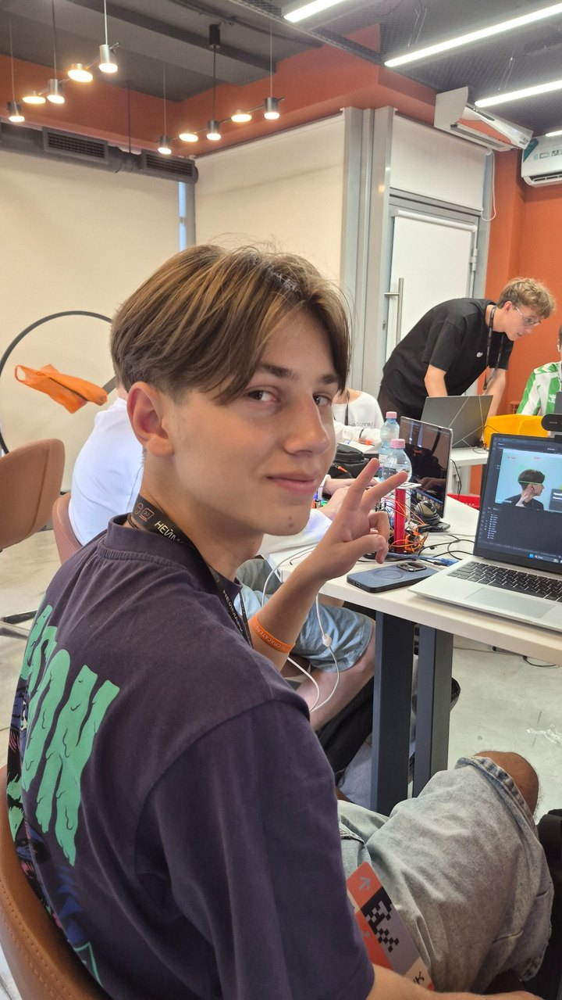 | **Управление роботом жестами**<br><br>Камера распознаёт положение пальцев и преобразует устойчивые жесты в команды движения робота.<br><br>**Ключевые направления:** MediaPipe, распознавание жестов, фильтрация команд, TCP-управление. |

## 15. Ролдугина Милана Владиславовна

| Фото | Проект |
|---|---|
| 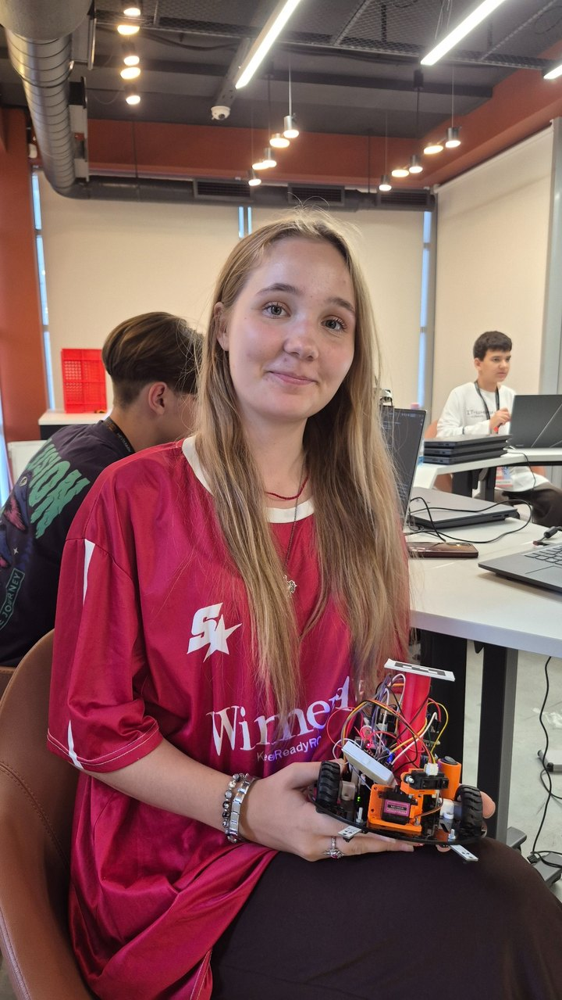 | **Игра «Не дай роботу доехать»**<br><br>Игровой проект, в котором робот стремится добраться до цели, а игрок должен помешать ему выполнить задачу.<br><br>**Ключевые направления:** интерактивный сценарий, автономное движение, реакция на действия игрока. |

## 16. Ромашков Максим Михайлович

| Фото | Проект |
|---|---|
| 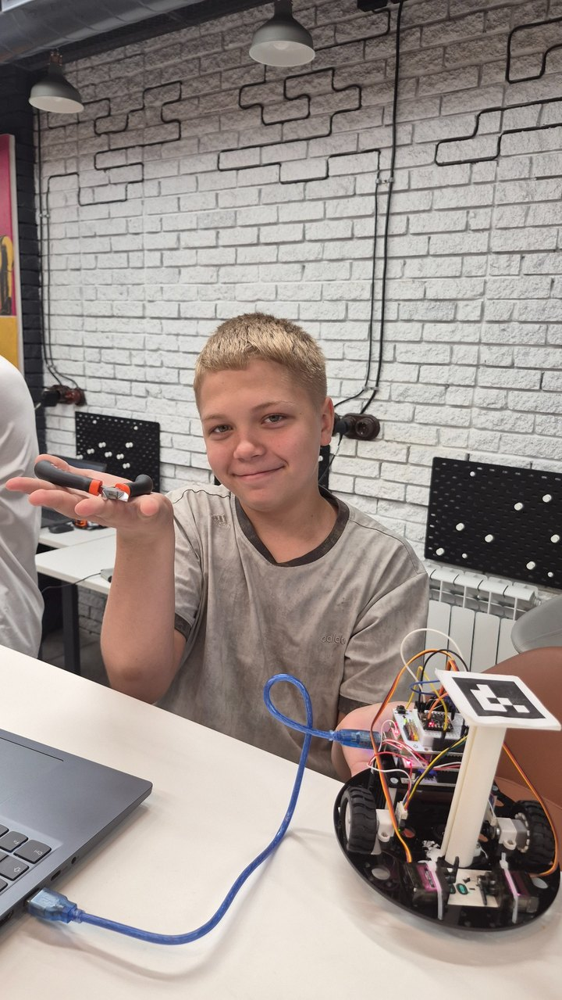 | **«Робот 67»**<br><br>Рабочее название индивидуального проекта. Подробная формулировка задачи будет добавлена после уточнения сценария и функций робота.<br><br>**Ключевые направления:** уточняются в ходе проектной работы. |

## 17. Черников Илья Алексеевич

| Фото | Проект |
|---|---|
| 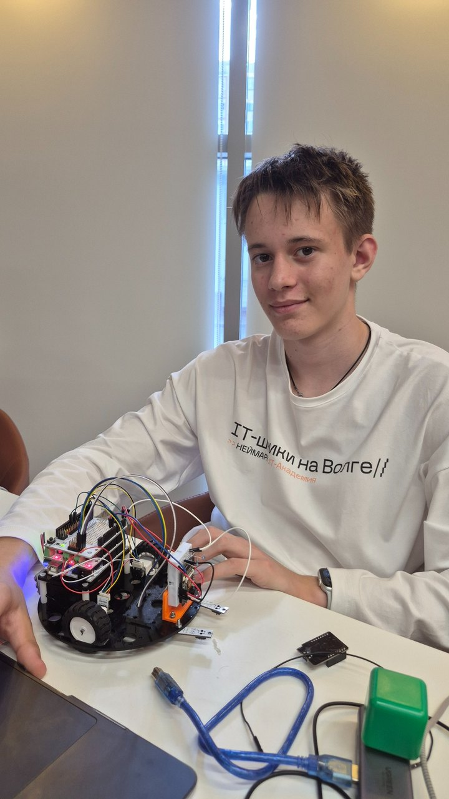 | **Задача регионального этапа ВсОШ**<br><br>Система классифицирует количество кубиков и на основании результата выбирает подходящий маршрут движения.<br><br>**Ключевые направления:** компьютерное зрение, классификация количества объектов, выбор маршрута. |

---
## Преподаватель

| Фото | Информация |
|---|---|
| 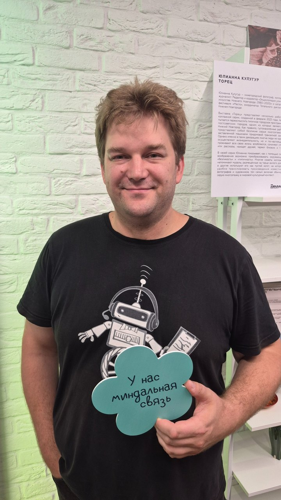 | **Степан Бурмистров**<br><br>Преподаватель интенсива и автор учебной программы.<br>

## Общая цель проектного этапа

Независимо от темы, законченный проект должен показывать не набор отдельных экспериментов, а связанный сценарий работы:

```text
входные данные
      ↓
обработка и принятие решения
      ↓
команда роботу или результат компьютерного зрения
      ↓
проверяемая демонстрация
```

Для защиты важно не только показать результат, но и объяснить устройство системы, движение данных, основной алгоритм, возникшие трудности и ограничения проекта.

## Материалы предыдущих дней

- [День 1 — сборка и аппаратная часть](../day_01_hardware/)
- [День 2 — одометрия и управление](../day_02_odometry_and_control/)
- [День 3 — Python и компьютерное зрение](../day_03_python_and_computer_vision/)
- [День 4 — подготовка к индивидуальному проекту](../day_04_project_preparation/)
